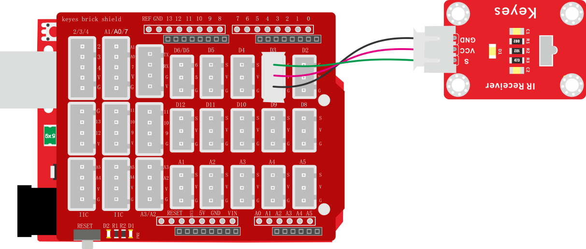
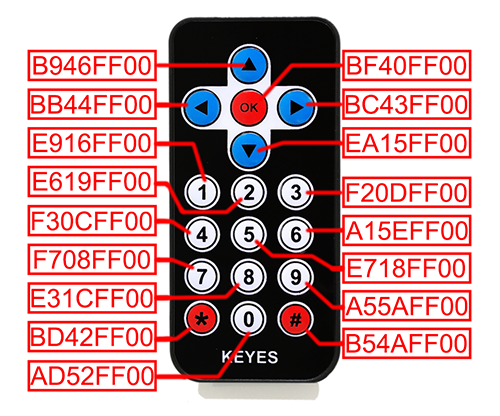
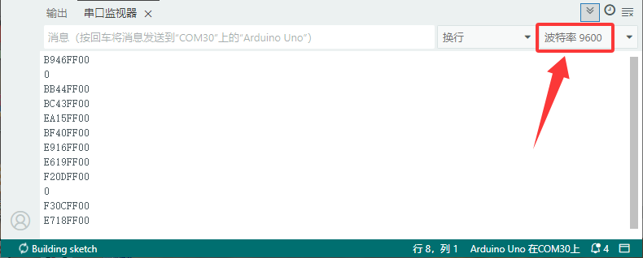

# 项目二十一 红外接收

## 1.实验说明

这一实验中，了解红外接收传感器的使用方法。红外接收传感器主要采用VS1838B红外接收传感器元件。该元件是集接收、放大、解调一体的器件，内部IC就已经完成了解调，输出的就是数字信号。它可接收标准38KHz调制的遥控器信号。

实验中，利用红外接收传感器接收外部红外发射设备发射的红外信号，并将接收信号在串口监视器上显示。

## 2.实验器材

- keyes brick 红外接收传感器*1

- keyes UNO R3开发板*1

- 传感器扩展板*1

- 3P 双头XH2.54连接线*1

- USB线*1

- JMP-1 17键 红外遥控*1

## 3.接线图



## 4.测试代码

```c
#include <IRremote.h>
const int RECV_PIN = 3;  //定义数字口3

void setup() {
    Serial.begin(9600);
    IrReceiver.begin(RECV_PIN, ENABLE_LED_FEEDBACK); // 启动接收，并开启LED反馈
}

void loop() {
    if (IrReceiver.decode()) { // 判断是否接收到信号
        // 打印原始数据值
        Serial.println(IrReceiver.decodedIRData.decodedRawData, HEX); // 注意访问方式

        IrReceiver.resume(); // 必须调用，准备接收下一个信号
    }
}
```

## 5.代码说明

编译上传之前我们先安装库文件`IRremote.h`，安装方法请看到Arduino 基础教程中查看。

下图是红外遥控的键值：



## 6.测试结果

按照接线图接线，上传测试代码成功，利用USB线上电后，打开串口监视器，里面就会显示红外接收传感器接收到的数据。

找到红外遥控器，拔出绝缘片，对准红外接收传感器的接收头按下按键。接收到信号后，红外接收传感器上的D1也开始闪烁，串口监视器显示如下图。

