Keyes brick 42合一传感器套装

# 产品介绍

Keyes brick 42合一传感器套装主要包含了我们常用的42款传感器/模块，还有对应的keyes UNO R3开发板、传感器扩展板和连接线。42款传感器/模块上都带有防反接口，和我们提供的传感器扩展板接口完全匹配。使用时，我们只需要将传感器扩展板堆叠在keyes UNO R3开发板，利用1根自带的连接线将传感器/模块连接在扩展板上，简单方便。

为了让你对这个42款传感器/模块有更深入的了解，我们还基于这个42款传感器/模块做个多个学习课程。这些课程是利用米思齐软件平台制作的，课程中我们提供了对应的接线方法、图形化编程代码、实验结果和简单的代码介绍等信息。通过这些课程，可以让我们对编程方法、逻辑有了更深刻的理解。

# 清单

|编码|名称|规格型号|数量|图片|
|-|-|-|-|-|
|1|Keyes模块|keyes brick LED白发白模块(焊盘孔) 防反插白色端子|1||
|2|Keyes传感器|keyes brick 热敏电阻传感器(焊盘孔) 防反插白色端子|1||
|3|Keyes传感器|keyes brick 按键传感器(焊盘孔) 防反插白色端子（配黄帽）
|1||
|4|Keyes模块|keyes brick 干簧管(焊盘孔) 防反插白色端子|1||
|5|Keyes传感器|keyes brick 魔术光杯传感器(焊盘孔) 防反插白色端子|2|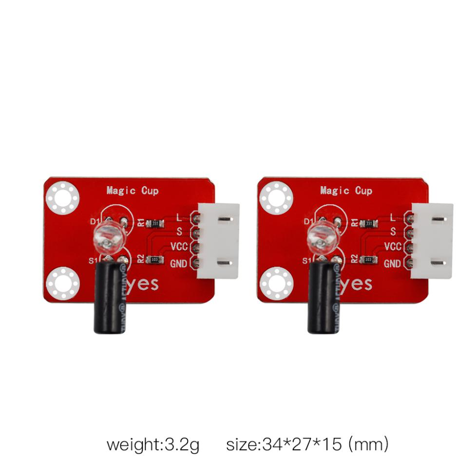|
|6|Keyes传感器|keyes brick DHT11温湿度传感器(焊盘孔) 防反插白色端子|1||
|7|Keyes传感器|keyes brick 震动模块传感器(焊盘孔) 防反插白色端子|1||
|8|Keyes传感器|keyes brick 水滴水蒸气传感器(焊盘孔) 防反插白色端子|1||
|9|Keyes传感器|keyes brick 倾斜模块传感器(焊盘孔) 防反插白色端子|1||
|10|Keyes传感器|keyes brick 光折断传感器(焊盘孔) 防反插白色端子|1||
|11|Keyes模块|keyes brick 手指测心跳模块(焊盘孔) 防反插白色端子|1|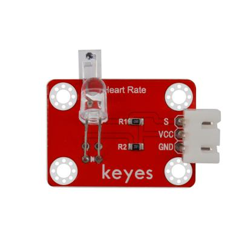|
|12|Keyes传感器|keyes brick ADXL345加速度传感器(焊盘孔) 防反插白色端子|1||
|13|Keyes传感器|keyes brick 土壤传感器(焊盘孔) 防反插白色端子|1||
|14|Keyes传感器|keyes brick 麦克风声音传感器(焊盘孔) 防反插白色端子|1||
|15|Keyes传感器|keyes brick 霍尔传感器(焊盘孔) 防反插白色端子|1||
|16|Keyes传感器|keyes brick 碰撞传感器(焊盘孔) 防反插白色端子|1|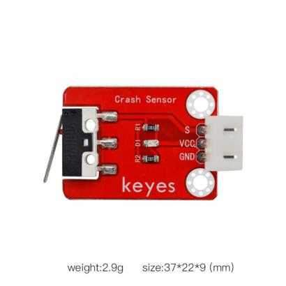|
|17|Keyes模块|SG90 9G 23*12.2*29mm 配十字臂 蓝色 辉盛 180度 环保|1||
|18|Keyes传感器|keyes brick HC-SR04超声波传感器 防反插白色端子|1||
|19|Keyes模块|keyes brick 有源蜂鸣器模块焊盘孔) 防反插白色端子|1||
|20|Keyes传感器|keyes brick MQ-2 烟雾传感器(焊盘孔) 防反插白色端子|1||
|21|Keyes传感器|keyes brick 敲击模块传感器(焊盘孔) 防反插白色端子|1|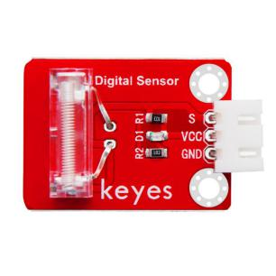|
|22|Keyes传感器|keyes brick 电容触摸传感器(焊盘孔) 防反插白色端子|1|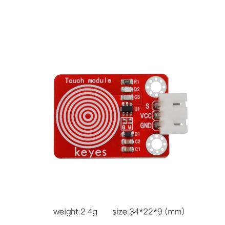|
|23|Keyes传感器|keyes brick 红外接收传感器(焊盘孔) 防反插白色端子|1|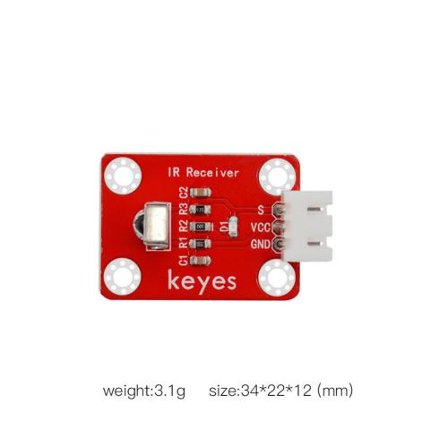|
|24|Keyes传感器|keyes brick 摇杆模块传感器(焊盘孔) 防反插白色端子（要配摇杆帽）|1||
|25|Keyes模块|keyes brick 无源蜂鸣器模块(焊盘孔) 防反插白色端子|1||
|26|Keyes传感器|keyes brick MQ-3 酒精传感器(焊盘孔) 防反插白色端子|1|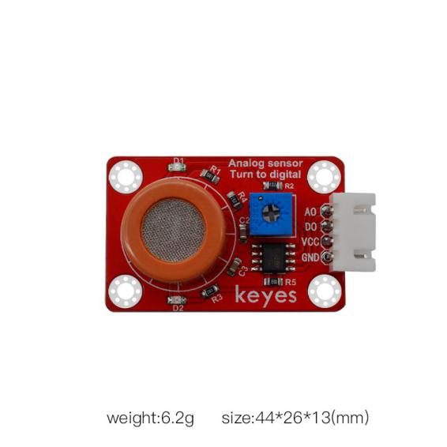|
|27|Keyes传感器|keyes brick 避障传感器(焊盘孔) 防反插白色端子|1||
|28|Keyes模块|keyes brick TM1637 4位数码管模块(焊盘孔) 防反插白色端子|1||
|29|Keyes模块|keyes brick 旋转编码器模块(焊盘孔) 防反插白色端子|1||
|30|Keyes传感器|keyes brick 人体红外热释电传感器(焊盘孔) 防反插白色端子|1||
|31|Keyes模块|keyes brick 激光头传感器模块(焊盘孔) 防反插白色端子|1||
|32|Keyes模块|keyes brick 可调电位器模块(焊盘孔) 防反插白色端子|1||
|33|Keyes传感器|keyes brick 巡线传感器(焊盘孔) 防反插白色端子|1||
|34|Keyes传感器|keyes brick 18B20温度传感器(焊盘孔) 防反插白色端子|1|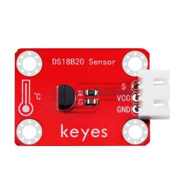|
|35|Keyes传感器|keyes brick TEMT6000光线传感器(焊盘孔) 防反插白色端子|1||
|36|Keyes模块|keyes brick 5V 单路继电器模块(焊盘孔) 防反插白色端子|1|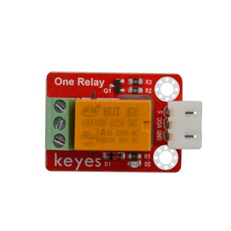|
|37|Keyes模块|keyes brick 插件RGB模块(焊盘孔) 防反插白色端子|1||
|38|Keyes模块|Keyes brick 8X8点阵模块(可选地址) 防反插白色端子|1||
|39|Keyes模块|keyes brick IIC 1602 蓝屏（5V）防反插白色端子|1||
|40|Keyes模块|0.96寸高亮高清晰 IIC通信 OLED模块 小OLED显示屏 蓝屏|1||
|41|Keyes模块|keyes brick 3231时钟模块(焊盘孔) 防反插白色端子|1||
|42|Keyes模块|KEYES 130电机-DC3-5V浇花小水泵驱动模块|1||
|43|Keyes扩展板|Keyes brick shield 传感器扩展板 防反插白色端子|1||
|44|Keyes开发板|keyes UNO R3 for arduino 开发板 红色 环保|1||
|45|连接线|3P 双头XH2.54插头 L=200mm 白色|15||
|46|连接线|4P 双头XH2.54插头 L=200mm 白色|7||
|47|连接线|5P 双头XH2.54插头 L=200mm 白色|3||
|48|USB线|AM/BM 透明蓝 OD:5.0 L=50cm 环保|1||
|49|包装袋|透明绿 开口50*76*0.2MM 环保|40||
|50|包装|KEYES Brick 42 IN 1 for arduino KE3003|1||
|51|红外遥控|JMP-1 17键86*40*6.5MM 黑色|1||
|52|水泵|DC3-5V浇花小水泵+100MM连接线|1||
|53|浇花水管|浇花水管 内径6MM 外径8MM 1米|1||
|54|直流电机|130电机+100MM连接线|1||
|55|桨|桨参数：孔径2mm 转动直径：72mm 中间圆帽直径：24mm 叶片长:25mm 中间圆帽颜色：黄 环保|1||
|56|包装盒|N-240 235*160*65MM 白色 环保|1||

# Arduino

## 开发板

### 第1小节 简单介绍keyes UNO R3开发板

我们先看一下他的特写：

我们通过下面的图来了解一下这个开发板的各个接口和主要元器件。

芯片简介

1 ATMEGA328P-AU

7 Atmega16U2 USB转串口芯片

9 AMS1117 5V稳压芯片

接口简介

2 ICSP接口

给ATMEGA328P-AU烧录固件接口

3 数字口D0-D13

串口通信：D0(RX)和D1(TX)

外部中断：D2（中断0）和D3（中断1）

PWM口：D3、D5、D6、D9、D10和D11

SPI通信：D10(SS)、D11(MOSI)、D12(MISO)和D13(SCK)

LED:D13直接驱动标志“L”的LED

4 ICSP接口

给Atmega16U2烧录固件接口

6 USB接口

用于下载程序、串口调试和供电

10 DC电源接口

可接入7V-12V范围内电压

11 电源输出接口

输出3.3V或5V，常用于对外供电或进行共地处理

12 DC电源接口

可接入7V-12V范围内电压

13模拟口A0-A5

IIC通信：A4(SDA)和A5（SCL）

也可当做数字口使用：A0(D14)、A1(D15)、A2(D16)、A3(D17)、A4(D18)和A5(D19)

器件简介

5 复位按键

8 16 MHz晶

### 第2小节 arduino IDE下载方法

（1）Installing Arduino IDE

When we get max control board, we need to download Arduino IDE and driver firstly.You could download Arduino IDE from the official website:

<https://www.arduino.cc/>, click the **SOFTWARE** on the browse bar, click “DOWNLOADS” to enter download page, as shown below:

There are various versions Of IDE for Arduino, just download a version that compatible with your system, here we will show you how to download and install the windows version Arduino IDE.

There are two versions of IDE for WINDOWS system, you can choose between the Installer (.exe) and the Zip packages. We suggest you use the first one that installs directly everything you need to use the Arduino Software (IDE), including the drivers. With the Zip package you need to install the drivers manually. The Zip file is also useful if you want to create a portable installation.

You just need to click JUST DOWNLOAD.

### 第3小节 驱动的安装方法

接下来是开发板驱动的安装，这次我们安装的是Keyes UNO R3
开发板的驱动，Keyes 2560 R3
开发板安装驱动方法和这个类似，驱动文件可以用同一个文件。

不同的系统，安装驱动的方法也有一些细小的区别，下面我们介绍在WIN 7系统安装驱动的方法。

第一次Keyes UNO R3
开发板连接电脑时，点击计算机--属性--设备管理器，显示如下图。

点击 Unknown device 安装驱动，如下图。

进入下图，选择

找到Arduino安装位置的drivers文件夹

点击“Next”，今天下图选择，开始安装驱动

安装驱动完成，出现下图点击Close。

这样驱动就装好了。点击计算机--属性--设备管理器，我们可看见如下图。

### 第4小节 Arduino IDE设置和工具栏介绍

装好了开发板的驱动，我们下面要了解Arduino开发软件的使用了，首先我们点击电脑桌面上的图标，打开Arduino IDE。

为了避免在将程序上载到板上时出现任何错误，必须选择正确的Arduino板名称，该名称与连接到计算机的电路板相匹配。转到Tools→Board，然后选择你的板。

然后再选择正确的COM口（安装驱动成功后可看到对应COM口）。

我们的程序上传到板之前，我们必须演示Arduino IDE工具栏中出现的每个符号的功能。

A - 用于检查是否存在任何编译错误。

B - 用于将程序上传到Arduino板。

C - 用于创建新草图的快捷方式。

D - 用于直接打开示例草图之一。

E - 用于保存草图。

F - 用于从板接收串行数据并将串行数据发送到板的串行监视器。

启动你的第一个程序

上面我们学习了怎么下载软件和安装开发板的驱动，那下面我们就开始正式开始第一个程序，打开文件选择例子，选择第一个文件BASIC里面的BLINK程序

按照前面方法设置板和COM口，IDE右下角显示对应板和COM口。

点击图标开始编译程序，检查错误，检查无误。

点击点击图标开始上传程序，上传成功。

程序上传成功，板载的LED灯亮一秒钟，灭一秒钟，恭喜你的第一个程序完成了！

### 第5小节 库文件的添加

首先找到arduino库文件夹：

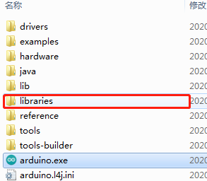

然后把所要用到的库文件复制在这个文件夹下就行了。

## 单个传感器/模块实验课程

在线课程视频：

[https://www.bilibili.com/video/BV12y411Y7sN/](https://www.bilibili.com/video/BV12y411Y7sN/)

拿到套件后，我们可以看到套件中有42款传感器/模块，有对应的keyes UNO R3

开发板、传感器扩展板和连接线。这里，我们将42款传感器/模块利用自带连接线，单独连接在keyes UNO R3开发板和传感器扩展板。然后上传对应的测试代码，单独测试各个传感器/模块的功能。

特别注意：实验时，模块/传感器连接线材时，必须按照资料里的接线方法及位置，电源与信息脚不能错接，否则会损坏模块/传感器。

### 实验一 LED 模块测试

实验说明

在这个套件中，我们有一个keyes brick LED白发白模块。它的控制方法非常简单，控制时，GND VCC上电后；信号端S为高电平时LED亮起，S为低电平时LED熄灭。

实验中，我们提供两个测试代码，分别控制LED模块上实现闪烁和呼吸灯的效果。闪烁效果好理解；呼吸灯效果，就是控制LED模块上LED首先逐渐变亮，然后逐渐变暗，循环交替，如人体呼吸一样。

实验器材

keyes brick LED白发白模块\*1

keyes UNO R3开发板\*1

传感器扩展板\*1

3P 双头XH2.54连接线\*1

USB线\*1

接线图

测试代码

代码1：

int ledPin = 3; //定义LED管脚接D3

void setup() {

pinMode(3, OUTPUT);//设置模式为输出

}

void loop() {

digitalWrite(3, HIGH); //输出高电平，点亮

delay(1000);//延迟1000毫秒

digitalWrite(3, LOW); //输出低电平，熄灭

delay(1000);

}

代码2：

int ledPin = 3; //定义LED引脚为D3

void setup() {

}

void loop() {

for (int i = 0; i \<= 255; i = i + 1) {//逐渐变亮

analogWrite(ledPin, i);

delay(10);

}

for (int i = 255; i \>= 0; i = i - 1) {//逐渐熄灭

analogWrite(ledPin, i);

delay(10);

}

}

代码说明

代码1说明：

1.  pinMode(pin,mode)；pin是用于设置模式的Arduino引脚号；mode为模式，可选：输入模式INPUT，输出模式OUTPUT或输入上拉INPUT_PULLUP，在这里我们设置了管脚3位输出模式。

<!-- -->

2.  digitalWrite(pin,     value)；pin是单片机数字管脚，在这里我们定义了管脚3；value是你将要输出的数字电平（HIGH/LOW）；如果使用pinMode（）将引脚配置为OUTPUT，则其电压将设置为相应的值：5V（在3.3V板上为3.3V）为HIGH，低电平为0V（接地）。如果没有把pinMode（）设置为OUTPUT，而是将LED连接到引脚，则在调用digitalWrite（HIGH）时，LED可能会变暗。因为此时digitalWrite（）将启用内部上拉电阻，其作用类似于一个大限流电阻。

3.  delay(ms)；延时函数，ms为暂停的毫秒数，数据类型：unsigned     long（范围 0~ 4,294,967,295 (2^32 - 1)）。

4.  通过整合前面知识。我们再来看代码就清楚明了了，代码中第一条我们把模块信号端接到D3，设置为高电平，就是点亮模块上LED；第二条延迟1000毫秒，就是让模块上LED点亮1秒。同样第三条第四条代码表示让模块上LED熄灭1秒。代码默认循环，也就是控制模块上LED，循环亮1秒，灭1秒，实现闪烁效果。通过代码设置，我们可以更改模块上LED亮灭的延迟时间，从而使模块上LED实现不同的闪烁效果。

5.  更多语法解释与详情请了解官网https://www.arduino.cc/reference/en/

    **代码2说明：**

<!-- -->

1.  代码中setup（）是只执行一次，而loop（）函数是一直循环。这里我们还用到了for（）循环：最简单形式为for(     ; ; )，我们在此实验中用到for (int i = 0; i \<= 255; i = i +
    1)；表示变量i从0到255，每次自加1，知道不满足 i \<=
    255这个判断表达式，否则一直执行大括号里的代码，即一共执行256次大括号里的代码；同理for     (int i = 255; i \>= 0; i = i - 1)；i每次自减1，当不满足i\>=
    0时，跳出该for（）循环，一共执行256次。

2.  代码1中，我们控制模块上信号端控制LED亮灭。在代码2中，我们通过利用keyes     UNO R3开发板上PWM口，设置PWM值，控制模块上LED亮度。

3.  keyes UNO R3开发板上只有D3 D5 D6 D9 D10     D11数字口是PWM口，也就是说如果要控制LED的亮度，信号端就只能接着几个接口。实验中，我们将模块信号端接在D3脚，属于PWM口。设置时我们设置PWM数值越小，模块上LED越暗，数值越大，模块上LED越亮，范围为0-255。analogWrite（pin，value），pin为PWM口，value是要输出的PWM值（0~255）。

4.  通过整合前面知识，我们再来看代码，就清楚多了。将D3的PWM值设置为i，i刚开始由0增加到255，每次加1，每加一次延迟10毫秒，模块上LED逐渐变亮。PWM为255后，i开始由255减小到0，每次减1，每减一次延迟10毫秒，模块上LED逐渐变暗。然后又逐渐变亮，循环交替，如人体呼吸一样。

5.  如果我们感觉逐渐变亮
    或者逐渐变暗的时间过长，我们可以更改代码设置。有两种方法，一种是将每次加1减1的延迟时间降低；另一种是更改步长，注意这个步长必须能被255整除，如3     5。步长改为3 -3代表i每次增加3或减小3。

### 实验二 激光头传感器模块发出激光

实验说明

在这个套件中，包含一个激光头传感器模块。它主要由1个铜材半导体激光管元件组成。控制时，我们需要在模块S端输入高电平信号，模块开始工作，激光管发射出红色激光信号。

实验中，我们只是控制这个模块上激光管循环发射红色激光信号。

实验器材

keyes brick 激光头传感器模块\*1

keyes UNO R3开发板\*1

传感器扩展板\*1

3P双头XH2.54连接线\*1

USB线\*1

接线图

测试代码

int laserPin = 2; //定义激光引脚为D2

void setup() {

pinMode(laserPin, OUTPUT);//定义输出模式

}

void loop() {

digitalWrite(laserPin, HIGH);//打开

delay(1000);//延时一秒

digitalWrite(laserPin, LOW);//关闭

delay(1000);//延时一秒

}

代码说明

参考实验一说明，这里就不多说了。

测试结果

上传测试代码成功，上电后，模块上激光管发射红色激光信号1秒，停止发射红色激光信号1秒，循环交替。

### 实验三 插件RGB模块调节LED颜色

实验说明

在这个套件中，有一个插件RGB模块，它采用F5-全彩RGB雾状共阴LED元件。控制时，我们需要将模块R G
B连接单片机PWM口，-接GND。我们通过调节3个PWM值，控制LED元件显示红光、绿光和蓝光的比例，从而控制RGB模块上LED显示不同颜色灯光。当设置的PWM值越大，对应显示的颜色比例越重。理论来说，通过调节这3中颜色光的混合比例，可以模拟出所有颜色的灯光。

实验中，我们通过测试代码，控制模块上RGB LED显示几个常用颜色。

实验器材

keyes brick 插件RGB模块\*1

keyes UNO R3开发板\*1

传感器扩展板\*1

4P 双头XH2.54连接线\*1

USB线\*1

接线图

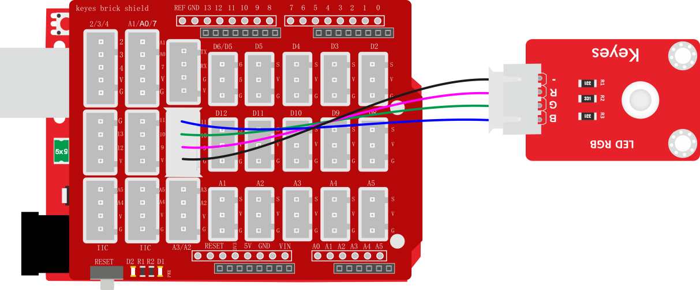

测试代码

代码1：

int redPin = 9; //定义红色接D9

int greenPin = 10; //定义绿色接D10

int bluePin = 11; //定义蓝色接D11

void setup() {

//设置三个管脚为输出模式

pinMode(redPin, OUTPUT);

pinMode(greenPin, OUTPUT);

pinMode(bluePin, OUTPUT);

}

void loop() {

//红色

digitalWrite(redPin, HIGH);

digitalWrite(greenPin, LOW);

digitalWrite(bluePin, LOW);

delay(1000);

//绿色

digitalWrite(redPin, LOW);

digitalWrite(greenPin, HIGH);

digitalWrite(bluePin, LOW);

delay(1000);

//蓝色

digitalWrite(9, LOW);

digitalWrite(greenPin, LOW);

digitalWrite(bluePin, HIGH);

delay(1000);

}

代码2：

int redPin = 9; //定义红色接D9

int greenPin = 10; //定义绿色接D10

int bluePin = 11; //定义蓝色接D11

void setup() {

}

void loop() {

//红色

analogWrite(redPin, 255);

analogWrite(greenPin, 0);

analogWrite(bluePin, 0);

delay(1000);

//绿色

analogWrite(redPin, 0);

analogWrite(greenPin, 255);

analogWrite(bluePin, 0);

delay(1000);

//蓝色

analogWrite(redPin, 0);

analogWrite(greenPin, 0);

analogWrite(bluePin, 255);

delay(1000);

//黄色

analogWrite(redPin, 255);

analogWrite(greenPin, 255);

analogWrite(bluePin, 0);

delay(1000);

//紫色

analogWrite(redPin, 255);

analogWrite(greenPin, 0);

analogWrite(bluePin, 255);

delay(1000);

//白色

analogWrite(redPin, 255);

analogWrite(greenPin, 255);

analogWrite(bluePin, 255);

delay(1000);

}

代码说明

代码1说明：

1.  代码1中，R G B代表控制模块上
    LED对应的红绿蓝3种颜色对应的端口，根据接线图我们接到了D9 D10     D11，设置为9 10 11，后面设置对应高低，设置GRB     LED中红绿蓝3个灯是否会亮，设置为高（对应数字口为高电平），对应的颜色就亮。

2.  现在观察代码，这个代码非常简单，只是简单的控制模块上RGB     LED显示红色1秒、

    绿色1秒、蓝色1秒，循环交替。

    **代码2说明：**

    1.代码2中，我们使用到了PWM输出，根据接线图我们接到了D9 D10

    D11，设置为9 10 11。后面设置数据代表设置模块上LED     红绿蓝颜色的比例，设置的

    数据越大（对应的PWM值越大），设置该颜色的比例越大。

    2.实验中我们通过设置对应数值，调节RGB     LED上红绿蓝颜色比例，从而控制RGB     LED显示对应颜色。所以理论上来说可以设置的颜色有256\*256\*256种。

测试结果

上传测试代码1成功，上电后，模块上RGB LED循环显示红绿蓝3种颜色，间隔时间为1秒。上传测试代码2成功，上电后，模块上RGB LED显示红绿蓝黄紫白6种颜色，循环不止，间隔时间为1秒。

### 实验四 控制继电器开关

实验说明

在这个套件中，包含一个5V 单路继电器模块。它主要采用HK4100F-DC 5V-SHC继电器元件。继电器有3个绿色接线柱用于外接电路，分别为NO COM和NC端（背后丝印）。当继电器没有接控制信号时，COM端和NC端连通，COM端和NO端断开。

控制时，我们把GND接单片机GND，VCC接单片机5V,S接单片机数字口。当S信号端设置为高电平时，继电器开启，继电器COM端和NC端断开，COM端和NO端连通；S信号端设置为低电平时，继电器关闭，继电器COM端和NC端连通，COM端和NO端断开。

实验中，我们只是控制继电器NO端和COM端循环连接和断开。

实验器材

keyes brick 5V 单路继电器模块\*1

keyes UNO R3开发板\*1

传感器扩展板\*1

3P双头XH2.54连接线\*1

USB线\*1

接线图

测试代码

int relayPin = 3; //定义继电器接管脚D3

void setup() {

pinMode(3, OUTPUT);//设置输出模式

}

void loop() {

digitalWrite(3, HIGH);//打开

delay(1000);

digitalWrite(3, LOW);//关闭

delay(1000);

}

代码说明

在实验中，我们把管脚设置为3，设置为高时，继电器上NO端和COM端连接，NC端和COM端断开；设置为低时，继电器上NO端和COM端断开，NC端和COM端连接。从而实现小电流控制大电流。

测试结果

上传测试代码成功，上电后，模块上NO端和COM端连接1秒，断开1秒，循环交替。

### 实验五 有源蜂鸣器模块播放声音

实验说明

在这个套件中，包含一个有源蜂鸣器模块，一个无源蜂鸣器模块。这个实验中，我们控制有源蜂鸣器发出声音。有源蜂鸣器元件内部自带震荡电路，控制时，我们只需要在蜂鸣器元件正极输入5V电源，负极接地，蜂鸣器就自动响起。在这个模块上我们在GND VCC输入5V电源；S信号端设置为高电平时，模块上蜂鸣器响起；设置为低电平时，模块上蜂鸣器没有声音。

实验中，我们只是控制这个模块上有源蜂鸣器的循环响起声音。

实验器材

keyes brick 有源蜂鸣器模块\*1

keyes UNO R3开发板\*1

传感器扩展板\*1

3P双头XH2.54连接线\*1

USB线\*1

接线图

测试代码

int buzzer = 3; //定义蜂鸣器接管脚D3

void setup() {

pinMode(3, OUTPUT);//设置输出模式

}

void loop() {

digitalWrite(3, HIGH); //发声

delay(1000);

digitalWrite(3, LOW); //停止发声

delay(1000);

}

代码说明

在实验中，我们把管脚设置为3，设置为高时，模块上有源蜂鸣器响起；设置为低时，模块上有源蜂鸣器关闭声音。

测试结果

上传测试代码成功，上电后，模块上有源蜂鸣器响起1秒，关闭1秒，循环交替。

### 实验六 无源蜂鸣器模块播放音乐

实验说明

前面课程中我们介绍了套件中的有源蜂鸣器模块的使用方法。在这里我们介绍下套件中的无源蜂鸣器模块，它主要采用12\*8.5MM 5V 2K无源蜂鸣器元件。无源蜂鸣器元件内部不带震荡电路，控制时，我们只需要在蜂鸣器元件正极输入不同频率的方波（电压5V），负极接地，控制蜂鸣器响起不同频率的声音。该元件的中心频率是2KHz。无源蜂鸣器驱动频率与发生频率之间是一一对应的关系，即驱动频率是2KHz的方波，那听到的声音频率也是2KHz。

实验中，我们利用无源蜂鸣器模块上蜂鸣器输出各种频率的声音，然后控制无源蜂鸣器模块上蜂鸣器播放完整音乐。

实验器材

keyes brick 无源蜂鸣器模块\*1

keyes UNO R3开发板\*1

传感器扩展板\*1

3P 双头XH2.54连接线\*1

USB线\*1

接线图

测试代码

代码1：

int beeppin = 3; //定义蜂鸣器引脚为D3

void setup() {

pinMode(beeppin, OUTPUT);//定义蜂鸣器管脚为输出模式

}

void loop() {

tone(beeppin, 262);//DO播放1000ms

delay(1000);

tone(beeppin, 294);//Re播放750ms

delay(750);

tone(beeppin, 330);//Mi播放625ms

delay(625);

tone(beeppin, 349,);//Fa播放500ms

delay(500);

tone(beeppin, 392,);//So播放375ms

delay(375);

tone(beeppin, 440,);//La播放250ms

delay(250);

tone(beeppin, 494,);//Si播放125ms

delay(125);

noTone(beeppin);//停止播放一秒

delay(1000);

}

代码2：

\#define D0 -1

\#define D1 262

\#define D2 293

\#define D3 329

\#define D4 349

\#define D5 392

\#define D6 440

\#define D7 494

\#define M1 523

\#define M2 586

\#define M3 658

\#define M4 697

\#define M5 783

\#define M6 879

\#define M7 987

\#define H1 1045

\#define H2 1171

\#define H3 1316

\#define H4 1393

\#define H5 1563

\#define H6 1755

\#define H7 1971

//列出全部D调的频率

\#define WHOLE 1

\#define HALF 0.5

\#define QUARTER 0.25

\#define EIGHTH 0.25

\#define SIXTEENTH 0.625

//列出所有节拍

int tune\[\] = //根据简谱列出各频率

{

D5, D5, D6, D5, M1, D7,

D5, D5, D6, D5, M2, M1,

D5, D5, M5, M3, M1, D7, D6,

M4, M4, M3, M1, M2, M1

};

float durt\[\] = //根据简谱列出各节拍

{

0.5, 0.5, 1, 1, 1, 1 + 1,

0.5, 0.5, 1, 1, 1, 1 + 1,

0.5, 0.5, 1, 1, 1, 1, 1,

0.5, 0.5, 1, 1, 1, 1 + 1

};

int beeppin = 3; //蜂鸣器的PIN

int length;

void setup() {

pinMode(beeppin, OUTPUT); //设置蜂鸣器引脚输出模式

length = sizeof(tune) / sizeof(tune\[0\]); //计算长度

}

void loop() {

for (int x = 0; x \< length; x++)

{

tone(beeppin, tune\[x\]);

**delay(500 \* durt\[x\]);
//这里用来根据节拍调节延时，500这个指数可以自己调整，在该音乐中，我发现用500比较合适。**

noTone(beeppin);

}

delay(2000);

}

代码说明

代码1说明：

在本实验中，我们用到了函数tone（）。tone(pin, frequency)；pin为生成音调的arduino引脚,我们设置了3；frequency为音调频率，单位为Hz,数据类型为unsigned int（范围0 ~ 65,535 ((2^16) -
1)）。tone函数在引脚上生成指定频率（和50％占空比）的方波。
直到调用noTone（）（停止生成音调）为止。
该引脚可以连接到压电蜂鸣器或其他扬声器以播放音调。tone（）一次只能产生一种音调。
如果某个音色已经在其他引脚上播放，则对tone（）的调用将无效。使用tone（）函数将干扰引脚3和11（Mega以外的板上）上的PWM输出。同时tone（）不能产生低于31Hz的音调。如果要在多个引脚上演奏不同的音高，则需要在一个引脚上调用noTone（），然后在下一个引脚上调用tone（）。

代码2说明：

我们先是列出了所有D调的频率，方便后面使用。然后根据简谱列出各频率，再列出各节拍，我们用到的一个节拍为500ms，这个可以自己调整，然后循环响起音调与对应节拍就成了一首歌曲。

测试结果

上传测试代码1成功，上电后，模块上无源蜂鸣器循环播放对应频率对应节拍的声音。上传测试代码2成功，上电后，模块上无源蜂鸣器循环播放《生日快乐》歌曲。

### 实验七 按键传感器检测实验

实验说明

在这个套件中，有一个keyes brick按键传感器，它主要采用1个轻触开关，自带1个黄色按键帽。当我们按下按键时，传感器信号端为低电平；松开按键时，信号端为高电平。

实验中，我们通过读取传感器上S端高低电平，判断传感器上按键是否按下；并且，我们在串口监视器上显示测试结果。

实验器材

keyes brick按键传感器\*1

keyes UNO R3开发板\*1

传感器扩展板\*1

3P双头XH2.54连接线\*1

USB线\*1

接线图

测试代码

int val = 0;

int button = 3; //按键的PIN

void setup() {

Serial.begin(9600); //设置波特率为9600

pinMode(button, INPUT); //设置为输入模式

}

void loop() {

val = digitalRead(button); //读取按键的值

Serial.print(val); //串口上打印出来

if (val == 0) { //按下按键则读取到低电平

Serial.print(" ");

Serial.println("Press the botton");

delay(100);

}

else {

Serial.print(" ");

Serial.println("Loosen the botton");

delay(100);

}

}

代码说明

1.  pinMode(button, INPUT);
    由前面学过的知识我们知道，在这里我们定义按键管脚3，设置为输入模式。通过pinMode（）配置为INPUT的Arduino（ATmega）引脚处于高阻抗状态。配置为INPUT的引脚对要采样的电路的要求极小，相当于该引脚前面的100MΩ串联电阻。这使它们对于读取传感器很有用。将引脚配置为INPUT，并且正在读取开关，则当开关处于断开状态时，输入引脚将处于“悬空状态”，从而导致不可预测的结果。为了确保开关断开时的读数正确，必须使用上拉或下拉电阻。该电阻的目的是在开关断开时将引脚拉至已知状态。通常选择一个10     K欧姆的电阻，因为它的阻值足够低，可以可靠地防止输入悬空，同时，该阻值也要足够高，以使开关闭合时不会消耗太多电流。如果使用下拉电阻，则当开关断开时，输入引脚将为低电平；当开关闭合时，输入引脚将为高电平。如果使用上拉电阻，则当开关断开时，输入引脚将为高电平；当开关闭合时，输入引脚将为低电平。

    2\. Serial.begin(9600)；初始化串口通信，并设置波特率为9600.

    3\.     digitalRead(button)；读取按键的数字电平，高HIGH或者低LOW。如果该引脚未连接任何东西，则digitalRead（）可以返回HIGH或LOW（并且可以随机更改）。模拟输入引脚可以用作数字引脚：A0、A1、A2、A3、A4、A5。

4\. if..else..语句：当if后面（）的逻辑判断为真时，执行大括号里的代码；否则执行else后面{}里的代码。

5\.
代码逻辑是传感器感应到按键按下时，信号端为低电平，D3口为低电平，即val为

0。这时我们在串口监视器显示对应的数字值和字符；否则（传感器感应到按键松开时），val为1，窗口监视器显示1和另外的字符。

测试结果

上传测试代码成功，利用USB线上电后，打开串口监视器，设置波特率为9600。串口监视器显示对应数据和字符。实验中，当传感器按下按键时，val为0，串口监视器显示“Press the button”字符；松开按键时，val为1，串口监视器显示“Loosen the button”字符，如下图。

### 实验八 电容触摸传感器检测实验

实验说明

在这个套件中，有一个keyes brick电容触摸传感器，它主要采用1个TTP223-BA6芯片。它是触摸检测芯片，提供一个触摸按键，功能是用可变面积的按键取代传统按键。当我们上电之后，传感器需要约0.5秒的稳定时间，此时间段内不要对键进行触摸，此时所有功能都被禁止，始终进行自校准，校准周期约为4秒。

实验中，我们通过读取传感器上S端高低电平，判断传感器上按键是否按下；并且，我们在串口监视器上显示测试结果。

实验器材

keyes brick电容触摸传感器\*1

keyes UNO R3开发板\*1

传感器扩展板\*1

3P双头XH2.54连接线\*1

USB线\*1

接线图

测试代码

int val = 0;

int button = 3; //按键的PIN

void setup() {

Serial.begin(9600);//波特率为9600

pinMode(button, INPUT);//设置输入模式

}

void loop() {

val = digitalRead(button);//读取按键的值

Serial.print(val);//打印出来

if (val == 1) {//按下为高电平

Serial.print(" ");

Serial.println("Press the button");

delay(100);

}

else {//松开为低电平

Serial.print(" ");

Serial.println("Loosen the button");

delay(100);

}

}

代码说明

当我们触摸传感器时，单片机会读取到高电平，即val == 1打印“Press the button”，否则打印“Loosen the button”。细节请参考实验七的代码说明。

测试结果

上传测试代码成功，利用USB线上电后，打开串口监视器，设置波特率为9600。串口监视器显示对应数据和字符。实验中，当传感器按下按键时，val为1，串口监视器显示“Press the button”字符；松开按键时，val为0，串口监视器显示“Loosen the button”字符，如下图。

### 实验九 干簧管检测附近磁场

实验说明

在这个套件中，有一个keyes brick 干簧管模块，它主要采用MKA10110
绿色磁簧元件元件。簧管是干式舌簧管的简称，是一种有触点的无源电子开关元件，具有结构简单，体积小便于控制等优点。它的外壳是一根密封的玻璃管，管中装有两个铁质的弹性簧片电板，还灌有一种惰性气体。平时，玻璃管中的两个由特殊材料制成的簧片是分开的。当有磁性物质靠近玻璃管时，在磁场磁力线的作用下，管内的两个簧片被磁化而互相吸引接触，簧片就会吸合在一起，使结点所接的电路连通。外磁力消失后，两个簧片由于本身的弹性而分开，线路也就断开了。该传感器就是利用元件这一特性，搭建电路将磁场信号转换为高低电平变换信号。

实验中，我们通过读取模块上S端高低电平，判断模块附近是否存在磁场；并且，我们在串口监视器上显示测试结果。

实验器材

keyes brick干簧管模块\*1

keyes UNO R3开发板\*1

传感器扩展板\*1

3P双头XH2.54连接线\*1

USB线\*1

接线图

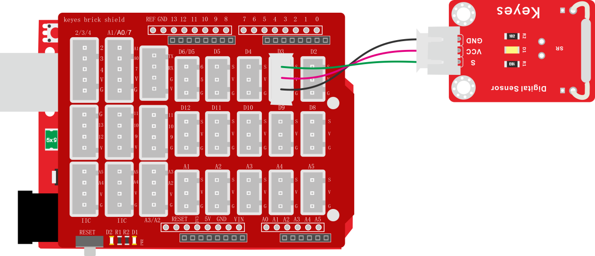

测试代码

int val = 0;

void setup() {

Serial.begin(9600);//设置波特率为9600

pinMode(3, INPUT);//设置模式为输入

}

void loop() {

val = digitalRead(3);//读取数字电平

Serial.print(val);//串口显示出来

if (val == 0) {//附近存在磁场

Serial.print(" ");

Serial.println("A magnetic field");

delay(100);

}

else {//无磁场

Serial.print(" ");

Serial.println("There is no magnetic field");

delay(100);

}

}

代码说明

设置方法和实验七类似，这里就不多做介绍了。

测试结果

上传测试代码成功，利用USB线上电后，打开串口监视器，设置波特率为9600。串口监视器显示对应数据和字符。实验中，当传感器检测到磁场时，val为0，串口监视器显示“A magnetic field”字符；没有检测到磁场时，val为1，串口监视器显示“There is no magnetic field”字符，如下图。

### 实验十 霍尔传感器检测磁场

实验说明

在这个套件中，有一个霍尔传感器，它主要采用A3144霍尔元件。该元件是由电压调整器、霍尔电压发生器、差分放大器、史密特触发器，温度补偿电路和集电极开路的输出级组成的磁敏传感电路，其输入为磁感应强度，输出是一个数字电压讯号。它是单极开关型的霍尔传感器，只感应南极磁场。传感器感应到无磁场或北极磁场时，信号端为高电平；感应到南极磁场时，信号端为低电平。当感应磁场强度越强时，感应距离越长。

实验中，我们利用霍尔传感器检测南极磁场，将测试结果在串口监视器上显示。

实验器材

keyes brick 霍尔传感器\*1

keyes UNO R3开发板\*1

传感器扩展板\*1

3P 双头XH2.54连接线\*1

USB线\*1

接线图

测试代码

int val = 0;

void setup() {

Serial.begin(9600);//设置波特率为9600

pinMode(3, INPUT);//设置模式为输入

}

void loop() {

val = digitalRead(3);//读取电平

Serial.print(val);//打印信号

if (val == 0) {//存在南极磁场

Serial.println(" The magnetic field at the South Pole!");

}

else {//不存在

Serial.println(" Just be all normal!");

}

}

代码说明

设置方法和实验七类似，这里就不多做介绍了。

测试结果

上传测试代码成功，利用USB线上电后，打开串口监视器，设置波特率为9600。当传感器感应到南极磁场时和当传感器感应到无磁场或北极磁场时，串口监视器显示如图。

### 实验十一 左右倾斜检测

实验说明

在这个套件中，有一个keyes brick 倾斜模块传感器，它主要采用SW-200D
振动开关元件。SW-200D
振动开关元件是滚珠型倾斜感应单方向性触发开关。该振动开关两端一端镀金，一端镀银；镀金端为触发端，镀银端为导电端。当传感器在水平位置或向导电端（镀银）倾斜时，开关元件为开路OFF状态，传感器信号端输出高电平；当传感器向触发端（镀金）倾斜时，开关元件为闭路ON状态，传感器信号端输出低电平。

实验中，我们通过读取模块上S端高低电平，判断传感器倾斜的方向；并且，我们在串口监视器上显示测试结果。

实验器材

keyes brick 倾斜模块传感器\*1

keyes UNO R3开发板\*1

传感器扩展板\*1

3P双头XH2.54连接线\*1

USB线\*1

接线图

测试代码

int val = 0;

void setup() {

Serial.begin(9600);//设置波特率为9600

pinMode(3, INPUT);//设置传感器的PIN输入模式

}

void loop() {

val = digitalRead(3);//读取电平

Serial.print(val);//打印数字电平

if (val == 0) {

Serial.print(" ");

Serial.println("Right");

delay(100);

}

else {

Serial.print(" ");

Serial.println("Left");

delay(100);

}

}

代码说明

设置方法和实验七类似，这里就不多做介绍了。

测试结果

上传测试代码成功，利用USB线上电后，打开串口监视器，设置波特率为9600。串口监视器显示对应数据和字符。实验中，手握传感器白色接口，当传感器向右倾斜时，val为0，串口监视器显示“Right”字符；当传感器向左倾斜时，val为1，串口监视器显示“Left”字符，如下图。

### 实验十二 碰撞检测

实验说明

在这个套件中，有一个keyes brick
碰撞传感器，它主要采用1个轻触开关。当物体碰到轻触开关弹片，下压时，传感器信号端为低电平，自带D1 LED亮起；否则传感器信号端为高电平，自带D1 LED熄灭。该传感器常用于3D打印机内做限位开关。

实验中，我们通过读取模块上S端高低电平，判断传感器弹片是否下压；并且，我们在串口监视器上显示测试结果。

实验器材

keyes brick 碰撞传感器\*1

keyes UNO R3开发板\*1

传感器扩展板\*1

3P双头XH2.54连接线\*1

USB线\*1

接线图

测试代码

int val = 0;

void setup() {

Serial.begin(9600);//设置波特率为9600

pinMode(3, INPUT);//设置输入模式

}

void loop() {

val = digitalRead(3);//读取传感器的值

Serial.print(val);//打印出来

if (val == 0) {//碰撞到了

Serial.print(" ");

Serial.println("The end of his!");

delay(100);

}

else {//没碰撞

Serial.print(" ");

Serial.println("All going well");

delay(100);

}

}

代码说明

设置方法和实验七类似，这里就不多做介绍了。

测试结果

上传测试代码成功，利用USB线上电后，打开串口监视器，设置波特率为9600。串口监视器显示对应数据和字符。实验中，传感器上弹片下压时，val为0，串口监视器显示“The end of his!”字符；当松开弹片时，val为1，串口监视器显示“All going well!”字符，如下图。

### 实验十三 附近有人吗

实验说明

在这个套件中，有一个keyes brick
人体红外热释电传感器，它是一款基于热释电效应的人体热释运动传感器，能检测到人体或动物身上发出的红外线，配合菲涅尔透镜能使传感器探测范围更远更广。它主要采用RE200B-P传感器元件。

实验中，我们通过读取模块上S端高低电平，判断附近是否有人在运动；并且，我们在串口监视器上显示测试结果。

实验器材

keyes brick人体红外热释电传感器\*1

keyes UNO R3开发板\*1

传感器扩展板\*1

3P双头XH2.54连接线\*1

USB线\*1

接线图

注：传感器自带2个电位器用于调节延迟时间和接收灵敏度，方法如下图。

测试代码

int val = 0;

void setup() {

Serial.begin(9600);//设置波特率为9600

pinMode(3, INPUT);//设置输入模式

}

void loop() {

val = digitalRead(3);//读取传感器的值

Serial.print(val);//打印值

if (val == 1) {//附近有人输出高电平

Serial.print(" ");

Serial.println("Some body is in this area!");

delay(100);

}

else {//没人则输出低电平

Serial.print(" ");

Serial.println("No one!");

delay(100);

}

}

代码说明

设置方法和实验七类似，这里就不多做介绍了。

测试结果

上传测试代码成功，利用USB线上电后，打开串口监视器，设置波特率为9600。

串口监视器显示对应数据和字符。实验中，传感器检测到附近有人在运动时，val为1，串口监视器显示“Somebody is in this area!”字符；没有检测到人运动时，val为0，串口监视器显示“No one!”字符，如下图。

### 实验十四 巡线传感器检测黑白线

实验说明

在这个套件中，有一个keyes brick 巡线传感器，它主要采用1个TCRT5000 反射型
黑白线识别传感器元件。传感器的原理是利用红外线对颜色的反射率不一样，将反射信号的强弱转化成电流信号。传感器没有检测到物体或者检测到黑色物体时，信号端为高电平；检测到白色物体时，信号端为低电平；它的检测高度为
0—3cm。我们可以通过旋转传感器上电位器，调节灵敏度，即调节检测高度。当旋转电位器，是传感器上D1 LED介于不亮与亮之间的临界点时，灵敏度最好。

实验中，我们通过读取模块上S端高低电平，判断传感器检测到的物体颜色（黑白）；并且，我们在串口监视器上显示测试结果。

实验器材

keyes brick巡线传感器\*1

keyes UNO R3开发板\*1

传感器扩展板\*1

3P双头XH2.54连接线\*1

USB线\*1

接线图

测试代码

int val = 0;

void setup() {

Serial.begin(9600);//设置波特率为9600

pinMode(3, INPUT);//设置传感器引脚为输入模式

}

void loop() {

val = digitalRead(3);//读取传感器的值

Serial.print(val);//串口打印值

if (val == 0) {//白色

Serial.print(" ");

Serial.println("White");

delay(100);

}

else {//黑色

Serial.print(" ");

Serial.println("Black");

delay(100);

}

}

代码说明

设置方法和实验七类似，这里就不多做介绍了。

测试结果

上传测试代码成功，利用USB线上电后，打开串口监视器，设置波特率为9600。串口监视器显示对应数据和字符。实验中，当传感器没有检测到物体或者检测到黑色物体时，val为1，串口监视器显示“Black”字符；检测到白色物体（能够反光）时，val为0，串口监视器显示“White”字符，如下图。

### 实验十五 避障传感器检测障碍物

实验说明

在这个套件中，有一个keyes brick避障传感器，它主要采用一对红外线发射与接收管元件。原理就是发射管发射出一定频率的红外线，当检测方向遇到障碍物（反射面）时，红外线反射回来被接收管接收，此时指示灯亮起，经过电路处理后，信号输出接口输出数字信号。传感器上有两个电位器，一个用于调节发送功率，一个用于调节接收频率，通过调节2个电位器，我们可以调节它的有效距离。

实验中，我们通过读取传感器上S端高低电平，判断是否存在障碍物；并且，我们在串口监视器上显示测试结果。

实验器材

keyes brick避障传感器\*1

keyes UNO R3开发板\*1

传感器扩展板\*1

3P双头XH2.54连接线\*1

USB线\*1

接线图

测试代码

int val = 0;

void setup() {

Serial.begin(9600);//设置波特率为9600

pinMode(3, INPUT);//设置输入模式

}

void loop() {

val = digitalRead(3);//读取电平

Serial.print(val);//打印读取的值

if (val == 0) {//有障碍物

Serial.print(" ");

Serial.println("There are obstacles");

delay(100);

}

else {//没检测到障碍物

Serial.print(" ");

Serial.println("All going well");

delay(100);

}

}

代码说明

设置方法和实验七类似，这里就不多做介绍了。

特别注意

烧录好测试代码，按照接线图连接好线，上电后，我们开始调节两个电位器调节感应距

离。

1.调节发射功率调节电位器，先将电位器顺时针到尽头，然后回调一些，使传感器上

D1 LED介于不亮与亮之间的零界点。

2.调节接收频率调节电位器，顺时针调节时，频率增大。调节使它产生38KHz频率的方波，调节时，也观察传感器上D1 LED，使它介于不亮与亮之间的零界点。

测试结果

上传测试代码成功，利用USB线上电后，打开串口监视器，设置波特率为9600。串口监视器显示对应数据和字符。实验中，当传感器检测到障碍物时，val为0，串口监视器显示“There are obstacles”字符；没有检测到障碍物时，val为1，串口监视器显示“All going well”字符，如下图。

### 实验十六 魔术光杯传感器

实验说明

在这个套件中，有两个keyes brick魔术光杯传感器，它的原理是利用PWM调光的原理，两个传感器的亮度发生变化。滚珠开关提供数字信号，触发PWM的调节，通过程序的设计，我们就能看到类似于两组装满光的杯子倒来倒去的效果了。

实验中，我们通过读取传感器上S端高低电平，判断传感器的倾斜方向，然后控制传感器上LED的亮度变化（调节L端的PWM值）。

验器材

keyes brick魔术光杯传感器\*2

keyes UNO R3开发板\*1

传感器扩展板\*1

4P双头XH2.54连接线\*2

USB线\*1

接线图

测试代码

int buttonStateA = 0;//模块1的状态

int buttonStateB = 0;//模块2的状态

int brightnessA = 0;//模块1的亮度

int brightnessB = 1000;//模块2的亮度

int sensor1=A2,sensor2=A4;//模块1传感器接A2，模块2传感器接A4

int led1=A3,led2=A5;//模块1led接A3，模块2led接A5

void PWMA(int val1) {//输出模拟值val

for (int i = 1; i \<= 5; i = i + 1) {

digitalWrite(led1, HIGH);

delayMicroseconds(val1);

digitalWrite(led1, LOW);

delayMicroseconds(1000 - val1);

}

}

void PWMB(int val2) {//输出模拟值val2

for (int i = 1; i \<= 5; i = i + 1) {

digitalWrite(led2, HIGH);

delayMicroseconds(val2);

digitalWrite(led2, LOW);

delayMicroseconds(1000 - val2);

}

}

void setup() {

Serial.begin(9600);//设置波特率为9600

pinMode(sensor1, INPUT);//传感器1输入模式

pinMode(led1,OUTPUT);//LED1输出模式

pinMode(sensor2, INPUT);//传感器2输入模式

pinMode(led2,OUTPUT);//LED2输出模式

}

void loop() {

buttonStateA = digitalRead(sensor1);//读取传感器1的转态

buttonStateB = digitalRead(sensor2);//读取传感器2的转态

**if (buttonStateA == 1 && brightnessA != 1000)
{//如果传感器1的转态为1，但亮度不到1000**

brightnessA = brightnessA + 1;//变亮

}

**else if (buttonStateA == 0 && brightnessA != 0)
{//如果传感器1的转态为0，但亮度不到0**

brightnessA = brightnessA - 1;//变暗

}

**if (buttonStateB == 1 && brightnessB != 0)
{//如果传感器2的转态为1，但亮度不到0**

brightnessB = brightnessB - 1;//变暗

}

**else if (buttonStateB == 0 && brightnessB != 1000)
{//如果传感器2的转态为0，但亮度不到1000**

brightnessB = brightnessB + 1;//变亮

}

//打印出两个模块的亮度值

Serial.print(brightnessA);

Serial.print(" ");

Serial.println(brightnessB);

if (brightnessA == 0) {//当LED1亮度为0

digitalWrite(led1, LOW);//熄灭

}

else if (brightnessA == 1000) {//当LED1亮度为1000

digitalWrite(led1, HIGH);//最亮

}

**else if (buttonStateA \> 0 && brightnessA \< 1000)
{//否则亮度在中间的话**

PWMA(brightnessA);//输出模拟值

}

//下同

if (brightnessB == 0) {

digitalWrite(led2, LOW);

}

else if (brightnessB == 1000) {

digitalWrite(led2, HIGH);

}

else if (brightnessB \> 0 && brightnessB \< 1000) {

PWMB(brightnessB);

}

}

代码说明

1.  PWMA（）子程序，，模拟PWM口的PWM值，设置方波，设置高低电平延迟时间总共为1000微妙，即周期为1毫秒，频率是1000Hz。设置是PWM值就相当于设置方波时高电平的延迟时间（val1和val2）。

2.  delayMicroseconds(us)，延时函数，与delay（）不同的是，该函数参数us为微秒，代表延迟微秒数。

3.  设置程序逻辑如下表格

<table>
<colgroup>
<col style="width: 15%" />
<col style="width: 84%" />
</colgroup>
<tbody>
<tr>
<td>条件</td>
<td>数字口A2（buttonStateA）为高电平并且brightnessA不是1000</td>
</tr>
<tr>
<td>设置</td>
<td>brightnessA设置为brightnessA加1（最大1000）</td>
</tr>
<tr>
<td>条件</td>
<td>数字口A2（buttonStateA）为低电平并且brightnessA不是0</td>
</tr>
<tr>
<td>设置</td>
<td>brightnessA设置为brightnessA减1（最小0）</td>
</tr>
<tr>
<td>条件</td>
<td>数字口A4（buttonStateB）为高电平并且brightnesB不是0</td>
</tr>
<tr>
<td>设置</td>
<td>brightnessB设置为brightnessB减1（最小0）</td>
</tr>
<tr>
<td>条件</td>
<td>数字口A4（buttonStateB）为低电平并且brightnessB不是1000</td>
</tr>
<tr>
<td>设置</td>
<td>brightnessB设置为brightnessB加1（最大1000）</td>
</tr>
<tr>
<td>条件</td>
<td>brightnessA为0</td>
</tr>
<tr>
<td>设置</td>
<td>设置数字口A3为低电平</td>
</tr>
<tr>
<td>条件</td>
<td>brightnessA为1000</td>
</tr>
<tr>
<td>设置</td>
<td>设置数字口A3为高电平</td>
</tr>
<tr>
<td>条件</td>
<td>brightnessA大于0且小于1000</td>
</tr>
<tr>
<td>设置</td>
<td>利用数字口A3模拟PWM口，设置A3的PWM值为brightnessA</td>
</tr>
<tr>
<td>条件</td>
<td>brightnessB为0</td>
</tr>
<tr>
<td>设置</td>
<td>设置数字口A5为低电平</td>
</tr>
<tr>
<td>条件</td>
<td>brightnessB为1000</td>
</tr>
<tr>
<td>设置</td>
<td>设置数字口A5为高电平</td>
</tr>
<tr>
<td>条件</td>
<td>brightnessB大于0且小于1000</td>
</tr>
<tr>
<td>设置</td>
<td>利用数字口A5模拟PWM口，设置A5的PWM值为brightnessB</td>
</tr>
</tbody>
</table>

测试结果

上传测试代码成功，利用USB线上电后，打开串口监视器，设置波特率为9600。将两个魔术光杯传感器同时倾斜一边，
一个魔术光杯上的LED逐渐变暗，同时另一个逐渐变亮，最终一个LED完全熄灭，一个LED最亮；在串口监视器中看到对应具体数值变化，如下图。当倾斜另一边中，现象一样，方向相反。

### 实验十七 光折断计数

实验说明

这个套件中包含一个 keyes brick
光折断传感器，它主要采用1个ITR-9608光电开关。它属于对射遮断式光电开关光学开关传感器。当用纸片挡住传感器凹槽后，传感器信号端为高电平，自带D1 LED熄灭；否则传感器信号端为低电平，自带D1 LED亮起。

在这里，我们通过检测传感器信号端高低电平，通过代码设置，模拟出流水线上利用类似传感器，对产品进行计数。

实验器材

keyes brick光折断传感器\*1

keyes UNO R3开发板\*1

传感器扩展板\*1

3P双头XH2.54连接线\*1

USB线\*1

接线图

测试代码

int PushCounter = 0; //计数赋初值0

int State = 0; //当前的状态

int lastState = 0; //之前的状态

void setup() {

Serial.begin(9600);//设置波特率为9600

pinMode(3, INPUT);//设置模式为输入

}

void loop() {

State = digitalRead(3);//读取当前状态

if (State != lastState) {//如果与之前的状态不相同

if (State == 1) {//光线折断

PushCounter = PushCounter + 1;//计数加1

}

}

lastState = State;//更新状态

Serial.println(PushCounter);//打印计数

}

代码说明

通过以下表格，我们可以了解这个代码的逻辑设置。

<table>
<colgroup>
<col style="width: 30%" />
<col style="width: 41%" />
<col style="width: 27%" />
</colgroup>
<tbody>
<tr>
<td rowspan="3">初始设置</td>
<td colspan="2">PushCounter设置为0（累计通过物体数目）</td>
</tr>
<tr>
<td colspan="2">State设置为0（传感信号端数值）</td>
</tr>
<tr>
<td colspan="2">lastState设置为0（传感器信号端上一循环数值）</td>
</tr>
<tr>
<td>当物体开始穿过传感器凹槽时（一瞬间）</td>
<td>State检测到变为1，lastState为0，两个数据不相等。</td>
<td>
PushCounter设置为

PushCounter加1
</td>
</tr>
<tr>
<td>当物体穿过传感器凹槽过程中（循环）</td>
<td>State检测到变为1，lastState设置为1，两个数据相等。</td>
<td>PushCounter不变</td>
</tr>
<tr>
<td>当物体刚穿过传感器凹槽过程中（一瞬间）</td>
<td>State检测到变为0，lastState设置为1，两个数据不相等。</td>
<td>PushCounter不变</td>
</tr>
<tr>
<td>当物体完全穿过传感器凹槽后（循环）</td>
<td>State检测到变为0，lastState设置为0，两个数据相等。</td>
<td>PushCounter不变</td>
</tr>
</tbody>
</table>

测试结果

上传测试代码成功，按照接线图接好线，利用USB上电后，打开串口监视器，设置波特率为9600；串口监视器显示PushCounter数据，每个物体穿过传感器凹槽，PushCounter数据不断加1。

### 实验十八 旋转编码器模块计数

实验说明

在这个套件中，有一个keyes brick
旋转编码器模块，它主要采用20脉冲旋转编码器元件。它可通过旋转计数正方向和反方向转动过程中输出脉冲的次数，这种转动计数是没有限制的，复位到初始状态，即从0开始计数。如果我们只计算信号的脉冲，则可以使用两个输出中的任何一个来确定旋转位置。但是，如果我们想要确定旋转方向，我们需要同时考虑两个信号。

实验中，我们利用keyes brick
旋转编码器模块用于计数，当我们顺时针旋转编码器时，设置数据i加1；逆时针旋转编码器时，设置数据i减1；按下编码器中间按键时，设置数据i为0；将测试结果在串口监视器上显示。

实验器材

keyes brick 旋转编码器模块\*1

keyes UNO R3开发板\*1

传感器扩展板\*1

5P双头XH2.54连接线\*1

USB线\*1

接线图

测试代码

\#include \<Encoder.h\>//导入编码器的库

int item = 0;

int old = 0;

Encoder encoder(2, 3);

int button = 4;//按键的PIN

void setup() {

Serial.begin(9600);//设置波特率

pinMode(button, INPUT);//按键为输入模式

}

void loop() {

item = encoder.read();//读取编码器的值赋给item

if (digitalRead(button) == 0) {//如果按键按下

Serial.println(digitalRead(button));//打印按键值

delay(100);

}

if (old != item) {//与之前读取的值不一样

Serial.println(item);//打印编码器的值

old = item;

}

}

代码说明

1.在实验中，我们需要把编码器的库导入到我们的IDE库文件夹中，不然编译不过。

2.  我们把CLK设置为2、DAT设置为3。该代码在库文件中设置好了，它的意思是中断2（CLK）下降后，读取数字口3（DAT）电压，当DAT电压为高电平时，旋转编码器的值加1；当DAT电压为低电平时，转编码器的值减1。

3.  然后循环程序中设置按钮管脚（D4）为低电平时，打印出来。

测试结果

上传测试代码成功，利用USB线上电后，打开串口监视器，设置波特率为9600。顺时针旋转编码器，显示数据减小；逆时针旋转编码器，显示数据增加；按下编码器中间按键，显示数据为0，如下图。

### 实验十九 敲击模块传感器检测状态

实验说明

在这个套件中，有一个敲击模块传感器，它主要采用SW-2802振动开关元件。SW-2802振动开关元件是弹簧型震动感应触发开关。该振动开关在静止時为开路OFF状态，
当受到外力碰触而达到相应震动力时,或移动速度达到适当离(偏)心力时，导电接脚会产生瞬间导通呈瞬间ON状态;当外力消失時,开关恢复为开路OFF状态。该传感器就是利用元件这一特性，搭建电路将震动信号转换为高低电平变换信号。

实验中，我们利用敲击模块传感器检测敲击状态，将测试结果在串口监视器上显示。

实验器材

keyes brick 敲击模块传感器\*1

keyes UNO R3开发板\*1

传感器扩展板\*1

3P 双头XH2.54连接线\*1

USB线\*1

接线图

测试代码

void attachInterrupt_fun_3() { //中断服务函数

procedure();

}

void procedure() {

Serial.println("Knock on!");//触发中断打印"Knock on!"

delay(100);

}

void setup(){

Serial.begin(9600);//设置波特率为9600

pinMode(3, INPUT_PULLUP);//引脚3配置为输入上拉模式

attachInterrupt(digitalPinToInterrupt(3),attachInterrupt_fun_3,FALLING);//中断引脚为D3，下降沿触发

}

void loop(){

Serial.println("All going well!");

delay(200);

}

代码说明

1.  在这一实验中，我们主要接触到的新知识是中断知识。keyes UNO     R3开发板的中断

    口是数字口2和数字口3，我们把信号端设置在数值口3了。

2.  pinMode(pin,     INPUT_PULLUP);这条代码的意思是配置管脚pin为输入上拉，之前我们说到配置为输入模式时，引脚的电平是悬浮状态，是不确定的，当我们设置为输入上拉模式时，电平处于确定的，高电平状态，除非我们改变它。

3.  attachInterrupt(digitalPinToInterrupt(pin), ISR,     mode)的第一个参数是中断号。通常使用digitalPinToInterrupt（pin）将实际的数字引脚转换为特定的中断号。例如连接到引脚3，则使用digitalPinToInterrupt（3）作为attachInterrupt（）的第一个参数。ISR为中断服务程序，是中断发生时调用的函数。Mode为出发中断模式，我们使用的UNO     R3开发板有四种触发中断模式：LOW：引脚为低电平时触发；CHANGE:引脚电平改变时触发；RISING：上升沿触发即电平由低变高时触发；FALLING：下降沿触发即电平由高变低时触发。这里我们使用了FALLING。

测试结果

上传测试代码成功，利用USB线上电后，打开串口监视器，设置波特率为9600。当传感器敲击信号时，传感器监视器显示“Knock on!”字符；否则显示“All going well!”字符，如下图。

### 实验二十 超声波测距

实验说明

在这个套件中，有一个HC-SR04超声波传感器，它可以检测前方是否存在障碍物，并且检测出传感器与障碍物的详细距离。它的原理和蝙蝠飞行的原理一样，就是超声波模块发送出一种频率很高，人体无法听到的超声波信号。这些超声波的信号若是碰到障碍物，就会立刻反射回来，在接收到返回的信息之后，通过判断发射信号和接收信号的时间差，计算出传感器和障碍物的距离。

实验中，我们利用传感器检测传感器和障碍物之间的距离，将测试结果在串口监视器上显示。

实验器材

keyes brick HC-SR04超声波传感器\*1

keyes UNO R3开发板\*1

传感器扩展板\*1

4P 双头XH2.54连接线\*1

USB线\*1

接线图

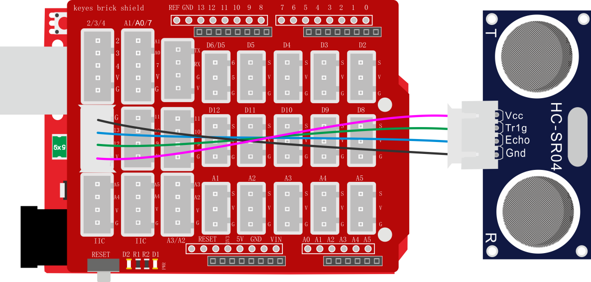

测试代码

int distance = 0; //定义一个用来接收距离的变量

int EchoPin = 13; //Echo引脚接D13

int TrigPin = 12; //Trig引脚接D12

float checkdistance() { //获取距离

// Give a short LOW pulse beforehand to ensure a clean HIGH pulse:

digitalWrite(TrigPin, LOW);

delayMicroseconds(2);

// The sensor is triggered by a HIGH pulse of 10 or more microseconds.

digitalWrite(TrigPin, HIGH);

delayMicroseconds(10);

digitalWrite(TrigPin, LOW);

// Read the signal from the sensor: a HIGH pulse whose

// duration is the time (in microseconds) from the sending

// of the ping to the reception of its echo off of an object.

float distance = pulseIn(EchoPin, HIGH) / 58.00;

delay(10);

return distance;

}

void setup() {

Serial.begin(9600);//设置波特率为9600

pinMode(TrigPin, OUTPUT);//Trig引脚为输出

pinMode(EchoPin, INPUT); //Echo引脚为输入

}

void loop() {

distance = checkdistance();

if (distance \< 2 || distance \>= 400) { //在范围外打印"-1"

Serial.println("-1");

delay(100);

}

else { //打印距离，单位厘米

Serial.print("distance:");

Serial.print(distance);

Serial.println("cm");

delay(100);

}

}

代码说明

HC-SR04超声波传感器最大测试距离为3-4m，最小测试距离为2cm。设置代码当检测距离小于2cm或者大于等于400cm时，串口监视器显示-1。我们在电脑的串口监视器中显示除传感器和障碍物之间的距离。

测试结果

上传测试代码成功，利用USB线上电后，打开串口监视器，设置波特率为9600。如果障碍物在测试范围外，串口监视器显示“-1”；否则，串口监视器显示超声波传感器和前方障碍物之间的距离，单位为cm，如下图。

### 实验二十一 红外接收

实验说明

这一实验中，我们了解下红外接收传感器的使用方法。红外接收传感器主要采用VS1838B红外接收传感器元件。该元件是集接收、放大、解调一体的器件，内部IC就已经完成了解调，输出的就是数字信号。它可接收标准38KHz调制的遥控器信号。

实验中，我们利用红外接收传感器接收外部红外发射设备发射的红外信号，并将接收信号在串口监视器上显示。

实验器材

keyes brick 红外接收传感器\*1

keyes UNO R3开发板\*1

传感器扩展板\*1

3P 双头XH2.54连接线\*1

USB线\*1

JMP-1 17键 红外遥控\*1

接线图

测试代码

\#include \<IRremote.h\>

int RECV_PIN = 3;//定义数字口3

IRrecv irrecv(RECV_PIN);

decode_results results;//声明一个IRremote库函数独有的变量类型(decode_resultc)

void setup() {

Serial.begin(9600);//设置波特率

irrecv.enableIRIn();// 使能红外接收

}

void loop() {

if (irrecv.decode(&results)) { //是否接收到红外遥控信号

Serial.println(results.value, HEX); //显示数据

irrecv.resume(); //接收下个数据

}

}

代码说明

编译上传之前我们先导入库文件IRremote.h，导入方法请看前面库文件的添加方法。

下图是红外遥控的键值：

测试结果

按照接线图接线，上传测试代码成功，利用USB线上电后，打开串口监视器，里面就会显示红外接收传感器接收到的数据。

找到红外遥控器，拔出绝缘片，对准红外接收传感器的接收头按下按键。接收到信号后，红外接收传感器上的D1也开始闪烁，串口监视器显示如下图。

### 实验二十二 DS18B20温度传感器测试温度

实验说明

在这个套件中，有一个keyes brick 18B20温度传感器，它主要采用DS18B20传感器元件。我们可以利用该传感器测试当前环境中的温度。它的测量范围为－55℃～＋125℃，测量精度为±0.5℃（-10℃至+85℃范围内）。

实验中，我们利用这个温度传感器测试当前环境中的温度，测试结果分为℃和℉两种；并且，我们在串口监视器上显示测试结果。

实验器材

keyes brick 18B20温度传感器\*1

keyes UNO R3开发板\*1

传感器扩展板\*1

3P双头XH2.54连接线\*1

USB线\*1

接线图

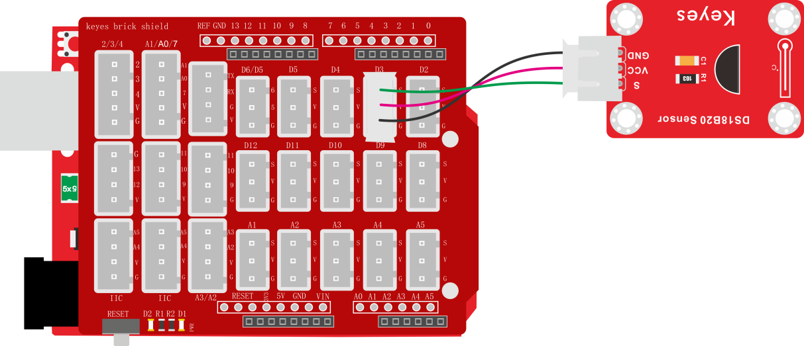

测试代码

\#include \<OneWire.h\>

\#include \<DallasTemperature.h\>

float val1;

float val2;

OneWire oneWire(3);

DallasTemperature sensors(&oneWire);

DeviceAddress insideThermometer;

float ds18b20_getTemp(int w) {

sensors.requestTemperatures();

if (w == 0) {

return sensors.getTempC(insideThermometer);

}

else {

return sensors.getTempF(insideThermometer);

}

}

void setup() {

val1 = 0;

val2 = 0;

Serial.begin(9600);

sensors.getAddress(insideThermometer, 0);

sensors.setResolution(insideThermometer, 9);

}

void loop() {

val1 = ds18b20_getTemp(0);

val2 = ds18b20_getTemp(1);

Serial.print(val1);

Serial.print("C ");

Serial.print(val2);

Serial.println("F");

delay(100);

}

代码说明

1\. 在实验中，我们需要先导入DS18B20的库文件。

2\. 我们把管脚设置为3，获取温度的单位分别设置为℃和℉。

3\. 设置两个小数变量，分别为val1和val2，将所测结果赋值给val1和val2。

4\.
串口监视器显示val1和val2的值，显示前需设置波特率（我们默认设置为9600，可更改）。

5\.
显示时，我们在数据后面添加单位，如果单位直接设置为℃和℉，测试结果会出现乱码。所以我们直接用C代替℃，F代替℉。

测试结果

上传测试代码成功，利用USB线上电后，打开串口监视器，设置波特率为9600。串口监视器显示当前环境的温度，如下图。

### 实验二十三 DHT11温湿度传感器检测温湿度

实验说明

在这个套件中，有一个keyes brick DHT11温湿度传感器，它主要采用DHT11
温湿度传感器元件。它是一款含有已校准数字信号输出的温湿度复合传感器。它应用专用的数字模块采集技术和温湿度传感技术，确保产品具有极高的可靠性与卓越的长期稳定性。传感器包括一个电阻式感湿元件和一个NTC测温元件，并与一个高性能8位单片机相连接。因此该产品具有品质卓越、超快响应、抗干扰能力强、性价比极高等优点。

实验中，我们利用这个传感器测试当前环境中的温湿度，并且，我们在串口监视器上显示测试结果。

实验器材

keyes brick DHT11温湿度传感器\*1

keyes UNO R3开发板\*1

传感器扩展板\*1

3P双头XH2.54连接线\*1

USB线\*1

接线图

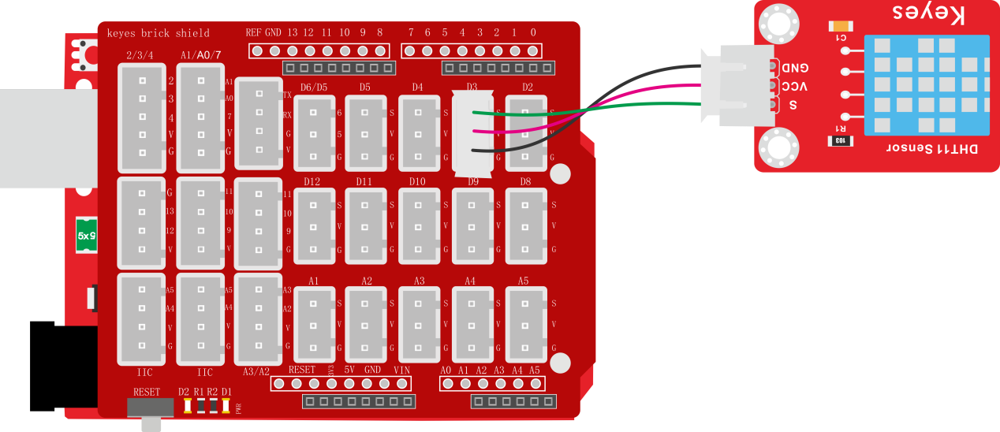

测试代码

\#include \<dht11.h\> //include the library code:

dht11 DHT;

\#define DHT11_PIN 3 //定义DHT11为数子口3

void setup() {

Serial.begin(9600);

}

void loop() {

int chk;

chk = DHT.read(DHT11_PIN); // READ DATA

switch (chk) {

case DHTLIB_OK:

break;

case DHTLIB_ERROR_CHECKSUM: //校检和错误返回

break;

case DHTLIB_ERROR_TIMEOUT: //超时错误返回

break;

default:

break;

}

// DISPLAT DATA

Serial.print("humidity:");

Serial.print(DHT.humidity);

Serial.print(" temperature:");

Serial.println(DHT.temperature);

delay(200);

}

代码说明

1\. 在实验中，我们需要先导入DHT11的库文件。

2\. 我们把管脚设置为3，选择获取温度和获取湿度。

3\. 设置两个小数变量，分别为val1和val2，将所测结果赋值给val1和val2。

4\.
串口监视器显示val1和val2的值，显示前需设置波特率（我们默认设置为9600，可更改）。

5\.
显示时，我们在数据后面添加单位。如果温度单位直接设置为℃，测试结果可能出现乱码，所以我们直接用C代替℃；湿度单位直接设置为%。

测试结果

上传测试代码成功，利用USB线上电后，打开串口监视器，设置波特率为9600。串口监视器显示当前环境中的温湿度数据，如下图。

### 实验二十四 可调电位器模块读取模拟值

实验说明

在这个套件中，有一个keyes brick 可调电位器模块，它主要采用一个10K
可调电阻。通过旋转电位器，我们可以改变电阻大小，然后搭建电路将电阻变化转换为电压变化。

实验中，我们利用这个模块测试对应的模拟值；并且，我们在串口监视器上显示测试结果。

实验器材

keyes brick 可调电位器模块\*1

keyes UNO R3开发板\*1

传感器扩展板\*1

3P双头XH2.54连接线\*1

USB线\*1

接线图

测试代码

volatile int item=0;

void setup(){

Serial.begin(9600);//设置波特率

}

void loop(){

item = analogRead(A3);//读取电位器的值

Serial.println(item);//打印值

delay(100);//延时100MS

}

代码说明

1.  在实验中，我们把管脚设置为A3。

2.  设置1个整数变量item，将所测结果赋值给item。

3.  串口监视器显示item的值，显示前需设置波特率（我们默认设置为9600，可更改）。

测试结果

上传测试代码成功，利用USB线上电后，打开串口监视器，设置波特率为9600。串口监视器显示对应模拟值。实验中，顺时针旋转电位器，模拟值增大，逆时针旋转电位器，模拟值减小，范围为0-1023，如下图。

### 实验二十五 TEMT6000光线传感器

实验说明

在这个套件中，有一个keyes brick TEMT6000光线传感器，它主要采用TEMT6000X01元件。该元件是一个高灵敏可见光光敏（NPN型）三极管。传感器可以将捕获的微小光线变化并放大100倍左右，并且轻松的被微控制器识别，进行AD转换。它对可见光照度的反应特性与人眼的特性类似，可以模拟人对环境光线的强度的判断，从而方便做出与人友好互动的应用。

实验中，我们利用这个传感器测试当前环境中的光照强度对应的模拟值，光照越强，模拟值越大；并且，我们在串口监视器上显示测试结果。

实验器材

keyes brick TEMT6000光线传感器\*1

keyes UNO R3开发板\*1

传感器扩展板\*1

3P双头XH2.54连接线\*1

USB线\*1

接线图

测试代码

volatile int item = 0;

void setup() {

Serial.begin(9600);//设置波特率

}

void loop() {

item = analogRead(A3);//读取电位器的值

Serial.println(item);//打印值

delay(100);//延时100MS

}

代码说明

1.  设置方法和实验二十四类似，这里就不多做介绍了。

测试结果

烧录好测试代码，按照接线图连接好线，利用USB线上电后，打开软件串口监视器，设置波特率为9600，我们可以看到对应光照强度的模拟值，光照越强，模拟值越大，如下图。

### 实验二十六 热敏电阻传感器简单测试

实验说明

在这个套件中，有一个热敏电阻传感器，它主要采用NTC-MF52AT热敏电阻元件。NTC-MF52AT热敏电阻元件能够时感知周边环境温度的变化，电阻大小随着温度的变化而变化。该传感器就是利用NTC-MF52AT热敏电阻元件这一特性，搭建电路将电阻变化转换为电压变化。

实验中，我们将传感器信号端接到keyes UNO R3开发板模拟口，读出对应的模拟值。我们可以利用模拟值，通过特定公式，计算出当前环境的温度。由于温度计算公式比较复杂，这里就不多介绍了。实验中，我们只是读取对应的模拟值。

实验器材

keyes brick 热敏电阻传感器\*1

keyes UNO R3开发板\*1

传感器扩展板\*1

3P 双头XH2.54连接线\*1

USB线\*1

接线图

测试代码

void setup() {

Serial.begin(9600);//设置波特率为9600

}

void loop() {

Serial.println(analogRead(A3));//读取并打印热敏电阻模拟值

delay(100);//延时100毫秒

}

代码说明

设置方法和实验二十四类似，这里就不多做介绍了。

测试结果

上传测试代码成功，利用USB线上电后，打开串口监视器，设置波特率为9600。串口监视器显示对应的模拟值，温度越高，模拟值越大。

### 实验二十七 麦克风声音传感器检测声音大小

实验说明

在这个套件中，有一个keyes brick
麦克风声音传感器，它主要采用一个高感度麦克风元件和LM386芯片。高感度麦克风元件用于检测外界的声音。利用LM386芯片搭建合适的电路，我们对高感度麦克风检测到的声音进行放大，最大倍数为200倍。使用时我们可以通过旋转传感器上电位器，调节声音的放大倍数。调节时，顺时针调节电位器到尽头，放大倍数最大。

实验中，我们利用这个传感器测试当前环境中的声音大小对应的模拟值，声音越大，模拟值越大；并且，我们在串口监视器上显示测试结果。

实验器材

keyes brick 麦克风声音传感器\*1

keyes UNO R3开发板\*1

传感器扩展板\*1

3P双头XH2.54连接线\*1

USB线\*1

接线图

测试代码

volatile int item = 0;

void setup() {

Serial.begin(9600);//设置波特率9600

}

void loop() {

item = analogRead(A3);//传感器接A3

Serial.println(item);//换行打印

delay(100);//加延时100MS

}

代码说明

设置方法和实验二十四类似，这里就不多做介绍了。

测试结果

上传测试代码成功，利用USB线上电后，打开串口监视器，设置波特率为9600。串口监视器显示对应模拟值。实验中，我们顺时针旋转电位器和对准MIC头大声说话，可以看到模拟值数据变大，如下图。

### 实验二十八 MQ-2 烟雾传感器

实验说明

在这个套件中，有一个keyes brick MQ-2 烟雾传感器，它主要用到了MQ-2
可燃气体、烟雾传感器元件。该元件所使用的气敏材料是在清洁空气中电导率较低的二氧化锡(SnO2)。当传感器所处环境中存在可燃气体时，传感器的电导率随空气中可燃气体浓度的增加而增大。该传感器对液化气、丙烷、氢气的灵敏度高，对天然气和其它可燃蒸汽的检测也很理想。它可检测多种可燃性气体，是一款适合多种应用的低成本传感器。

使用时，A0端读取对应气体的模拟值；D0端连接一个LM393芯片（比较器），我们可以通过电位器调节测量气体报警临界点，在D0输出数字值。当测量气体含量超过临界点时，D0端输出低电平；测量气体含量没超过临界点时，D0端输出高电平。

实验中，我们读取传感器A0端模拟值，和D0端数字值，判断空气中测量气体的含量，以及它们是否超标。

实验器材

keyes brick MQ-2 烟雾传感器\*1

keyes UNO R3开发板\*1

传感器扩展板\*1

4P 双头XH2.54连接线\*1

USB线\*1

接线图

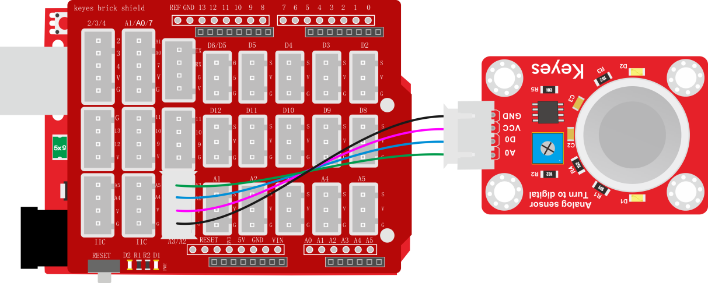

测试代码

volatile int val1 = 0;

volatile int val2 = 0;

void setup() {

Serial.begin(9600);

pinMode(A2, INPUT);

}

void loop() {

val1 = digitalRead(A2);//读取数字值

Serial.print(val1);

if (val1 == 1) {

Serial.println(" Normal");

}

else {

Serial.println(" Exceeding");

}

val2 = analogRead(A3);//读取模拟值

Serial.println(val2);

delay(100);

}

代码说明

参考实验七，根据A2管脚高低电平，设置串口监视器输出不同字符。根据接线，读取模拟口A3的模拟值，并将测试结果只是串口监视器上显示。

测试结果

上传测试代码成功，利用USB线上电后，打开串口监视器，设置波特率为9600。串口监视器显示对应数据和字符。实验中，我们可以看到当测试的模拟值小于等于374时，气体含量没有超过临界点；当测试的模拟值大于等于522时，气体含量超过临界点；那么就代表气体含量临界点对于的模拟值在374-522之间，我们可以通过旋转传感器上电位器，调节临界点。

### 实验二十九 MQ-3 酒精传感器

实验说明

在这个套件中，有一个keyes brick MQ-3 酒精传感器，它主要用到了MQ-3
酒精、乙醇蒸汽传感器元件。该元件所使用的气敏材料是在清洁空气中电导率较低的二氧化锡(SnO2)。当传感器所处环境中存在酒精蒸汽时，传感器的电导率随空气
中酒精蒸汽浓度的增加而增大。

使用时，A0端读取对应酒精蒸汽的模拟值；D0端连接一个LM393芯片（比较器），我们可以通过电位器调节测量酒精蒸汽报警临界点，在D0输出数字值。当测量酒精蒸汽含量超过临界点时，D0端输出低电平；测量酒精蒸汽含量没超过临界点时，D0端输出高电平。

实验中，我们读取传感器A0端模拟值，和D0端数字值，判断空气中酒精蒸汽的含量，以及它们是否超标。

实验器材

keyes brick MQ-3 酒精传感器\*1

keyes UNO R3开发板\*1

传感器扩展板\*1

4P双头XH2.54连接线\*1

USB线\*1

接线图

测试代码

volatile int val1 = 0;

volatile int val2 = 0;

void setup() {

Serial.begin(9600);

pinMode(A2, INPUT);//设置为输入模式

}

void loop() {

val1 = digitalRead(A2);//读取数字值

Serial.print(val1);

if (val1 == 1) {

Serial.println(" Normal");

}

else {

Serial.println(" Exceeding");

}

val2 = analogRead(A3);//读取模拟值

Serial.println(val2);

delay(100);

}

代码说明

设置方法和实验二十八类似，这里就不多做介绍了。

测试结果

上传测试代码成功，利用USB线上电后，打开串口监视器，设置波特率为9600。串口监视器显示对应数据和字符。实验中，我们可以看到当测试的模拟值小于等于73时，酒精蒸汽含量没有超过临界点；当测试的模拟值大于等于76时，酒精蒸汽含量超过临界点；那么就代表酒精蒸汽含量临界点对于的模拟值在73-76之间，我们可以通过旋转传感器上电位器，调节临界点。

### 实验三十 摇杆模块传感器

实验说明

在这个套件中，有一个keyes brick 摇杆模块传感器，它主要采用PS2
手柄摇杆元件。控制时，我们需要将模块X Y端口连接单片机模拟口，B端口连接单片机数字口，VCC接单片机电源输出端（3.3-5V），GND接单片机GND。我们可以读取两个模拟值和一个数字口的高低电平情况，判断模块上摇杆的工作状态。

实验中，我们将读取两个模拟值和一个数字值，并在串口监视器上显示测试结果。

实验器材

keyes brick 摇杆模块传感器\*1

keyes UNO R3开发板\*1

传感器扩展板\*1

5P双头XH2.54连接线\*1

USB线\*1

接线图

测试代码

volatile int X = 0;

volatile int Y = 0;

volatile int Button = 0;

void setup() {

Serial.begin(9600);

pinMode(7, INPUT);//定义按键的PIN为数字口7

}

void loop() {

X = analogRead(A0);

Y = analogRead(A1);

Button = digitalRead(7);

Serial.write("X:");

Serial.print(X);

Serial.write(" Y:");

Serial.print(Y);

Serial.write(" B:");

Serial.println(Button);

delay(100);

}

代码说明

1.在实验中，根据接线，x管脚设置为A0，y管脚设置为A1，摇杆按钮管脚设置为7，串口监视器显示测试数据，显示前需设置波特率（我们默认设置为9600，可更改）。

测试结果

上传测试代码成功，利用USB线上电后，打开串口监视器，设置波特率为9600。串口监视器显示对应数值。摇动摇杆，x轴和y轴对应的模拟值发生改变，按下按钮，读取到的数字值为1，否则为0，如下图。

### 实验三十一 手指测心跳模块

实验说明

在这个套件中，有一个手指测心跳模块，它主要由1个光敏接收器和1个红外发射器组成。红外发射器在手指的一面，光敏接收器在手指的另一面；光敏接收器用来获取发射的光通量；当血压脉动通过手指时，光敏接收器的电阻会用微小的变化。

使用时，我们提供该模块和arduino系列单片机搭配使用的方法。**测试时，特别需要注意，需要用黑布包裹模块和手指，确保在无光环境中测试，否则测试不准确。**

实验中，我们将测试得到是数据，复制到Excel上，并生成相应的图片。

实验器材

keyes brick 手指测心跳模块\*1

keyes UNO R3开发板\*1

传感器扩展板\*1

3P 双头XH2.54连接线\*1

USB线\*1

接线图

测试代码

int sensorPin = A3; // 传感器的引脚为A3

void setup() {

Serial.begin(9600);//设置波特率为9600

}

void loop() {

int value = analogRead(A3); //读取模拟值

Serial.println(value);//打印出来

}

代码说明

将管脚设置为A3，将所测数据用串口监视器打印出来。

测试结果

烧录好测试代码，按照接线图连接好线；利用USB接口上电后，进入串口监视器，设置波特率为9600。用，用手指按住光敏接收器，用黑布包裹模块和手指。串口监视器显示对应数据，如下图。

等待一会，将串口监视器数据复制到excel上，生成对应图片，如下图。

### 实验三十二 ADXL345加速度传感器

实验说明

在这个套件中，有一个keyes brick ADXL345加速度传感器，它采用ADXL345BCCZ芯片。ADXL345BCCZ是一款小而薄的低功耗3轴加速度计，分辨率高（13位），测量范围达±16g。它数字输出数据为16位二进制补码格式，可通过SPI（3线或4线）或I2C数字接口访问。该传感器非常适合移动设备应用。它可以在倾斜检测应用中测量静态重力加速度，还可以测量运动或冲击导致的动态加速度。其高分辨率(4mg/LSB)，能够测量不到1.0°的倾斜角度变化。

实验中，我们测试出传感器X Y Z轴的加速度数值；并且，我们在串口监视器上显示测试数据。

实验器材

keyes brick ADXL345加速度传感器\*1

keyes UNO R3开发板\*1

传感器扩展板\*1

4P双头XH2.54连接线\*1

USB线\*1

接线图

测试代码

\#include \<Wire.h\>

\#include \<I2Cdev.h\>

\#include \<ADXL345.h\> //ADXL345的库

float X = 0;

float Y = 0;

float Z = 0;

ADXL345 accel;

void setup() {

Serial.begin(9600);

Wire.begin();

accel.initialize(); //初始化

}

void loop() {

//读取加速度值

X = accel.getAccelerationX();

Y = accel.getAccelerationY();

Z = accel.getAccelerationZ();

//打印加速度值

Serial.print("X:");

Serial.print(X);

Serial.print("g Y:");

Serial.print(Y);

Serial.print("g Z:");

Serial.print(Z);

Serial.println("g");

delay(100);

}

代码说明

设置3个小数变量X Y Z，将所测结果赋值给X Y Z。串口监视器显示X Y Z的值，显示前需设置波特率（我们默认设置为9600，可更改）。

测试结果

上传测试代码成功，利用USB线上电后，打开串口监视器，设置波特率为9600。串口监视器显示传感器对应的X Y Z的值，单位为g，如下图。

### 实验三十三 震动模块传感器

实验说明

这是一个常用的震动模块传感器。它具有无方向性特性，任何角度均可以触发工作，完全密封式封装可以防水、防尘，适用于小电流电路的触发。

传感器接上电源后，在静止时为开路（OFF）状态，信号端输出为高电平，传感器上LED变暗；当受到外力碰触而达到适当震动力时，或移动速度达到适当离（偏）心力时，导电接脚会发生瞬间导通（ON）状态，使电气特性改变，信号端输出为低电平，传感器上LED变亮；而当外力消失时电气特性恢复开路（OFF）状态。

传感器上兼容各种单片机控制板，如arduino系列单片机。使用时，我们可以在单片机上堆叠一个传感器扩展板。传感器上模块和自带导线连接，然后连接在传感器扩展板上，简单方便。同时，传感器自带2个直径为3mm的定位孔，方便你将传感器固定在其他设备。

实验中，我们通过读取传感器上S端高低电平，判断传感器是否震动；并且，我们在串口监视器上显示测试结果。

实验器材

keyes brick震动模块传感器\*1

keyes UNO R3开发板\*1

传感器扩展板\*1

3P双头XH2.54连接线\*1

USB线\*1

接线图

测试代码

void attachInterrupt_fun_3() { //中断服务程序

Serial.println(" Vibrate");

}

void setup() {

Serial.begin(9600);//波特率为9600

pinMode(3, INPUT_PULLUP);//输入上拉

attachInterrupt(digitalPinToInterrupt(3), attachInterrupt_fun_3, FALLING); //下降沿触发

}

void loop() {

Serial.println(" It's still"); //循环打印

delay(100);

}

代码说明

设置方法和实验十九类似，这里就不多做介绍了。

测试结果

烧录好测试代码，按照接线图连接好线，上电后，打开串口监视器，设置波特率为9600.当传感器每检测到一次震动时，串口监视器打印Vibrate，否则打印It's still。

### 实验三十四 水滴水蒸气传感器

实验说明

这是一个常用的水滴水蒸气传感器。它的原理是通过电路板上裸露的印刷平行线检测水量的大小。水量越多，就会有更多的导线被联通，随着导电的接触面积增大，输出的电压就会逐步上升。除了可以检测水量的大小，它还可以检测空气中的水蒸气。

同时，传感器自带2个直径为3mm的定位孔，方便你将传感器固定在其他设备。

实验中，我们将传感器信号端(S端)输入到arduino系列单片机的模拟口，感知模拟值的变化，并在串口监视器上显示出对应的模拟值。

实验器材

keyes brick 水滴水蒸气传感器\*1

keyes UNO R3开发板\*1

传感器扩展板\*1

3P双头XH2.54连接线\*1

USB线\*1

接线图

测试代码

int item = 0;

int Water = A3; //水蒸气传感器的PIN为A3

void setup() {

Serial.begin(9600);//设置波特率为9600

}

void loop() {

item = analogRead(A3); //读取水蒸气传感器的值

Serial.print("Water:");

Serial.println(item);

delay(100);

}

代码说明

设置方法和实验二十八类似，这里就不多做介绍了。

测试结果

烧录好测试代码，按照接线图连接好线；利用USB接口上电后，进入串口监视器，设置波特率为9600。当水蒸气传感器上检测到水分时，输出的模拟值在串口监视器显示出来，如下图。

### 实验三十五 土壤传感器

实验说明

这是一个常用的土壤传感器。它可用于检测土壤中的水分。将它和其他单片机搭配使用，我们可以制作一款自动浇花装置。当您长时间不在家或过了浇水的时间，它可以感测到您的植物是否已经渴了。然后我再控制其他设备给您的植物浇水。

实验中，我们将传感器信号端(S端)输入到arduino系列单片机的模拟口，感知模拟值的变化，并在串口监视器上显示出对应的模拟值。

实验器材

keyes brick 土壤传感器\*1

keyes UNO R3开发板\*1

传感器扩展板\*1

3P双头XH2.54连接线\*1

USB线\*1

接线图

测试代码

int item = 0;

int Soil = A3; //土壤传感器接A3

void setup() {

Serial.begin(9600);//设置波特率为9600

}

void loop() {

item = analogRead(A3);//读取模拟值

Serial.print("Soil moisture:");

Serial.println(item);//打印土壤湿度值

delay(100);//延时100MS

}

代码说明

设置方法和实验二十八类似，这里就不多做介绍了。

测试结果

烧录好测试代码，按照接线图连接好线，利用USB线上电后，打开软件串口监视器，设置波特率为9600，我们可以看到对应土壤湿度的模拟值，土壤湿度越高，模拟值越大，如下图。

### 实验三十六 舵机控制

实验说明

舵机是一种位置伺服的驱动器，主要是由外壳、电路板、无核心马达、齿轮与位置检测

器所构成。舵机有很多规格，但所有的舵机都有外接三根线，分别用棕、红、橙三种颜

色进行区分，由于舵机品牌不同，颜色也会有所差异，棕色为接地线，红色为电源正极

线，橙色为信号线。

舵机的转动的角度是通过调节PWM（脉冲宽度调制）信号的占空比来实现的，标准PWM

（脉冲宽度调制）信号的周期固定为20ms（50Hz），理论上脉宽分布应在1ms到2ms

之间，但是，事实上脉宽可由0.5ms 到2.5ms 之间，脉宽和舵机的转角0°～180°相

对应。有一点值得注意的地方，由于舵机牌子不同，对于同一信号，不同牌子的舵机旋

转的角度也会有所不同。

实验器材

keyes 伺服舵机\*1

keyes UNO R3开发板\*1

传感器扩展板\*1

USB线\*1

接线图

测试代码

//代码1：

int servoPin = 9;//舵机的PIN

void setup() {

pinMode(servoPin, OUTPUT);//舵机引脚设置为输出

}

void loop() {

servopulse(servoPin, 0);//转动到0度

delay(1000);//延时1秒

servopulse(servoPin, 90);//转动到90度

delay(1000);

servopulse(servoPin, 180);//转动到180度

delay(1000);

}

void servopulse(int pin, int myangle) { //脉冲函数

int pulsewidth = map(myangle, 0, 180, 500, 2500); //将角度映射到脉宽

for (int i = 0; i \< 5; i++) { //输出脉冲

digitalWrite(pin, HIGH);//将舵机接口电平至高

delayMicroseconds(pulsewidth);//延时脉宽值的微秒数

digitalWrite(pin, LOW);//将舵机接口电平至低

delay(20 - pulsewidth / 1000);

}

}

代码2：

\#include \<Servo.h\> //舵机库

Servo myservo;

void setup() {

myservo.attach(9);//舵机连接数字口9

}

void loop() {

for (int pos = 0; pos \< 180; pos++) {

myservo.write(pos); //转动到pos角度

delay(15); //加延时转慢一点

}

for (int pos = 180; pos \> 0; pos--) {

myservo.write(pos);

delay(15);

}

delay(2000);//等待2秒

}

代码说明

代码1说明：

1.  map(value, fromLow, fromHigh, toLow,     toHigh)；value为我们要映射的值；fromLow,     fromHigh为当前值的下限和上限；toLow,     toHigh为我们要映射到的目标范围的下限和上限。比如我们在实验中map(myangle,     0, 180, 500,     2500)的意思就是我们传进来一个需要转动的角度值为myangle，然后这个值的范围是0度到180度，我们要映射的范围为500us到2500us，即把0到180转到了500到2500然后被返回了，返回的数据类型为整型，余数会被截断，不进行四舍五入或平均。

    2\.     之后我们调用我们定义的的函数servopulse（）就能让舵机转动了，代码中我们设置了让舵机从0度转动到90度再转动到180度，再转动到0度，中间暂停一秒，反复循环。

代码2说明：

1.  首先我们先添加舵机库，不然不能编译。

2.  这个库的方法.attach()方法是连接舵机引脚，我们连到9，10也可以，这里面用到了定时器，使用其他管脚可能会出现冲突。

3.  myservo.write(pos)为转动到pos角度值。myservo.read()是读取舵机当前角度值。

4.  其他设置请参照前面相关的代码说明。

测试结果

实验1 结果：

上传测试代码成功，利用USB线上电后，舵机由0度，90度，180度三个角度来回转动。

实验2 结果：

上传测试代码成功，利用USB线上电后，舵机由0~180度来回转动，并且每次转动一度。

### 实验三十七 3231时钟模块

实验说明

这个模块主要用到高精度时钟芯片DS3231。它是低成本、高精度I2C实时时钟(RTC)，具有集成的温补晶振(TCXO)和晶体。该器件包含电池输入端，断开主电源时仍可保持精确的计时。集成晶振提高了器件的长期精确度，并减少了生产线的元件数量。DS3231提供商用级和工业级温度范围，采用16引脚300mil的SO封装。

实验中，我们利用keyes brick
时钟模块获取系统时间，将测试结果在串口监视器上显示出来。

实验器材

keyes brick 3231时钟模块\*1

keyes UNO R3开发板\*1

传感器扩展板\*1

4P双头XH2.54连接线\*1

USB线\*1

接线图

测试代码

//DS3231时钟模块的库

\#include \<RtcDS3231.h\>

\#include \<SoftwareWire.h\>

SoftwareWire myWire(A4, A5); //i2c接口

RtcDS3231\<SoftwareWire\> Rtc(myWire);

void setup() {

Serial.begin(57600);//设置波特率为57600

Rtc.Begin();

Rtc.SetIsRunning(true);

Rtc.SetDateTime(RtcDateTime(\_\_DATE\_\_, \_\_TIME\_\_));

}

void loop() {

//打印年/月/日/时/分/秒/星期

Serial.print(Rtc.GetDateTime().Year());

Serial.print(" ");

Serial.print(Rtc.GetDateTime().Month());

Serial.print(" ");

Serial.print(Rtc.GetDateTime().Day());

Serial.print(" ");

Serial.print(Rtc.GetDateTime().Hour());

Serial.print(" ");

Serial.print(Rtc.GetDateTime().Minute());

Serial.print(" ");

Serial.print(Rtc.GetDateTime().Second());

Serial.print(" ");

Serial.println(Rtc.GetDateTime().DayOfWeek());

delay(1000);//延时1秒

}

代码说明

在实验中，我们需要先导入这个时钟模块的库。Rtc.GetDateTime()为获取当前系统的时间和日期。细节请看代码注释。

测试结果

烧录好测试代码，按照接线图连接好线；利用USB接口上电后，进入串口监视器，设置波特率为57600。我们可在软件串口监视器中看到设置时间日期（年、月、日、时、分、秒、周），如下图。

### 实验三十八 TM1637 4位数码管模块

实验说明

这个模块主要由一个0.36英寸 红色共阳
4位数码管组成，它的驱动芯片是TM1637。使用时，我们只需要2根信号线即可使单片机控制4位8数码管，大大节约了控制板IO口资源。

实验中，我们利用四位数码管各显示出0~9，并加延迟为1秒。

实验器材

keyes brick TM1637 4位数码管模块\*1

keyes UNO R3开发板\*1

传感器扩展板\*1

4P双头XH2.54连接线\*1

USB线\*1

接线图

测试代码

\#include "SevenSegmentTM1637.h" // 导入SevenSegmentTM1637库

/\* 初始化全局TM1637显示对象

构造函数有两个参数，时钟引脚号和数字输出引脚号：

SevenSegmentTM1637（pinCLK，pinDIO）;

\*/

int PIN_CLK = A3; //定义CLK引脚为数字口A3

int PIN_DIO = A2; //定义DIO引脚为数字口A2

SevenSegmentTM1637 display(PIN_CLK, PIN_DIO);

// run setup code

void setup() {

Serial.begin(9600); // 设置波特率为9600

display.begin(); // 初始化显示

display.setBacklight(100); // 设置亮度为100%

delay(1000); // wait 1000 ms

}

void loop() {

display.print("LOOP"); // 显示LOOP

delay(1000); // 等待1秒

display.clear(); // 清除显示

for (uint8_t i = 0; i \< 100; i++) { // 循环100次

display.print(i); // 显示计数

delay(100); // 延时100ms

}

display.clear(); // 清除显示

display.print("SUCC"); // 显示SUCC

display.blink(); // 闪烁SUCC

delay(1000); // 等待1秒

}

代码说明

在实验中，我们先导入TM1637模块的库文件，细节请看代码注释。

测试结果

烧录好测试代码，按照接线图连接好线,上电后，4位数码管按分刷新时间。

### 实验三十九 8X8点阵模块

实验说明

当我们利用单片机驱动一个8\*8点阵时，我们总共需要用到16个数字口，这样就极大的浪费单片机资料。为此，我们特别设计了这个模块，利用HT16K33芯片驱动1个8\*8点阵，只需要利用单片机的I2C通信端口控制点阵，大大的节约了单片机资源。

模块兼容各种单片机控制板，如arduino系列单片机。使用时，我们可以在单片机上堆叠一个传感器扩展板。模块和自带导线连接，然后连接在传感器扩展板上，简单方便。模块上自带3个拨码开关，可以让你随意拨动开关，这I2C通信地址。设置方法如下表格。

<table>
<colgroup>
<col style="width: 11%" />
<col style="width: 11%" />
<col style="width: 11%" />
<col style="width: 11%" />
<col style="width: 11%" />
<col style="width: 11%" />
<col style="width: 11%" />
<col style="width: 11%" />
<col style="width: 11%" />
<col style="width: 0%" />
</colgroup>
<tbody>
<tr>
<td>A0（1）</td>
<td>A1（2）</td>
<td>A2（3）</td>
<td>A0（1）</td>
<td>A1（2）</td>
<td>A2（3）</td>
<td>A0（1）</td>
<td>A1（2）</td>
<td colspan="2">A2（3）</td>
</tr>
<tr>
<td>0（OFF）</td>
<td>0（OFF）</td>
<td>0（OFF）</td>
<td>1（ON）</td>
<td>0（OFF）</td>
<td>0（OFF）</td>
<td>0（OFF）</td>
<td>1（ON）</td>
<td colspan="2">0（OFF）</td>
</tr>
<tr>
<td colspan="3">OX70</td>
<td colspan="3">OX71</td>
<td colspan="3">OX72</td>
<td></td>
</tr>
<tr>
<td>A0（1）</td>
<td>A1（2）</td>
<td>A2（3）</td>
<td>A0（1）</td>
<td>A1（2）</td>
<td>A2（3）</td>
<td>A0（1）</td>
<td>A1（2）</td>
<td colspan="2">A2（3）</td>
</tr>
<tr>
<td>1（ON）</td>
<td>1（ON）</td>
<td>0（OFF）</td>
<td>0（OFF）</td>
<td>0（OFF）</td>
<td>1（ON）</td>
<td>1（ON）</td>
<td>0（OFF）</td>
<td colspan="2">1（ON）</td>
</tr>
<tr>
<td colspan="3">OX73</td>
<td colspan="3">OX74</td>
<td colspan="3">OX75</td>
<td></td>
</tr>
<tr>
<td>A0（1）</td>
<td>A1（2）</td>
<td>A2（3）</td>
<td>A0（1）</td>
<td>A1（2）</td>
<td>A2（3）</td>
<td colspan="4" rowspan="3"></td>
</tr>
<tr>
<td>0（OFF）</td>
<td>1（ON）</td>
<td>1（ON）</td>
<td>1（ON）</td>
<td>1（ON）</td>
<td>1（ON）</td>
</tr>
<tr>
<td colspan="3">OX76</td>
<td colspan="3">OX77</td>
</tr>
</tbody>
</table>

同时，模块自带2个直径为3mm的定位孔，方便你将模块固定在其他设备。

实验中我们让点阵显示出图案。

实验器材

keyes brick 8\*8点阵模块\*1

keyes UNO R3开发板\*1

传感器扩展板\*1

4P双头XH2.54连接线\*1

USB线\*1

接线图

测试代码

\#include \<Matrix.h\>//点阵的库

Matrix myMatrix(SDA, SCL);

uint8_t LEDArray\[8\];

const uint8_t LedArray1\[8\] PROGMEM = {0x00, 0x18, 0x3c, 0x7e, 0xff, 0xff, 0x66, 0x00};//心形图案

void setup() {

myMatrix.begin(0x70);//iic地址

myMatrix.clear();//清除显示

myMatrix.setBrightness(5);//亮度5,范围0~15

}

void loop() {

memcpy_P(&LEDArray, &LedArray1, 8);

for (int i = 0; i \< 8; i++)

{

for (int j = 0; j \< 8; j++)

{

if ((LEDArray\[i\] & 0x01))

myMatrix.drawPixel(j, i, 1);

else

myMatrix.drawPixel(j, i, 0);

LEDArray\[i\] = LEDArray\[i\] \>\> 1;

}

}

myMatrix.write();

}

代码说明

1.  首先我们需要先导入库文件

2.  我们代码中的图案是一个字节数据类型的数组构成，我们在下面的表格上表示出来。

    我们将{0x00, 0x18, 0x3c, 0x7e, 0xff, 0xff, 0x66,     0x00}转化为二进制，填入下面的8\*8表格就清晰了。其中1表示亮，0表示灭，我们可以看到是一个心形。

<table>
<colgroup>
<col style="width: 12%" />
<col style="width: 12%" />
<col style="width: 12%" />
<col style="width: 12%" />
<col style="width: 12%" />
<col style="width: 12%" />
<col style="width: 12%" />
<col style="width: 12%" />
</colgroup>
<tbody>
<tr>
<td>0</td>
<td>0</td>
<td>0</td>
<td>0</td>
<td>0</td>
<td>0</td>
<td>0</td>
<td>0</td>
</tr>
<tr>
<td>0</td>
<td>0</td>
<td>0</td>
<td>1</td>
<td>1</td>
<td>0</td>
<td>0</td>
<td>0</td>
</tr>
<tr>
<td>0</td>
<td>0</td>
<td>1</td>
<td>1</td>
<td>1</td>
<td>1</td>
<td>0</td>
<td>0</td>
</tr>
<tr>
<td>0</td>
<td>1</td>
<td>1</td>
<td>1</td>
<td>1</td>
<td>1</td>
<td>1</td>
<td>0</td>
</tr>
<tr>
<td>1</td>
<td>1</td>
<td>1</td>
<td>1</td>
<td>1</td>
<td>1</td>
<td>1</td>
<td>1</td>
</tr>
<tr>
<td>1</td>
<td>1</td>
<td>1</td>
<td>1</td>
<td>1</td>
<td>1</td>
<td>1</td>
<td>1</td>
</tr>
<tr>
<td>0</td>
<td>1</td>
<td>1</td>
<td>0</td>
<td>0</td>
<td>1</td>
<td>1</td>
<td>0</td>
</tr>
<tr>
<td>0</td>
<td>0</td>
<td>0</td>
<td>0</td>
<td>0</td>
<td>0</td>
<td>0</td>
<td>0</td>
</tr>
</tbody>
</table>

测试结果

烧录好测试代码，按照接线图连接好线；上电后，点阵显示一个心形图案。

### 实验四十 IIC 1602 液晶屏

实验说明

这是一个可以显示2行，每行16个字符的液晶屏模块。液晶屏显示蓝底白字，自带I2C通信模块，使用时只需连接单片机I2C通信接口，大大节约了单片机资源。I2C通信模块上带有1个电位器，可用于调节显示屏背光，通信地址默认为0x27。

实验中我们让iic 1602显示屏显示出一些字符。

实验器材

keyes brick IIC 1602 蓝屏\*1

keyes UNO R3开发板\*1

传感器扩展板\*1

4P双头XH2.54连接线\*1

USB线\*1

接线图

测试代码

\#include \<Wire.h\>

\#include \<LiquidCrystal_I2C.h\>//通过i2c驱动lcd显示屏的库函数

LiquidCrystal_I2C mylcd(0x27, 16, 2);//将LCD地址设置为0x27（16个字符和2行）

void setup() {

mylcd.init();//1602初始化

mylcd.backlight();//设置背光

mylcd.setCursor(0, 0);//设置光标为第一行第一个字符

mylcd.print(" Hello World!");//打印

mylcd.setCursor(0, 1);//设置光标为第二行第一个字符

mylcd.print(" Hello Keyes!");

}

void loop() {

}

代码说明

1.  首先导入库文件

2.  mylcd.init()为初始化1602显示屏；mylcd.backlight()打开背光；mylcd.setCursor()设置光标位置；mylcd.print()显示字符；

测试结果

烧录好测试代码，按照接线图连接好线；上电后，显示屏两行分别显示" Hello World! "和" Hello Keyes! "字符。

### 实验四十一 IIC OLED模块

实验说明

oled是有机发光二极管，又称为有机点激光显示。OLED显示技术具有自发光特性，它采用非常薄的有机材料涂层和玻璃基板，当有电流通过时，这些有机材料就会发光。OLED显示屏可视角度大、功耗低。OLED同时具备自发光、不需背光源（只上电是不会亮的，驱动程序和接线正确才会亮）、对比度高、厚度薄、视角广、反应速度快、可用于挠曲面版、使用温度范围广、结构及制程简单等优异特性。

这个模块主要用到一个0.96寸 OLED
蓝屏，它是利用SSD1306驱动，利用I2C通信和单片机通信连接。模块自带4个定位孔，方便你将模块固定在其他设备。

实验中我们将让oled模块显示出一些字符。

实验器材

keyes brick IIC OLED模块\*1

keyes UNO R3开发板\*1

传感器扩展板\*1

4P双头XH2.54连接线\*1

USB线\*1

接线图

测试代码

\#include \<U8g2lib.h\>

\#include \<Wire.h\>

U8G2_SSD1306_128X64_NONAME_1_HW_I2C u8g2(U8G2_R0, U8X8_PIN_NONE);

void page1() {

u8g2.setFont(u8g2_font_timR12_tf);//12号罗马字体

u8g2.setFontPosTop();//设置输出位置

u8g2.setCursor(0, 0);//设置光标为0,0(最大为128,64)

u8g2.print("Hello World");//显示"Hello World"

u8g2.setFont(u8g2_font_timR18_tf);////18号罗马字体

u8g2.setFontPosTop();//设置输出位置

u8g2.setCursor(0, 20);//设置光标为0,20

u8g2.print("Hello Keyes");//显示"Hello Keyes"

u8g2.setFont(u8g2_font_open_iconic_all_2x_t);//设置字体

u8g2.drawGlyph(100, 30 + 2 \* 8, 187);//显示位置和图案

}

void setup() {

u8g2.setI2CAddress(0x3C \* 2);

u8g2.begin();

u8g2.enableUTF8Print();

}

void loop() {

u8g2.firstPage(); //调用此过程,标志着图像循环的开始

do

{

page1();

} while (u8g2.nextPage()); //调用此过程,标志着图像循环的结束

}

代码说明

1.  首先导入oled的库文件。

2.  我们可以使用该库函数进行设置想要显示的字符的字体型号、大小、位置、亮度、还可以显示图案，当然我们也能自己画线、圆、椭圆、矩形、三角形等等，具体查看代码注释。

测试结果

上传测试代码成功，按照接线图接好线，利用USB上电后，oled显示屏显示“Hello World”“Hello Keyes”和一个自带图像：

### 实验四十二 电机-水泵驱动模块

实验说明

在生活中，我们经常需要驱动一个风扇转动或者或者一个小水泵。为了方便接线，我们特别设计了130电机-DC3-5V浇花小水泵驱动模块。使用时，只需要将水泵或130电机两端连接在模块的2pin接口上，同时，模块的4pin接口用于连接对应单片机，用于控制电机或水泵状态。

模块兼容各种单片机控制板，如arduino系列单片机。模块上自带的防反插白色端子兼具为2.54mm，使用时，我们可以利用杜邦线连接到单片机。为方便接线，我们还特别设计了一款完全兼容这模块和Arduino UNO R3单片机的扩展板，我们只需要将扩展板堆叠到UNO R3单片机，利用1根3P
双头XH2.54插头线（防反）即可连接在扩展板上，简单方便。

实验中，我们让电机转动起来和小水泵抽水。

实验器材

keyes brick电机-水泵驱动模块\*1

keyes UNO R3开发板\*1

传感器扩展板\*1

4P双头XH2.54连接线\*1

USB线\*1

DC3-5V浇花小水泵+100MM连接线\*1

浇花水管 内径6MM 外径8MM 1米\*1

130电机+100MM连接线\*1

电机桨\*1

接线图

电机接线图：

水泵接线图：

测试代码

//电机：

void setup() {

//设置电机引脚为输出

pinMode(A2, OUTPUT);

pinMode(A3, OUTPUT);

}

void loop() {

//逆时针转

digitalWrite(A2, LOW);

digitalWrite(A3, HIGH);

delay(2000);

//停止

digitalWrite(A2, LOW);

digitalWrite(A3, LOW);

delay(1000);

//顺时针转

digitalWrite(A2, HIGH);

digitalWrite(A3, LOW);

delay(2000);

//停止

digitalWrite(A2, LOW);

digitalWrite(A3, LOW);

delay(1000);

}

水泵：

void setup() {

//设置水泵引脚为输出

pinMode(A2, OUTPUT);

pinMode(A3, OUTPUT);

}

void loop() {

//开水泵

digitalWrite(A2, HIGH);

digitalWrite(A3, LOW);

delay(3000);

//关水泵

digitalWrite(A2, LOW);

digitalWrite(A3, LOW);

delay(1000);

}

代码说明

代码1说明：

将管脚设置为A2、A3，当A2输出为低电平，A3输出为高电平时，电机逆时针旋转；当A2输出为高电平，A3输出为低电平时，电机顺时针旋转；当两个管脚都设置为低电平时，电机停止转动。

代码2说明：

当A2输出为低电平，A3输出为高电平时，水泵工作（两个引脚的电平输出反过来也行，这个水泵没有正负极）；当A2、A3都输出低电平时水泵停止工作。

测试结果

烧录好测试130电机代码，按照接线图连接好线；上电后，风扇逆时针转动2秒；停止1秒；顺时针转动2秒；停止1秒；循环交替。

烧录好测试小水泵代码，按照接线图连接好线；将小水泵放入水中，上电后，水泵抽水3秒停止1秒，循环交替。

## 传感器/模块组合实验课程

前面课程中，我们单独测试了传感器/模块的功能，功能比较单一。在此，我们可以将多个传感器/模块搭配使用，组合出各种各样的功能。传感器/模块种类比较多，我们只是选择几款比较经典的组合实验。你们也可以根据自己的想法，自己设置代码，组合出你想要的特别的功能。

### 实验一 电位器调节灯光亮度

实验说明

在前面课程中，我们学习了利用代码调节LED模块上LED亮度的方法。学习利用可调电位器读取模拟值的方法。两个组合，我们利用可调电位器读取到的模拟值控制LED的亮度。设计代码时，模拟值的范围是0-1023；LED的亮度是由PWM值控制，范围为0-255。在这里，我们就需要用到映射功能，将0-1023数值映射到0-255。

设置成功后，我们就可以通过旋转电位器，控制模块上LED的亮度。

实验器材

keyes brick LED模块\*1

keyes brick 可调电位器模块\*1

keyes UNO R3开发板\*1

传感器扩展板\*1

3P 双头XH2.54连接线\*2

USB线\*1

接线图

测试代码

int val1 = 0;

int val2 = 0;

void setup() {

Serial.begin(9600);

}

void loop() {

val1 = analogRead(A3);

Serial.print(val1);

Serial.print(" ");

val2 = map(val1, 0, 1023, 0, 255);

Serial.println(val2);

analogWrite(3, val2);

delay(100);

}

代码说明

设置变量，控制设置，以及串口通信，我们都在前面课程中介绍了。实验中映射功能

将val1从范围0-1023映射到0-255，并赋值给val2，这里可参照前面实验二十。

测试结果

上传测试代码成功，上电后，旋转模块上电位器，就可以调节LED模块上的LED的亮度。

### 实验二 模拟户外灯

实验说明

在生活中我们可以看到户外有很多公共灯光。这些灯白天不亮，一到晚上，阳光暗下的时候，自动亮起；当阳光变亮时，这些灯就自动关闭。难道是有人在手动控制这些灯光？实际上不是的，实际上这些灯光上都安装有光敏传感器，这些传感器将外界阳光的亮暗，转换成对应数值。然后设置一个临界点，当超过临界点时，控制灯光熄灭，没有超过时，控制灯光亮起。

在这个实验中，我们利用套件中自带的光线传感器和LED模块模拟这一现象。

实验器材

keyes brick TEMT6000光线传感器\*1

keyes brick LED模块\*1

keyes UNO R3开发板\*1

传感器扩展板\*1

3P 双头XH2.54连接线\*2

USB线\*1

接线图

测试代码

int val = 0;

void setup() {

Serial.begin(9600);

pinMode(3, OUTPUT);

}

void loop() {

val = analogRead(A3);

Serial.println(val);

if (val \< 150) {

digitalWrite(3, HIGH);

}

else {

digitalWrite(3, LOW);

}

delay(100);

}

代码说明

在实验中，我们设置了当模拟值低于150时LED亮起，否则熄灭。

测试结果

上传测试代码成功，利用USB线上电后，打开串口监视器，设置波特率为9600。串口监视器显示对应模拟值。实验中，我们把光线传感器用手握住，数据变小，小于150时，LED模块上LED亮起，否则熄灭。

### 实验三 旋转编码器模块控制RGB模块

实验说明

在前面课程的实验二十中，我们利用旋转编码器计数。在这里我们将它扩展下，通过得出的计数，我们用来控制RGB模块上LED显示不同颜色。

设计代码时，我们需要对所得数据取绝对值。然后我们将数据除以3，得到余数，余数为0控制双色LED模块上LED亮红光，余数为1，双色LED模块上LED亮绿光，余数为2，双色LED模块上LED亮蓝光。

实验器材

keyes brick 旋转编码器模块\*1

keyes UNO R3开发板\*1

keyes brick 插件RGB模块\*1

传感器扩展板\*1

5P双头XH2.54连接线\*1

4P 双头XH2.54连接线\*1

USB线\*1

接线图

测试代码

\#include \<Encoder.h\>

volatile int item;

volatile int val;

Encoder encoder_1(2, 3);

void setup() {

item = 0;

val = 0;

Serial.begin(9600);

}

void loop() {

item = encoder_1.read();

val = (long) (item) % (long) (3);

Serial.println(val);

if (val == 0) {

analogWrite(9, 255);

analogWrite(10, 0);

analogWrite(11, 0);

} else if (val == 1) {

analogWrite(9, 0);

analogWrite(10, 255);

analogWrite(11, 0);

} else {

analogWrite(9, 0);

analogWrite(10, 0);

analogWrite(11, 255);

}

delay(100);

}

代码说明

在实验中我们将val设置为item除以3的余数，item是编码器的值。得到余数后根据接线设置管脚为9（红灯）、10（绿灯）和11（蓝灯）。参考前面实验学习的控制方法，利用余数控制模块上LED显示对应灯光颜色。

测试结果

上传测试代码成功，按照接线图接好线，上电后，打开串口监视器，设置波特率为9600。旋转编码器，串口监视器显示对应余数。即可控制外接的RGB模块上的LED的颜色（红绿蓝）。

### 实验四 按键控制RGB灯

实验说明

在前面课程中，我们利用旋转编码器计数然后控制RGB模块。在这一课程中，我们做一个扩展，我们利用代码，计算出按下模块上按键的次数。设置计数代码时，我们可以参考第四章实验十七的计数代码。然后我们将所得数据除以三，所得余数为0 1 2三种。然后通过不同的余数，控制RGB模块上LED显示不同的颜色。

这样，我们就可以通过不断的按下按键，任意调节RGB模块上LED显示不同颜色了（三种颜色）。

实验器材

keyes brick 插件RGB模块\*1

keyes UNO R3开发板\*1

keyes brick 按键传感器\*1

传感器扩展板\*1

4P双头XH2.54连接线\*1

3P 双头XH2.54连接线\*1

USB线\*1

接线图

测试代码

volatile int PushCounter;

volatile int State;

volatile int lastState;

volatile int PushCounter1;

void setup() {

PushCounter = 0;

State = 1;

lastState = 1;

PushCounter1 = 0;

Serial.begin(9600);

pinMode(3, INPUT);

pinMode(9, OUTPUT);

pinMode(10, OUTPUT);

pinMode(11, OUTPUT);

}

void loop() {

State = digitalRead(3);

if (State != lastState) {

if (State == 0) {

PushCounter = PushCounter + 1;

}

}

lastState = State;

PushCounter1 = (long) (PushCounter) % (long) (3);

Serial.println(PushCounter1);

delay(200);

if (PushCounter1 == 0) {

digitalWrite(9, HIGH);

digitalWrite(10, LOW);

digitalWrite(11, LOW);

} else if (PushCounter1 == 1) {

digitalWrite(9, LOW);

digitalWrite(10, HIGH);

digitalWrite(11, LOW);

} else if (PushCounter1 == 2) {

digitalWrite(9, LOW);

digitalWrite(10, LOW);

digitalWrite(11, HIGH);

}

}

代码说明

通过以下表格，我们可以了解这个代码的逻辑设置。

<table>
<colgroup>
<col style="width: 23%" />
<col style="width: 32%" />
<col style="width: 21%" />
<col style="width: 21%" />
</colgroup>
<tbody>
<tr>
<td rowspan="4">初始设置</td>
<td colspan="3">PushCounter设置为0（累计通过物体数目）</td>
</tr>
<tr>
<td colspan="3">PushCounter1设置为0（累计通过物体数目除以3的余数）</td>
</tr>
<tr>
<td colspan="3">State设置为1（传感信号端数值）</td>
</tr>
<tr>
<td colspan="3">lastState设置为1（传感器信号端上一循环数值）</td>
</tr>
<tr>
<td>按键按下（一瞬间）</td>
<td>State检测到变为0，lastState为1，两个数据不相等。</td>
<td>
PushCounter设置为

PushCounter加1
</td>
<td>PushCounter1加1或变为0</td>
</tr>
<tr>
<td>长按按键（循环）</td>
<td>State检测到变为0，lastState设置为0，两个数据相等。</td>
<td>PushCounter不变</td>
<td>PushCounte1不变</td>
</tr>
<tr>
<td>松开按键（一瞬间）</td>
<td>State检测到变为1，lastState设置为0，两个数据不相等。</td>
<td>PushCounter不变</td>
<td>PushCounte1不变</td>
</tr>
<tr>
<td>按键松开（循环）</td>
<td>State检测到变为1，lastState设置为1，两个数据相等。</td>
<td>PushCounter不变</td>
<td>PushCounte1不变</td>
</tr>
<tr>
<td>PushCounte1为0</td>
<td colspan="3">设置RGB模块上LED显示红色</td>
</tr>
<tr>
<td>PushCounte1为1</td>
<td colspan="3">设置RGB模块上LED显示绿色</td>
</tr>
<tr>
<td>PushCounte1为2</td>
<td colspan="3">设置RGB模块上LED显示蓝色</td>
</tr>
</tbody>
</table>

测试结果

上传测试代码成功，按照接线图接好线，利用USB上电后，打开串口监视器，设置波特率为9600；串口监视器显示PushCounte1数据，不断按下按键，PushCounte1数据在0 1
2中变化。当PushCounte1为0时，RGB模块上LED显示红色；当PushCounte1为1时，RGB模块上LED显示绿色；当PushCounte1为2时，RGB模块上LED显示蓝色。

### 实验五 温度控制RGB灯

实验说明

在前面实验中，我们利用按键手动控制RGB模块上LED灯的颜色。在这一课程中，我们利用一个热敏电阻传感器检测当前环境的温度。然后利用检测到的温度数据控制RGB模块上LED灯的颜色。

生活中，我们可以把这个电路设计应用到环境中。我们利用温度传感器检测到环境温度，控制LED的颜色。这样我们就可以通过LED颜色，判断周围环境大概温度。

实验器材

keyes brick 插件RGB模块\*1

keyes UNO R3开发板\*1

keyes brick 热敏电阻传感器\*1

传感器扩展板\*1

4P双头XH2.54连接线\*1

3P 双头XH2.54连接线\*1

USB线\*1

接线图

测试代码

volatile int val;

void setup() {

val = 0;

Serial.begin(9600);

pinMode(9, OUTPUT);

pinMode(10, OUTPUT);

pinMode(11, OUTPUT);

}

void loop() {

val = analogRead(A3);

Serial.print("Temperature:");

Serial.println(val);

delay(100);

if (val \<= 400) {

digitalWrite(9, LOW);

digitalWrite(10, LOW);

digitalWrite(11, HIGH);

} else if (val \> 400 && val \<= 600) {

digitalWrite(9, LOW);

digitalWrite(10, HIGH);

digitalWrite(11, LOW);

} else if (val \> 600) {

digitalWrite(9, HIGH);

digitalWrite(10, LOW);

digitalWrite(11, LOW);

}

}

代码说明

1.  实验中，检测并显示温度的方法和上一课中实验二十六一样。

    2\.     检测到温度数据后通过设置if判断控制RGB模块上的LED颜色，设置方法参考上一课中实验七知识点。

测试结果

上传测试代码成功，按照接线图接好线，利用USB上电后，打开串口监视器，设置波特率为9600；串口监视器显示当前环境中温度数值。当模拟值小于400时，RGB模块上的LED显示蓝色；当模拟值大于400且小于等于600时，RGB模块上的LED显示绿色；当模拟值大于600时，RGB模块上的LED显示红色。

### 实验六 障碍物报警实验

实验说明

在上一课实验十五中，我们利用避障传感器检测前方障碍物，结果在串口监视器显示。在这一实验中，我们利用检测结果控制一个有源蜂鸣器响起。

生活中，我们可以利用一个检测传感器控制一个有源蜂鸣器响起，做报警设备，如检测磁场（霍尔传感器）、检测倾斜（倾斜模块）等等。

实验器材

keyes brick 避障传感器\*1

keyes UNO R3开发板\*1

keyes brick 有源蜂鸣器模块\*1

传感器扩展板\*1

3P 双头XH2.54连接线\*2

USB线\*1

接线图

测试代码

volatile int item;

void setup() {

item = 0;

pinMode(3, INPUT);

pinMode(10, OUTPUT);

}

void loop() {

item = digitalRead(3);

if (item == 0) {

digitalWrite(10, HIGH);

} else {

digitalWrite(10, LOW);

}

delay(100);

}

代码说明

实验中代码设置和上一课中实验七类似，只是将控制串口监视器显示换成了控制有源蜂鸣器的响起。

测试结果

上传测试代码成功，按照接线图接好线，上电后，检测到障碍物时，外接的有源蜂鸣器响起声音，否则有源蜂鸣器停止响起声音。

### 实验七 超声波雷达

实验说明

在前面一章节中，实验三，我们学会了控制RGB模块发出彩色光；实验六，我们学会了利用无源蜂鸣器模块，调节响起声音的频率；实验二十，我们学会了利用超声波传感器检测前方障碍物的距离。我们可以将三个实验结合在一起。设置时，我们通过超声波传感器测试出障碍物距离。然后，我们利用距离大小控制无源蜂鸣器上模块上蜂鸣器响起对应频率的声音和RGB亮起对应颜色。搭建好电路后，我们可以人为控制超声波前方障碍物，控制检测距离，从而达到控制声音响起频率、LED灯颜色来模拟雷达效果。

实验器材

keyes brick HC-SR04超声波传感器\*1

keyes brick 无源蜂鸣器模块\*1

keyes brick 插件RGB模块\*1

keyes UNO R3开发板\*1

传感器扩展板\*1

3P 双头XH2.54连接线\*1

4P 双头XH2.54连接线\*2

USB线\*1

接线图

测试代码

volatile int distance = 0;

float checkdistance_12_13() {

digitalWrite(12, LOW);

delayMicroseconds(2);

digitalWrite(12, HIGH);

delayMicroseconds(10);

digitalWrite(12, LOW);

float distance = pulseIn(13, HIGH) / 58.00;

delay(10);

return distance;

}

void setup() {

Serial.begin(9600);

pinMode(12, OUTPUT);

pinMode(13, INPUT);

pinMode(3, OUTPUT);

pinMode(9, OUTPUT);

pinMode(10, OUTPUT);

pinMode(11, OUTPUT);

}

void loop() {

distance = checkdistance_12_13();

Serial.println(distance);

if (distance \<= 10) {

tone(3, 880);

delay(100);

noTone(3);

digitalWrite(9, HIGH);

digitalWrite(10, LOW);

digitalWrite(11, LOW);

} else if (distance \> 10 && distance \<= 20) {

tone(3, 532);

delay(200);

noTone(3);

digitalWrite(9, LOW);

digitalWrite(10, LOW);

digitalWrite(11, HIGH);

} else {

digitalWrite(9, LOW);

digitalWrite(10, HIGH);

digitalWrite(11, LOW);

}

}

代码说明

1.  设置时，我们通过调节不同距离范围，设置声音频率和灯光颜色。

2.  为方便控制障碍物距离，我们可以在上面代码中，根据实际情况，在控制逻辑里调节距离范围。

测试结果

上传测试代码成功，按照接线图接好线，上电后，打开串口监视器，设置波特率为9600.检测到障碍物不同距离时，外接无源蜂鸣器模块上蜂鸣器响起不同频率的声音RGB亮起不同的颜色。

### 实验八 酒精检测仪

实验说明

在前面一章节中，实验五，我们学会了利用有源蜂鸣器模块，调节响起声音的频率；实验二十九，我们学会了利用MQ-3
酒精传感器检测酒精浓度，实验四十，我们学会了控制1602显示屏；。我们可以将三个实验结合在一起。设置时，我们通过酒精传感器测试出酒精浓度。然后，我们利用浓度大小控制有源蜂鸣器报警和1602显示屏显示浓度。从而达到酒精检测仪的模拟效果。

实验器材

keyes brick 有源蜂鸣器模块\*1

keyes UNO R3开发板\*1

keyes brick MQ-3 酒精传感器\*1

传感器扩展板\*1

IIC 1602 蓝屏\*1

3P双头XH2.54连接线\*1

4P 双头XH2.54连接线\*2

USB线\*1

接线图

测试代码

\#include \<Wire.h\>

\#include \<LiquidCrystal_I2C.h\>

LiquidCrystal_I2C mylcd(0x27, 16, 2);

int item = 0;

void setup() {

mylcd.init();

mylcd.backlight();

pinMode(3, OUTPUT);

}

void loop() {

item = analogRead(A3);

mylcd.setCursor(1 - 1, 1 - 1);

mylcd.print("Alcoho:");

if (item \< 10) {

mylcd.setCursor(1 - 1, 2 - 1);

mylcd.print(item);

mylcd.setCursor(2 - 1, 2 - 1);

mylcd.print(" ");

digitalWrite(3, LOW);

}

else if (item \< 100) {

mylcd.setCursor(1 - 1, 2 - 1);

mylcd.print(item);

mylcd.setCursor(3 - 1, 2 - 1);

mylcd.print(" ");

digitalWrite(3, LOW);

}

else {

mylcd.setCursor(1 - 1, 2 - 1);

mylcd.print(item);

digitalWrite(3, HIGH);

}

delay(100);

}

代码说明

1.  实验中，在1602显示还有检测酒精浓度都跟前面讲的原理是一样的。

2.  主要讲一下这里为什么要分开显示，如果不分开显示出来值的话，最后面那位值就会保留原来的数值，不会被刷新。比如开始显示的值是100，当模拟值降到95的时候，后面的“0”还在，就会显示成“950”。

测试结果

上传测试代码成功，按照接线图接好线，上电后，检测到不同酒精浓度时，外接有源蜂鸣器模块上蜂鸣器报警，1602显示屏上第一行显示“Alcoho：”，第二行显示浓度值。

### 实验九 智能浇花系统

实验说明

生活中，可能由于我们不在家时间过长，可能导致我们家中的花草枯萎。所以我们常常想，要是能做成一个自动的智能的浇花装置就好了。

在前面我们学会使用土壤传感器和水泵模块，所以我们可以把它们结合起来做成一个智能浇花系统。当检测到土壤湿度低于某一个值时的时候，水泵开启，给花浇水直到高于所设定的阈值。这样就实现了智能浇花。

实验器材

keyes brick 土壤传感器\*1

keyes UNO R3开发板\*1

keyes brick 电机-水泵驱动模块\*1

传感器扩展板\*1

3P双头XH2.54连接线\*1

4P 双头XH2.54连接线\*1

USB线\*1

DC3-5V浇花小水泵+100MM连接线\*1

浇花水管 内径6MM 外径8MM 1米\*1

接线图

测试代码

volatile int item = 0;

void setup() {

Serial.begin(9600);

pinMode(A2, OUTPUT);

pinMode(A3, OUTPUT);

}

void loop() {

item = analogRead(A4);

Serial.println(item);

if (item \< 200) {

digitalWrite(A2, LOW);

digitalWrite(A3, HIGH);

} else {

digitalWrite(A2, LOW);

digitalWrite(A3, LOW);

}

delay(100);

}

代码说明

在代买中我们设置了阈值为200，当土壤湿度低于这个阈值，水泵将自动浇水；水泵的驱动请参照前面实验四十二。

测试结果

上传测试代码成功，按照接线图接好线，上电后，打开串口监视器，设置波特率为9600.串口监视器上打印土壤湿度值，当这个值低于200时水泵抽水，否则关闭。这个值根据实际情况去设置就行。

### 实验十 散热装置

实验说明

生活中，我们的电脑或者电路板芯片等等经常会由于工作时间或者功耗问题而发热严重，所以我们常常需要一个散热装置。

在前面我们学会使用温度传感器和电机模块，所以我们这节实验可以把它们结合起来做成一个智能散热装置。当检测到环境温度高于某一个值时的时候，电机开启，从而降低环境温度，达到散热效果。

实验器材

keyes brick 热敏电阻传感器\*1

keyes UNO R3开发板\*1

keyes brick 电机-水泵驱动模块\*1

传感器扩展板\*1

3P双头XH2.54连接线\*1

4P 双头XH2.54连接线\*1

USB线\*1

130电机+100MM连接线\*1

电机桨\*1

接线图

测试代码

volatile int item = 0;

void setup() {

Serial.begin(9600);

pinMode(A2, OUTPUT);

pinMode(A3, OUTPUT);

}

void loop() {

item = analogRead(A4);

Serial.println(item);

if (item \> 600) {

digitalWrite(A2, HIGH);

digitalWrite(A3, LOW);

} else {

digitalWrite(A2, LOW);

digitalWrite(A3, LOW);

}

delay(100);

}

代码说明

这里代码设置跟上个实验相似，原理可参照上个实验，热敏电阻的使用与电机的驱动请参照前面实验。

测试结果

烧录好测试代码，按照接线图连接好线，利用USB线上电后，打开软件串口监视器，设置波特率为9600，我们可以看到对应温度的模拟值，温度度越高，模拟值越大，如下图。当这个值超过我们设定的值时，电机转动。

### 实验十一 综合实验

实验说明

在前面我们做了很多实验，每做一个实验，我们都需要重新上传一次代码。那我们可以把多个实验组合在一起吗？可以的，在这一实验中，我们将第四章节中的实验三、实验二十、实验二十一、实验二十三、实验二十五、实验三十、实验三十二和本章节中的实验一，组合在一起。设置时，我们参考本章节实验四的方法，利用外接按键模块。每按一次按键，功能变换一次，实验功能循环交替。

实验器材

keyes brick LED白发白模块\*1

keyes brick 按键传感器\*1

keyes brick DHT11温湿度传感器\*1

keyes brick ADXL345加速度传感器\*1

keyes brick 红外接收传感器\*1

keyes brick 摇杆模块传感器\*1

keyes brick HC-SR04超声波传感器\*1

keyes brick TEMT6000光线传感器\*1

keyes brick 可调电位器模块\*1

keyes brick 插件RGB模块\*1

keyes UNO R3开发板\*1

传感器扩展板\*1

3P 双头XH2.54连接线\*6

4P 双头XH2.54连接线\*3

5P 双头XH2.54连接线\*1

JMP-1 17键 红外遥控\*1

USB线\*1

接线图

测试代码

\#include \<Wire.h\>

\#include \<I2Cdev.h\>

\#include \<ADXL345.h\>

\#include \<dht11.h\>

\#include \<IRremote.h\>

dht11 DHT;

\#define DHT11_PIN 8

int PushCounter = 0;

int State = 1;

int LastState = 1;

int PushCounter1 = 0;

int val1 = 0;

int val2 = 0;

int x = 0;

int y = 0;

int button = 0;

float ADXL345_X = 0;

float ADXL345_Y = 0;

float ADXL345_Z = 0;

int val3 = 0;

int val4 = 0;

int val5 = 0;

int distance = 0;

ADXL345 accel;

IRrecv irrecv(4);

decode_results results;

float checkdistance_12_13() {

digitalWrite(12, LOW);

delayMicroseconds(2);

digitalWrite(12, HIGH);

delayMicroseconds(10);

digitalWrite(12, LOW);

float distance = pulseIn(13, HIGH) / 58.00;

delay(10);

return distance;

}

void yushu_0() {

digitalWrite(9, HIGH);

digitalWrite(10, LOW);

digitalWrite(11, LOW);

delay(300);

digitalWrite(9, LOW);

digitalWrite(10, HIGH);

digitalWrite(11, LOW);

delay(300);

digitalWrite(9, LOW);

digitalWrite(10, LOW);

digitalWrite(11, HIGH);

delay(300);

}

void yushu_1() {

if (irrecv.decode(&results)) {

Serial.println(results.value, HEX);

irrecv.resume();

}

}

void yushu_2() {

int chk;

chk = DHT.read(DHT11_PIN); // READ DATA

switch (chk) {

case DHTLIB_OK:

break;

case DHTLIB_ERROR_CHECKSUM: //校检和错误返回

break;

case DHTLIB_ERROR_TIMEOUT: //超时错误返回

break;

default:

break;

}

// DISPLAT DATA

Serial.print("humidity:");

Serial.print(DHT.humidity);

Serial.print(" temperature:");

Serial.println(DHT.temperature);

delay(200);

}

void yushu_3() {

x = analogRead(A0);

y = analogRead(A1);

button = digitalRead(7);

Serial.print("X:");

Serial.print(x);

Serial.print(" Y:");

Serial.print(y);

Serial.print(" B:");

Serial.println(button);

delay(100);

}

void yushu_4() {

ADXL345_X = accel.getAccelerationX();

ADXL345_Y = accel.getAccelerationY();

ADXL345_Z = accel.getAccelerationZ();

Serial.print("ADXL345_X:");

Serial.print(ADXL345_X);

Serial.print(" ADXL345_Y:");

Serial.print(ADXL345_Y);

Serial.print(" ADXL345_Z:");

Serial.println(ADXL345_Z);

delay(50);

}

void yushu_5() {

val3 = analogRead(A3);

val4 = map(val3, 0, 1023, 0, 255);

Serial.println(val4);

analogWrite(5, val4);

delay(100);

}

void yushu_6() {

val5 = analogRead(A2);

Serial.println(val5);

delay(100);

}

void yushu_7() {

distance = checkdistance_12_13();

Serial.print("distance:");

Serial.print(distance);

Serial.println("cm");

delay(100);

}

void setup() {

pinMode(2, INPUT);

pinMode(9, OUTPUT);

pinMode(10, OUTPUT);

pinMode(11, OUTPUT);

Serial.begin(9600);

Wire.begin();

accel.initialize();

pinMode(7, INPUT);

irrecv.enableIRIn();

pinMode(12, OUTPUT);

pinMode(13, INPUT);

}

void loop() {

State = digitalRead(2);

if (State != LastState) {

if (State == 0) {

PushCounter = PushCounter + 1;

}

}

LastState = State;

PushCounter1 = (long) (PushCounter) % (long) (8);

if (PushCounter1 == 0) {

yushu_0();

} else if (PushCounter1 == 1) {

yushu_1();

} else if (PushCounter1 == 2) {

yushu_2();

} else if (PushCounter1 == 3) {

yushu_3();

} else if (PushCounter1 == 4) {

yushu_4();

} else if (PushCounter1 == 5) {

yushu_5();

} else if (PushCounter1 == 6) {

yushu_6();

} else if (PushCounter1 == 7) {

yushu_7();

}

}

代码说明

1.  设置时，我们参考本章节实验四方法。计算出按下按键的次数，除以8，得到余数，为0     1 2 3 4 5 6 7，根据不同的余数，控制实验实现不同功能。

2.  实验中，我们对应功能，都利用了子程序设置。子程序设置方法，可以参考前面章节实验。

3.  参照介绍方法，我们可以在接线中添加或减少传感器/模块，然后在代码中更改实验功能。

测试结果

上传测试代码成功，按照接线图接好线，利用USB上电。

刚开始时，按键次数为0，余数为0，RGB模块上LED循环闪烁红绿蓝三种颜色。点击打卡串口监视器，设置波特率为9600，按一下按键（时间长些），按键次数为1，余数为1，RGB模块上LED显示蓝色，实验实现的功能是红外接收模块红外发射信息。如果我们利用红外遥控对准接收模块接收头，按下按键，红外接收头接收到信息，串口监视器显示如下。

特别注意：如果先按下按键，按键次数变为1，再打开串口监视器时，程序会复位，按键成次数会变为0，需要再按下按键重新设置按键次数。

再按一下按键，按键次数为2，余数为2，实验实现的功能是利用DHT11温湿度传感器读取环境中的温湿度数值，每0.1秒读取一次，串口监视器显示数据如下图。

再按一下按键，按键次数为3，余数为3，实验实现的功能是读取摇杆模块传感器X轴和Y轴对应的模拟值，B（Z轴）接口对应的数字值，串口监视器显示如下图。

再按一下按键，按键次数为4，余数为4，实验实现的功能是利用ADXL345加速度传感器测试X Y Z 3轴加速度数值，单位为g，串口监视器显示如下图。

再按一下按键，按键次数为5，余数为5，实验实现的功能是利用外接可调电位器模块调节D5接口的PWM值，从而调节外接的LED白发白模块上LED的亮度。串口监视器显示图下图。

再按一下按键，按键次数为6，余数为6，实验实现的功能是利用外接TEMT6000光线传感器输出模拟值，串口监视器显示图下图。

再按一下按键，按键次数为7，余数为7，实验实现的功能是利用超声波模块检测距离并在串口打印出来，串口监视器显示图下图。

再按一下按键，按键次数为8，余数为0，实现初始时的现象。不断按下按键，余数循环变化，实验功能也循环变化。

# 米思齐

## 开发板

### 第1小节 简单介绍keyes UNO R3开发板

我们先看一下它的特写：

我们通过下面的图来了解一下这个开发板的各个接口和主要元器件。

芯片简介

1 ATMEGA328P-AU

7 Atmega16U2 USB转串口芯片

9 AMS1117 5V稳压芯片

接口简介

2 ICSP接口

给ATMEGA328P-AU烧录固件接口

3 数字口D0-D13

串口通信：D0(RX)和D1(TX)

外部中断：D2（中断0）和D3（中断1）

PWM口：D3、D5、D6、D9、D10和D11

SPI通信：D10(SS)、D11(MOSI)、D12(MISO)和D13(SCK)

LED:D13直接驱动标志“L”的LED

4 ICSP接口

给Atmega16U2烧录固件接口

6 USB接口

用于下载程序、串口调试和供电

10 DC电源接口

可接入7V-12V范围内电压

11 电源输出接口

输出3.3V或5V，常用于对外供电或进行共地处理

12 DC电源接口

可接入7V-12V范围内电压

13模拟口A0-A5

IIC通信：A4(SDA)和A5（SCL）

也可当做数字口使用：A0(D14)、A1(D15)、A2(D16)、A3(D17)、A4(D18)和A5(D19)

器件简介

5 复位按键

8 16 MHz晶

### 第2小节 keyes UNO R3开发板的驱动安装方法

接下来是开发板驱动的安装，这次我们安装的是keyes UNO R3开发板的驱动，这个开发板的USB转串口芯片是ATMEGA16U2-MU。

不同的系统，安装驱动的方法也有一些细小的区别，下面我们介绍在WIN 7系统安装驱动的方法。

第一次keyes UNO R3开发板连接电脑时，点击计算机--属性--设备管理器，显示如下图。

点击 Unknown device 安装驱动，如下图。

进入下图，选择

找到Arduino安装位置的drivers文件夹

点击“Next”，今天下图选择，开始安装驱动

安装驱动完成，出现下图点击Close。

这样驱动就装好了。点击计算机--属性--设备管理器，我们可看见如下图。

### 第3小节 了解米思奇

上一节我们学习了keyes UNO R3开发板的驱动安装方法，这节课我们开始学习米思奇图形化编程软件

1.Mixly简介

Mixly是一款由北京师范大学教育学部创客教育实验室傅骞教授团队基于Google的Blockly图形化编程框架开发的免费开源的图形化Arduino编程软件。是一款面向创意电子开发的免费开源图形化编程工具；一个面向创意电子教育的完整支持生态；一个创客教育工作者实现梦想的舞台。

可以说Mixly是目前功能最丰富，操作最流畅的Arduino图形化编程软件，几乎可以替代Arduino IDE编程工具。

米思齐软件下载地址

<http://mixly.org/explore/software/mixly-arduino>

2.Mixly的设计理念及适合人群

2.1设计理念

（1）易用性

Mixly在设计上做到了完全绿色使用。目前Mixly支持win、ubuntu、mac。Windows用户直接从网上下载Mixly软件包，解压后即可在Windows XP及以上版本的操作系统运行（下文附有下载链接）。

（2）简单性

Mixly采用了Blockly图形化编程引擎，使用图形化的积木块代替了复杂的文本操作，为初学者的快速入门奠定了良好的基础。①用不同颜色的示意图标代表不同类型的功能块，方便用户归类区分。②在复合功能块中提供默认选项，有效减少用户的拖动次数。③在同一个界面整合软件的所有功能。④提供参考教程及代码示例。 

（3）功能性

功能多样，arduino IDE能实现的功能和函数，Mixly也几乎都可以实现。支持arduino所有的官方开发板。

（4）延续性

图形化编程系统的目标绝对不是替换原有的文本编程方式，而是希望通过图形化编程更好更快地理解编程的原理和程序的思维，并为未来的文本编程打好基础。Mixly的设计理念也是如此。在软件的设计上加入了更多的可延续性内容，从而保护了用户的学习成果。具体来说，包括引入变量类型、在模块的设计上尽量保持和文本编程的一致、支持图形编程和文本编程的对照等。 

（5）生态性 

生态性是Mixly最重要的设计理念，也是它区别于其他Arduino图形化编程的最重要特征。为了实现可持续发展，Mixly在设计上既允许厂商开发自己的特有模块，用户需要有JavaScript编程基础才能制作这部分模块，也允许用户直接利用Mixly的图形化编程功能生成通用模块（如数码管显示、蜂鸣音播报等，用户只需会使用Mixly即可制作这部分模块）。以上两类模块均可通过“导入库”功能导入Mixly系统，从而在Mixly软件的普及中实现用户自身的价值。

2.2合适人群

从以上的设计理念，可以看出，Mixly适合中小学生来学习编程思维。也适合创客制作作品时能快速编程。当然更适合一些不想学文本编程，却想做一些智能控制小作品的大朋友们。

3.Mixly界面功能介绍

3.1 Mixly系统功能简介

Mixly的主界面由左上的模块选择区、中上的程序构建区、右上的代码程序区（可隐藏）、中部的系统功能区和下部的消息提示区构成。

如下图所示：

界面一些常用的功能：通过该界面，用户可以完成程序的编写、上传、保存、代码查看等全部工作。支持程序块向左拖出编程窗、拖拽至垃圾桶、delete键及右键delete四种删除方式；软件支持4种语言：English、Español、中文简体、中文繁体
。

3.2 IO功能模块：主板是keyes UNO R3开发板

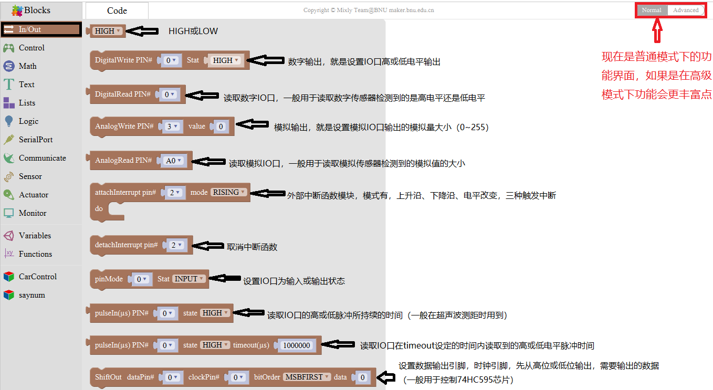

3.3 控制模块

3.4 数学模块

3.5文本模块

3.6 List模块

3.7 Logic模块

3.8 Variable模块

3.9 SerialPort模块

3.10 Communicate模块

3.11 Sensor模块

3.12 Actuator模块

3.13 Monitor模块

3.14 Function模块

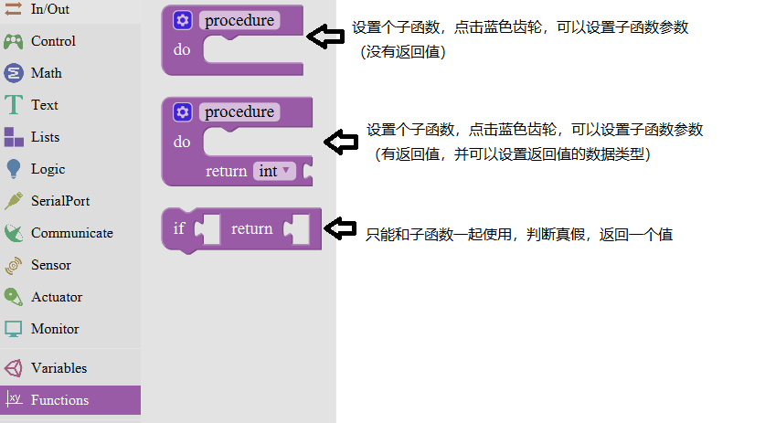

### 第4小节 米思奇库文件添加

库文件的导入，导出和编辑如下图所示。

## 单个传感器/模块实验课程

拿到套件后，我们可以看到套件中有42款传感器/模块，有对应的keyes UNO R3

开发板、传感器扩展板和连接线。这里，我们将42款传感器/模块利用自带连接线，单独连接在keyes UNO R3开发板和传感器扩展板。然后上传对应的测试代码，单独测试各个传感器/模块的功能。

特别注意：实验时，模块/传感器连接线材时，必须按照资料里的接线方法及位置，电源与信息脚不能错接，否则会损坏模块/传感器。

### 实验一 LED 模块测试

实验说明

在这个套件中，我们有一个keyes brick LED白发白模块。它的控制方法非常简单，控制时，GND VCC上电后；信号端S为高电平时LED亮起，S为低电平时LED熄灭。

实验中，我们提供两个测试代码，分别控制LED模块上实现闪烁和呼吸灯的效果。闪烁效果好理解；呼吸灯效果，就是控制LED模块上LED首先逐渐变亮，然后逐渐变暗，循环交替，如人体呼吸一样。

实验器材

keyes brick LED白发白模块\*1

keyes UNO R3开发板\*1

传感器扩展板\*1

3P 双头XH2.54连接线\*1

USB线\*1

接线图

测试代码

代码1：

代码2：

代码说明

代码1说明：

1.代码1中我们从界面中

找到。

2.  中，管脚是指模块信号端连接的接口，通过接线图，我们方向模块信号端连接在D3，因此，代码中我们把管脚设置为3。是指，我们可以将模块信号端S设置为高低电平。我们测试的过程中，当模块S端设为高电平（高）时，模块上LED亮起，设为低电平（低）时，模块上LED熄灭。

    3.代码中代码延迟时间，单位毫秒，代表延迟1000毫秒，即1秒。

    4.在米思齐软件中，只要没有单元，就代表代码中所有设置都是循环的。

    5.通过整合前面知识。我们再来看代码就清楚明了了，代码中第一条我们把模块信号端接到D3，设置为高电平，就是点亮模块上LED；第二条延迟1000毫秒，就是让模块上LED点亮1秒。同样第三条第四条代码表示让模块上LED熄灭1秒。代码默认循环，也就是控制模块上LED，循环亮1秒，灭1秒，实现闪烁效果。通过代码设置，我们可以更改模块上LED亮灭的延迟时间，从而使模块上LED实现不同的闪烁效果。

    **代码2说明：**

<!-- -->

1.  代码中，用到了单元，代码改单元中的代码设置
    只执行1次，然后后面的代码就一直是循环的了。

2.  代码1中，我们控制模块上信号端控制LED亮灭。在代码2中，我们通过利用keyes     UNO     R3开发板上PWM口，设置PWM值，控制模块上LED亮度。只有PWM口的原理，这里就不多介绍了，网上有很多信息。

3.  keyes UNO R3开发板上只有D3 D5 D6 D9 D10     D11数字口是PWM口，也就是说如果要控制LED的亮度，信号端就只能接着几个接口。实验中，我们将模块信号端接在D3脚，属于PWM口。设置时我们设置PWM数值越小，模块上LED越暗，数值越大，模块上LED越亮，范围为0-255。

4.  ，初始化时，我们将D3的PWM数值设置为0，即熄灭模块上的LED。

5.  代表设置一个变量i，i从0直接增加到255，每一次都加1，总共加了255次。

6.  代表将D3的PWM值设置为i，代表延迟10毫秒；和前面代码搭配，代表每过10毫秒，变量i都加1，直到i为255。

7.  代表设置一个变量i，i从255直接减小到0，每一次都加-1，总共加了255次。

8.  通过整合前面知识，我们再来看代码，就清楚多了。初始时我们将D3端设置为0，熄灭模块上LED。然后开始循环，将D3的PWM值设置为i，i刚开始由0增加到255，每次加1，每加一次延迟10毫秒，模块上LED逐渐变亮。PWM为255后，i开始由255减小到0，每次减1，每减一次延迟10毫秒，模块上LED逐渐变暗。然后又逐渐变亮，循环交替，如人体呼吸一样。

9.  如果我们感觉逐渐变亮
    或者逐渐变暗的时间过长，我们可以更改代码设置。有两种方法，一种是将每次加1减1的延迟时间降低；另一种是更改步长，注意这个步长必须能被255整除，如3     5。步长改为3 -3代表i每次增加3或减小3。

### 实验二 激光头传感器模块发出激光

实验说明

在这个套件中，包含一个激光头传感器模块。它主要由1个铜材半导体激光管元件组成。控制时，我们需要在模块S端输入高电平信号，模块开始工作，激光管发射出红色激光信号。

实验中，我们只是控制这个模块上激光管循环发射红色激光信号。

实验器材

keyes brick 激光头传感器模块\*1

keyes UNO R3开发板\*1

传感器扩展板\*1

3P双头XH2.54连接线\*1

USB线\*1

接线图

测试代码

1\.
在实验中，我们需要在单元内，找到以下模块。

3.  我们把管脚设置为2，设置为高时，模块上激光管发射出红色激光信号；设置为低时，模块上激光管不发射出红色激光信号。

测试结果

上传测试代码成功，上电后，模块上激光管发射红色激光信号1秒，停止发射红色激光信号1秒，循环交替。

### 实验三 插件RGB模块调节LED颜色

实验说明

在这个套件中，有一个插件RGB模块，它采用F5-全彩RGB雾状共阴LED元件。控制时，我们需要将模块R G
B连接单片机PWM口，-接GND。我们通过调节3个PWM值，控制LED元件显示红光、绿光和蓝光的比例，从而控制RGB模块上LED显示不同颜色灯光。当设置的PWM值越大，对应显示的颜色比例越重。理论来说，通过调节这3中颜色光的混合比例，可以模拟出所有颜色的灯光。

实验中，我们通过测试代码，控制模块上RGB LED显示几个常用颜色。

实验器材

keyes brick 插件RGB模块\*1

keyes UNO R3开发板\*1

传感器扩展板\*1

4P 双头XH2.54连接线\*1

USB线\*1

接线图

测试代码

代码1：

代码2：

代码说明

代码1说明：

代码1中，我们从中找到

，其中R G B代表控制

模块上 LED对应的红绿蓝3种颜色对应的端口，根据接线图我们接到了D9 D10 D11，设置为9 10 11，后面设置对应高低，设置GRB LED中红绿蓝3个灯是否会亮，设置为高（对应数字口为高电平），对应的颜色就亮。

4.  现在观察代码，这个代码非常简单，只是简单的控制模块上RGB     LED显示红色1秒、

    绿色1秒、蓝色1秒，循环交替。

    **代码2说明：**

    1.代码2中，我们从中找到

    ，其中R     G B

    代表控制RGB LED对应的红绿蓝3种颜色对应的端口，根据接线图我们接到了D9     D10

    D11，设置为9 10 11。后面设置数据代表设置模块上LED     红绿蓝颜色的比例，设置的

    数据越大（对应的PWM值越大），设置该颜色的比例越大。

    2.实验中我们通过设置对应数值，调节RGB     LED上红绿蓝颜色比例，从而控制RGB LED显示对应颜色。

测试结果

上传测试代码1成功，上电后，模块上RGB LED循环显示红绿蓝3种颜色，间隔时间为1秒。上传测试代码2成功，上电后，模块上RGB LED显示红绿蓝黄紫白6种颜色，循环不止，间隔时间为1秒。

### 实验四 控制继电器开关

实验说明

在这个套件中，包含一个5V 单路继电器模块。它主要采用HK4100F-DC 5V-SHC继电器元件。继电器有3个绿色接线柱用于外接电路，分别为NO COM和NC端（背后丝印）。当继电器没有接控制信号时，COM端和NC端连通，COM端和NO端断开。

控制时，我们把GND接单片机GND，VCC接单片机5V,S接单片机数字口。当S信号端设置为高电平时，继电器开启，继电器COM端和NC端断开，COM端和NO端连通；S信号端设置为低电平时，继电器关闭，继电器COM端和NC端连通，COM端和NO端断开。

实验中，我们只是控制继电器NO端和COM端循环连接和断开。

实验器材

keyes brick 5V 单路继电器模块\*1

keyes UNO R3开发板\*1

传感器扩展板\*1

3P双头XH2.54连接线\*1

USB线\*1

接线图

测试代码

代码说明

1\.
在实验中，我们需要在的单元内，找到以下模块。

2\.
我们把管脚设置为3，设置为高时，继电器上NO端和COM端连接，NC端和COM端断开；设置为低时，继电器上NO端和COM端断开，NC端和COM端连接。

测试结果

上传测试代码成功，上电后，模块上NO端和COM端连接1秒，断开1秒，循环交替。

### 实验五 有源蜂鸣器模块播放声音

实验说明

在这个套件中，包含一个有源蜂鸣器模块，一个无源蜂鸣器模块。这个实验中，我们控制有源蜂鸣器发出声音。有源蜂鸣器元件内部自带震荡电路，控制时，我们只需要在蜂鸣器元件正极输入5V电源，负极接地，蜂鸣器就自动响起。在这个模块上我们在GND VCC输入5V电源；S信号端设置为高电平时，模块上蜂鸣器响起；设置为低电平时，模块上蜂鸣器没有声音。

实验中，我们只是控制这个模块上有源蜂鸣器的循环响起声音。

实验器材

keyes brick 有源蜂鸣器模块\*1

keyes UNO R3开发板\*1

传感器扩展板\*1

3P双头XH2.54连接线\*1

USB线\*1

接线图

测试代码

代码说明

1\.
在实验中，我们需要在单元内，找到以下模块。

2.  我们把管脚设置为3，设置为高时，模块上有源蜂鸣器响起；设置为低时，模块上有源蜂鸣器关闭声音。

测试结果

上传测试代码成功，上电后，模块上有源蜂鸣器响起1秒，关闭1秒，循环交替。

### 实验六 无源蜂鸣器模块播放音乐

实验说明

前面课程中我们介绍了套件中的有源蜂鸣器模块的使用方法。在这里我们介绍下套件中的无源蜂鸣器模块，它主要采用12\*8.5MM 5V 2K无源蜂鸣器元件。无源蜂鸣器元件内部不带震荡电路，控制时，我们只需要在蜂鸣器元件正极输入不同频率的方波（电压5V），负极接地，控制蜂鸣器响起不同频率的声音。该元件的中心频率是2KHz。无源蜂鸣器驱动频率与发生频率之间是一一对应的关系，即驱动频率是2KHz的方波，那听到的声音频率也是2KHz。

实验中，我们利用无源蜂鸣器模块上蜂鸣器输出各种频率的声音，然后控制无源蜂鸣器模块上蜂鸣器播放完整音乐。

实验器材

keyes brick 无源蜂鸣器模块\*1

keyes UNO R3开发板\*1

传感器扩展板\*1

3P 双头XH2.54连接线\*1

USB线\*1

接线图

测试代码

代码1：

代码2：

代码说明

代码1说明：

1\. 在的单元找到

，其中管脚是代码模块信号端接口，我们连接的是D3，所以设置为3；音调设置对应的是模块上无源蜂鸣器发出的频率，我们可以点击米思齐软件上代码按键，看到对应频率；持续时间对应的是各个频率延迟的时间，延迟1秒就是1个节拍。

2.同样，可以在的单元找到

，管脚我们同样设置为3，代码1中为了方便观察效果，我们在后面加了延迟500毫秒。

代码2说明：

通过设置频率和对应节拍，依次播放就响起旋律了。

测试结果

上传测试代码1成功，上电后，模块上无源蜂鸣器循环播放对应频率对应节拍的声音。上传测试代码2成功，上电后，模块上无源蜂鸣器循环播放《生日快乐》歌曲。

### 实验七 按键传感器检测实验

实验说明

在这个套件中，有一个keyes brick按键传感器，它主要采用1个轻触开关，自带1个黄色按键帽。当我们按下按键时，传感器信号端为低电平；松开按键时，信号端为高电平。

实验中，我们通过读取传感器上S端高低电平，判断传感器上按键是否按下；并且，我们在串口监视器上显示测试结果。

实验器材

keyes brick按键传感器\*1

keyes UNO R3开发板\*1

传感器扩展板\*1

3P双头XH2.54连接线\*1

USB线\*1

接线图

测试代码

代码说明

1\. 在单元找到，设置item初始变量为

整数，并赋值为0，。

2.初始化设置波特率为9600。

3.同样，可以在的单元找到

，管脚我们同样设置为3。我们将读取到D3读取到的数字值赋值给item，。

4.在单元内，找到，点击进行设置，我们可以在里面任

意添加 如果否则 否则逻辑单元，如下图。

我们实验中，只需要添加一个
否则单元，设置完成后点击，完成设置。

5.代码逻辑是传感器感应到按键按下时，信号端为低电平，D3口为低电平，即item为

0。这时我们在串口监视器显示对应的数字值和字符；否则（传感器感应到按键松开时），item为1，窗口监视器显示1和另外的字符。

测试结果

上传测试代码成功，利用USB线上电后，打开串口监视器，设置波特率为9600。串口监视器显示对应数据和字符。实验中，当传感器按下按键时，item为0，串口监视器显示“Press the button”字符；松开按键时，item为1，串口监视器显示“Loosen the button”字符，如下图。

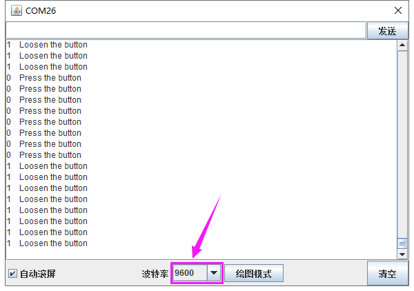

### 实验八 电容触摸传感器检测实验

实验说明

在这个套件中，有一个keyes brick电容触摸传感器，它主要采用1个TTP223-BA6芯片。它是触摸检测芯片，提供一个触摸按键，功能是用可变面积的按键取代传统按键。当我们上电之后，传感器需要约0.5秒的稳定时间，此时间段内不要对键进行触摸，此时所有功能都被禁止，始终进行自校准，校准周期约为4秒。

实验中，我们通过读取传感器上S端高低电平，判断传感器上按键是否按下；并且，我们在串口监视器上显示测试结果。

实验器材

keyes brick电容触摸传感器\*1

keyes UNO R3开发板\*1

传感器扩展板\*1

3P双头XH2.54连接线\*1

USB线\*1

接线图

测试代码

代码说明

1\. 在实验中，我们需要在单元内，找到以下元件。

2\.
其它设置方法和上一实验类似。在上一实验中，当检测到按键信号时，信号端为低电平，即item为0。在这一实验中，当检测到按键信号时，信号端为高电平，即item为1。

测试结果

上传测试代码成功，利用USB线上电后，打开串口监视器，设置波特率为9600。串口监视器显示对应数据和字符。实验中，当传感器按下按键时，item为1，串口监视器显示“Press the button”字符；松开按键时，item为0，串口监视器显示“Loosen the button”字符，如下图。

### 实验九 干簧管检测附近磁场

实验说明

在这个套件中，有一个keyes brick 干簧管模块，它主要采用MKA10110
绿色磁簧元件元件。簧管是干式舌簧管的简称，是一种有触点的无源电子开关元件，具有结构简单，体积小便于控制等优点。它的外壳是一根密封的玻璃管，管中装有两个铁质的弹性簧片电板，还灌有一种惰性气体。平时，玻璃管中的两个由特殊材料制成的簧片是分开的。当有磁性物质靠近玻璃管时，在磁场磁力线的作用下，管内的两个簧片被磁化而互相吸引接触，簧片就会吸合在一起，使结点所接的电路连通。外磁力消失后，两个簧片由于本身的弹性而分开，线路也就断开了。该传感器就是利用元件这一特性，搭建电路将磁场信号转换为高低电平变换信号。

实验中，我们通过读取模块上S端高低电平，判断模块附近是否存在磁场；并且，我们在串口监视器上显示测试结果。

实验器材

keyes brick干簧管模块\*1

keyes UNO R3开发板\*1

传感器扩展板\*1

3P双头XH2.54连接线\*1

USB线\*1

接线图

测试代码

代码说明

1\. 在实验中，我们需要在库文件的单元内，找到以下元件。

2\. 其它设置方法和实验七类似，这里就不多做介绍了。

测试结果

上传测试代码成功，利用USB线上电后，打开串口监视器，设置波特率为9600。串口监视器显示对应数据和字符。实验中，当传感器检测到磁场时，item为0，串口监视器显示“A magnetic field”字符；没有检测到磁场时，item为1，串口监视器显示“There is no magnetic field”字符，如下图。

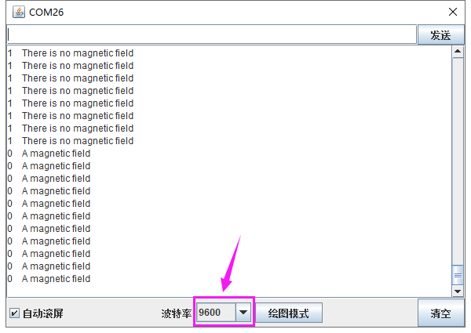

### 实验十 霍尔传感器检测磁场

实验说明

在这个套件中，有一个霍尔传感器，它主要采用A3144霍尔元件。该元件是由电压调整器、霍尔电压发生器、差分放大器、史密特触发器，温度补偿电路和集电极开路的输出级组成的磁敏传感电路，其输入为磁感应强度，输出是一个数字电压讯号。它是单极开关型的霍尔传感器，只感应南极磁场。传感器感应到无磁场或北极磁场时，信号端为高电平；感应到南极磁场时，信号端为低电平。当感应磁场强度越强时，感应距离越长。

实验中，我们利用霍尔传感器检测南极磁场，将测试结果在串口监视器上显示。

实验器材

keyes brick 霍尔传感器\*1

keyes UNO R3开发板\*1

传感器扩展板\*1

3P 双头XH2.54连接线\*1

USB线\*1

接线图

测试代码

代码说明

1.  在实验中，我们需要在单元内，找到以下元件。

    

2.  其它设置方法和实验七类似，这里就不多做介绍了。

3.  

测试结果

上传测试代码成功，利用USB线上电后，打开串口监视器，设置波特率为9600。当传感器感应到南极磁场时，传感器监视器显示如图1；当传感器感应到无磁场或北极磁场时，串口监视器显示如图2。

图1

图2

### 实验十一 左右倾斜检测

实验说明

在这个套件中，有一个keyes brick 倾斜模块传感器，它主要采用SW-200D
振动开关元件。SW-200D
振动开关元件是滚珠型倾斜感应单方向性触发开关。该振动开关两端一端镀金，一端镀银；镀金端为触发端，镀银端为导电端。当传感器在水平位置或向导电端（镀银）倾斜时，开关元件为开路OFF状态，传感器信号端输出高电平；当传感器向触发端（镀金）倾斜时，开关元件为闭路ON状态，传感器信号端输出低电平。

实验中，我们通过读取模块上S端高低电平，判断传感器倾斜的方向；并且，我们在串口监视器上显示测试结果。

实验器材

keyes brick 倾斜模块传感器\*1

keyes UNO R3开发板\*1

传感器扩展板\*1

3P双头XH2.54连接线\*1

USB线\*1

接线图

测试代码

代码说明

1.  在实验中，我们需要在单元内，找到以下元件。

    

2.  其它设置方法和实验七类似，这里就不多做介绍了。

测试结果

上传测试代码成功，利用USB线上电后，打开串口监视器，设置波特率为9600。串口监视器显示对应数据和字符。实验中，手握传感器白色接口，当传感器向右倾斜时，item为0，串口监视器显示“Right”字符；当传感器向左倾斜时，item为1，串口监视器显示“Left”字符，如下图。

### 实验十二 碰撞检测

实验说明

在这个套件中，有一个keyes brick
碰撞传感器，它主要采用1个轻触开关。当物体碰到轻触开关弹片，下压时，传感器信号端为低电平，自带D1 LED亮起；否则传感器信号端为高电平，自带D1 LED熄灭。该传感器常用于3D打印机内做限位开关。

实验中，我们通过读取模块上S端高低电平，判断传感器弹片是否下压；并且，我们在串口监视器上显示测试结果。

实验器材

keyes brick 碰撞传感器\*1

keyes UNO R3开发板\*1

传感器扩展板\*1

3P双头XH2.54连接线\*1

USB线\*1

接线图

测试代码

代码说明

1.  在实验中，我们需要在单元内，找到以下元件。

    

    2\. 其它设置方法和实验七类似，这里就不多做介绍了。

测试结果

上传测试代码成功，利用USB线上电后，打开串口监视器，设置波特率为9600。串口监视器显示对应数据和字符。实验中，传感器上弹片下压时，item为0，串口监视器显示“The end of his!”字符；当松开弹片时，item为1，串口监视器显示“All going well!”字符，如下图。

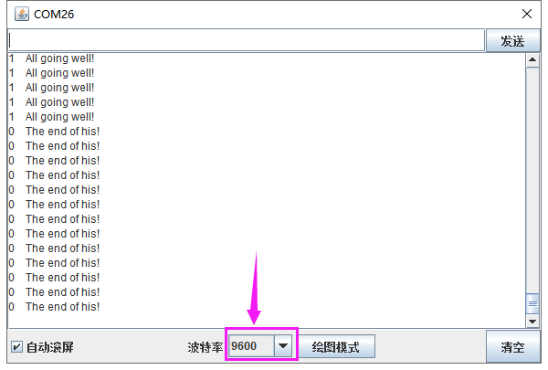

### 实验十三 附近有人吗

实验说明

在这个套件中，有一个keyes brick
人体红外热释电传感器，它是一款基于热释电效应的人体热释运动传感器，能检测到人体或动物身上发出的红外线，配合菲涅尔透镜能使传感器探测范围更远更广。它主要采用RE200B-P传感器元件。

实验中，我们通过读取模块上S端高低电平，判断附近是否有人在运动；并且，我们在串口监视器上显示测试结果。

实验器材

keyes brick人体红外热释电传感器\*1

keyes UNO R3开发板\*1

传感器扩展板\*1

3P双头XH2.54连接线\*1

USB线\*1

接线图

注：传感器自带2个电位器用于调节延迟时间和接收灵敏度，方法如下图。

测试代码

代码说明

1.  在实验中，我们需要在单元内，找到以下元件。

    

    2\. 其它设置方法和实验七类似，这里就不多做介绍了。

测试结果

上传测试代码成功，利用USB线上电后，打开串口监视器，设置波特率为9600。

串口监视器显示对应数据和字符。实验中，传感器检测到附近有人在运动时，item为1，串口监视器显示“Somebody is in this area!”字符；没有检测到人运动时，item为0，串口监视器显示“No one!”字符，如下图。

### 实验十四 巡线传感器检测黑白线

实验说明

在这个套件中，有一个keyes brick 巡线传感器，它主要采用1个TCRT5000 反射型
黑白线识别传感器元件。传感器的原理是利用红外线对颜色的反射率不一样，将反射信号的强弱转化成电流信号。传感器没有检测到物体或者检测到黑色物体时，信号端为高电平；检测到白色物体时，信号端为低电平；它的检测高度为
0—3cm。我们可以通过旋转传感器上电位器，调节灵敏度，即调节检测高度。当旋转电位器，是传感器上D1 LED介于不亮与亮之间的临界点时，灵敏度最好。

实验中，我们通过读取模块上S端高低电平，判断传感器检测到的物体颜色（黑白）；并且，我们在串口监视器上显示测试结果。

实验器材

keyes brick巡线传感器\*1

keyes UNO R3开发板\*1

传感器扩展板\*1

3P双头XH2.54连接线\*1

USB线\*1

接线图

测试代码

代码说明

1.  在实验中，我们需要在单元内，找到以下元件。

    

    2\. 其它设置方法和实验七类似，这里就不多做介绍了。

测试结果

上传测试代码成功，利用USB线上电后，打开串口监视器，设置波特率为9600。串口监视器显示对应数据和字符。实验中，当传感器没有检测到物体或者检测到黑色物体时，item为1，串口监视器显示“Black”字符；检测到白色物体（能够反光）时，item为0，串口监视器显示“White”字符，如下图。

### 实验十五 避障传感器检测障碍物

实验说明

在这个套件中，有一个keyes brick避障传感器，它主要采用一对红外线发射与接收管元件。原理就是发射管发射出一定频率的红外线，当检测方向遇到障碍物（反射面）时，红外线反射回来被接收管接收，此时指示灯亮起，经过电路处理后，信号输出接口输出数字信号。传感器上有两个电位器，一个用于调节发送功率，一个用于调节接收频率，通过调节2个电位器，我们可以调节它的有效距离。

实验中，我们通过读取传感器上S端高低电平，判断是否存在障碍物；并且，我们在串口监视器上显示测试结果。

实验器材

keyes brick避障传感器\*1

keyes UNO R3开发板\*1

传感器扩展板\*1

3P双头XH2.54连接线\*1

USB线\*1

接线图

测试代码

代码说明

1.  在实验中，我们需要在单元内，找到以下元件。

    

    2\. 其它设置方法和实验七类似，这里就不多做介绍了。

    **特别注意**

烧录好测试代码，按照接线图连接好线，上电后，我们开始调节两个电位器调节感应距

离。

1.调节发射功率调节电位器，先将电位器顺时针到尽头，然后回调一些，使传感器上

D1 LED介于不亮与亮之间的零界点。

2.调节接收频率调节电位器，顺时针调节时，频率增大。调节使它产生38KHz频率的方波，调节时，也观察传感器上D1 LED，使它介于不亮与亮之间的零界点。

测试结果

上传测试代码成功，利用USB线上电后，打开串口监视器，设置波特率为9600。串口监视器显示对应数据和字符。实验中，当传感器检测到障碍物时，item为0，串口监视器显示“There are obstacles”字符；没有检测到障碍物时，item为1，串口监视器显示“All going well”字符，如下图。

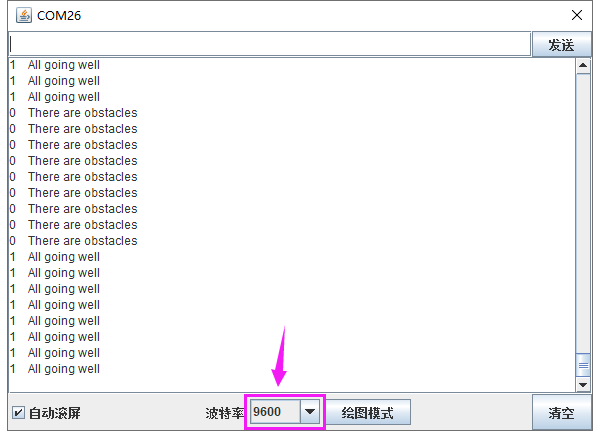

### 实验十六 魔术光杯传感器

实验说明

在这个套件中，有两个keyes brick魔术光杯传感器，它的原理是利用PWM调光的原理，两个传感器的亮度发生变化。滚珠开关提供数字信号，触发PWM的调节，通过程序的设计，我们就能看到类似于两组装满光的杯子倒来倒去的效果了。

实验中，我们通过读取传感器上S端高低电平，判断传感器的倾斜方向，然后控制传感器上LED的亮度变化（调节L端的PWM值）。

验器材

keyes brick魔术光杯传感器\*2

keyes UNO R3开发板\*1

传感器扩展板\*1

4P双头XH2.54连接线\*2

USB线\*1

接线图

测试代码

代码说明

1.下面是设置子程序，模拟PWM口的PWM值，设置子程序方法可以参考实验二。设置时，设置方波，设置高低电平延迟时间总共为1000微妙，即周期为1秒，频率是1000Hz。设置是PWM值就相当于设置方波时高电平的延迟时间（val1和val2）。

2.设置程序逻辑如下表格

<table>
<colgroup>
<col style="width: 15%" />
<col style="width: 84%" />
</colgroup>
<tbody>
<tr>
<td>条件</td>
<td>数字口A2（buttonStateA）为高电平并且brightnessA不是1000</td>
</tr>
<tr>
<td>设置</td>
<td>brightnessA设置为brightnessA加1（最大1000）</td>
</tr>
<tr>
<td>条件</td>
<td>数字口A2（buttonStateA）为低电平并且brightnessA不是0</td>
</tr>
<tr>
<td>设置</td>
<td>brightnessA设置为brightnessA减1（最小0）</td>
</tr>
<tr>
<td>条件</td>
<td>数字口A4（buttonStateB）为高电平并且brightnesB不是0</td>
</tr>
<tr>
<td>设置</td>
<td>brightnessB设置为brightnessB减1（最小0）</td>
</tr>
<tr>
<td>条件</td>
<td>数字口A4（buttonStateB）为低电平并且brightnessB不是1000</td>
</tr>
<tr>
<td>设置</td>
<td>brightnessB设置为brightnessB加1（最大1000）</td>
</tr>
<tr>
<td>条件</td>
<td>brightnessA为0</td>
</tr>
<tr>
<td>设置</td>
<td>设置数字口A3为低电平</td>
</tr>
<tr>
<td>条件</td>
<td>brightnessA为1000</td>
</tr>
<tr>
<td>设置</td>
<td>设置数字口A3为高电平</td>
</tr>
<tr>
<td>条件</td>
<td>brightnessA大于0且小于1000</td>
</tr>
<tr>
<td>设置</td>
<td>利用数字口A3模拟PWM口，设置A3的PWM值为brightnessA</td>
</tr>
<tr>
<td>条件</td>
<td>brightnessB为0</td>
</tr>
<tr>
<td>设置</td>
<td>设置数字口A5为低电平</td>
</tr>
<tr>
<td>条件</td>
<td>brightnessB为1000</td>
</tr>
<tr>
<td>设置</td>
<td>设置数字口A5为高电平</td>
</tr>
<tr>
<td>条件</td>
<td>brightnessB大于0且小于1000</td>
</tr>
<tr>
<td>设置</td>
<td>利用数字口A5模拟PWM口，设置A5的PWM值为brightnessB</td>
</tr>
</tbody>
</table>

测试结果

上传测试代码成功，利用USB线上电后，打开串口监视器，设置波特率为9600。将两个魔术光杯传感器同时倾斜一边，
一个魔术光杯上的LED逐渐变暗，同时另一个逐渐变亮，最终一个LED完全熄灭，一个LED最亮；在串口监视器中看到对应具体数值变化，如下图。当倾斜另一边中，现象一样，方向相反。

### 实验十七 光折断计数

实验说明

这个套件中包含一个 keyes brick
光折断传感器，它主要采用1个ITR-9608光电开关。它属于对射遮断式光电开关光学开关传感器。当用纸片挡住传感器凹槽后，传感器信号端为高电平，自带D1 LED熄灭；否则传感器信号端为低电平，自带D1 LED亮起。

在这里，我们通过检测传感器信号端高低电平，通过代码设置，模拟出流水线上利用类似传感器，对产品进行计数。

实验器材

keyes brick光折断传感器\*1

keyes UNO R3开发板\*1

传感器扩展板\*1

3P双头XH2.54连接线\*1

USB线\*1

接线图

测试代码

代码说明

1\. 在实验中，我们需要在库文件的单元内，找到以下元件。

2.  通过以下表格，我们可以了解这个代码的逻辑设置。

<table>
<colgroup>
<col style="width: 30%" />
<col style="width: 41%" />
<col style="width: 27%" />
</colgroup>
<tbody>
<tr>
<td rowspan="3">初始设置</td>
<td colspan="2">PushCounter设置为0（累计通过物体数目）</td>
</tr>
<tr>
<td colspan="2">State设置为0（传感信号端数值）</td>
</tr>
<tr>
<td colspan="2">lastState设置为0（传感器信号端上一循环数值）</td>
</tr>
<tr>
<td>当物体开始穿过传感器凹槽时（一瞬间）</td>
<td>State检测到变为1，lastState为0，两个数据不相等。</td>
<td>
PushCounter设置为

PushCounter加1
</td>
</tr>
<tr>
<td>当物体穿过传感器凹槽过程中（循环）</td>
<td>State检测到变为1，lastState设置为1，两个数据相等。</td>
<td>PushCounter不变</td>
</tr>
<tr>
<td>当物体刚穿过传感器凹槽过程中（一瞬间）</td>
<td>State检测到变为0，lastState设置为1，两个数据不相等。</td>
<td>PushCounter不变</td>
</tr>
<tr>
<td>当物体完全穿过传感器凹槽后（循环）</td>
<td>State检测到变为0，lastState设置为0，两个数据相等。</td>
<td>PushCounter不变</td>
</tr>
</tbody>
</table>

测试结果

上传测试代码成功，按照接线图接好线，利用USB上电后，打开串口监视器，设置波特率为9600；串口监视器显示PushCounter数据，每个物体穿过传感器凹槽，PushCounter数据不断加1。

### 实验十八 旋转编码器模块计数

实验说明

在这个套件中，有一个keyes brick
旋转编码器模块，它主要采用20脉冲旋转编码器元件。它可通过旋转计数正方向和反方向转动过程中输出脉冲的次数，这种转动计数是没有限制的，复位到初始状态，即从0开始计数。如果我们只计算信号的脉冲，则可以使用两个输出中的任何一个来确定旋转位置。但是，如果我们想要确定旋转方向，我们需要同时考虑两个信号。

实验中，我们利用keyes brick
旋转编码器模块用于计数，当我们顺时针旋转编码器时，设置数据i加1；逆时针旋转编码器时，设置数据i减1；按下编码器中间按键时，设置数据i为0；将测试结果在串口监视器上显示。

实验器材

keyes brick 旋转编码器模块\*1

keyes UNO R3开发板\*1

传感器扩展板\*1

5P双头XH2.54连接线\*1

USB线\*1

接线图

测试代码

代码说明

1.在实验中，我们需要在单元内，找到以下元件。

2.我们把CLK设置为2、DAT设置为3。该代码在库文件中设置好了，它的意思是中断2（CLK）下降后，读取数字口3（DAT）电压，当DAT电压为高电平时，旋转编码器的值加1；当DAT电压为低电平时，转编码器的值减1。我们可以打开米思齐软件中的看到对应设置的C语言代码。

3.然后循环程序中设置按钮管脚（D4）为低电平时，打印出来。

测试结果

上传测试代码成功，利用USB线上电后，打开串口监视器，设置波特率为9600。顺时针旋转编码器，显示数据减小；逆时针旋转编码器，显示数据增加；按下编码器中间按键，显示数据为0，如下图。

### 实验十九 敲击模块传感器检测状态

实验说明

在这个套件中，有一个敲击模块传感器，它主要采用SW-2802振动开关元件。SW-2802振动开关元件是弹簧型震动感应触发开关。该振动开关在静止時为开路OFF状态，
当受到外力碰触而达到相应震动力时,或移动速度达到适当离(偏)心力时，导电接脚会产生瞬间导通呈瞬间ON状态;当外力消失時,开关恢复为开路OFF状态。该传感器就是利用元件这一特性，搭建电路将震动信号转换为高低电平变换信号。

实验中，我们利用敲击模块传感器检测敲击状态，将测试结果在串口监视器上显示。

实验器材

keyes brick 敲击模块传感器\*1

keyes UNO R3开发板\*1

传感器扩展板\*1

3P 双头XH2.54连接线\*1

USB线\*1

接线图

测试代码

代码说明

1.  在这一实验中，我们主要接触到的新知识是中断知识。keyes UNO     R3开发板的中断

    口是数字口2和数字口3，我们把信号端设置在数值口3了。

2.  我们在 找到，设置管脚为3，
    有3中模式：上升、下降和改变。没有敲击时，传感器信号端为高电平，感受到敲击信号，传感器信号端变为低电平；因此我们设置为下降。

    3\. 中断设置为，就是说，传感器感应到敲击信号，中

    断口3下降，执行子程序，否则执行循环程序。

测试结果

上传测试代码成功，利用USB线上电后，打开串口监视器，设置波特率为9600。当传感器敲击信号时，传感器监视器显示“Knock on!”字符；否则显示“All going well!”字符，如下图。

### 实验二十 超声波测距

实验说明

在这个套件中，有一个HC-SR04超声波传感器，它可以检测前方是否存在障碍物，并且检测出传感器与障碍物的详细距离。它的原理和蝙蝠飞行的原理一样，就是超声波模块发送出一种频率很高，人体无法听到的超声波信号。这些超声波的信号若是碰到障碍物，就会立刻反射回来，在接收到返回的信息之后，通过判断发射信号和接收信号的时间差，计算出传感器和障碍物的距离。

实验中，我们利用传感器检测传感器和障碍物之间的距离，将测试结果在串口监视器上显示。

实验器材

keyes brick HC-SR04超声波传感器\*1

keyes UNO R3开发板\*1

传感器扩展板\*1

4P 双头XH2.54连接线\*1

USB线\*1

接线图

测试代码

代码说明

1.  我们在
    找到。根据接线，将Trig设置为12，Echo设置为13。

2.  HC-SR04超声波传感器最大测试距离为3-4m，最小测试距离为2cm。设置代码当检测距离小于2cm或者大于等于400cm时，串口监视器显示-1。

    

3.  我们在电脑的串口监视器中显示除传感器和障碍物之间的距离。

测试结果

上传测试代码成功，利用USB线上电后，打开串口监视器，设置波特率为9600。如果障碍物在测试范围外，串口监视器显示“-1”；否则，串口监视器显示超声波传感器和前方障碍物之间的距离，单位为cm，如下图。

### 实验二十一 红外接收

实验说明

这一实验中，我们了解下红外接收传感器的使用方法。红外接收传感器主要采用VS1838B红外接收传感器元件。该元件是集接收、放大、解调一体的器件，内部IC就已经完成了解调，输出的就是数字信号。它可接收标准38KHz调制的遥控器信号。

实验中，我们利用红外接收传感器接收外部红外发射设备发射的红外信号，并将接收信号在串口监视器上显示。

实验器材

keyes brick 红外接收传感器\*1

keyes UNO R3开发板\*1

传感器扩展板\*1

3P 双头XH2.54连接线\*1

USB线\*1

接线图

测试代码

代码说明

1.  我们在 找到，根据接线，我们把管脚设置为3。

    设置后，我们得到接收到的数据，以十六进制换行打印出来。

测试结果

按照接线图接线，上传测试代码成功，利用USB线上电后，打开串口监视器，里面就会显示红外接收传感器接收到的数据。

找到红外遥控器，拔出绝缘片，对准红外接收传感器的接收头按下按键。接收到信号后，红外接收传感器上的D1也开始闪烁，串口监视器显示如下图。

### 实验二十二 DS18B20温度传感器测试温度

实验说明

在这个套件中，有一个keyes brick 18B20温度传感器，它主要采用DS18B20传感器元件。我们可以利用该传感器测试当前环境中的温度。它的测量范围为－55℃～＋125℃，测量精度为±0.5℃（-10℃至+85℃范围内）。

实验中，我们利用这个温度传感器测试当前环境中的温度，测试结果分为℃和℉两种；并且，我们在串口监视器上显示测试结果。

实验器材

keyes brick 18B20温度传感器\*1

keyes UNO R3开发板\*1

传感器扩展板\*1

3P双头XH2.54连接线\*1

USB线\*1

接线图

测试代码

代码说明

1\. 在实验中，我们需要在库文件的单元内，找到以下元件。

2\. 我们把管脚设置为3，获取温度的单位分别设置为℃和℉。

3\. 设置两个小数变量，分别为val1和val2，将所测结果赋值给val1和val2。

4\.
串口监视器显示val1和val2的值，显示前需设置波特率（我们默认设置为9600，可更改）。

5\.
显示时，我们在数据后面添加单位，如果单位直接设置为℃和℉，测试结果会出现乱码。所以我们直接用C代替℃，F代替℉。

测试结果

上传测试代码成功，利用USB线上电后，打开串口监视器，设置波特率为9600。串口监视器显示当前环境的温度，如下图。

### 实验二十三 DHT11温湿度传感器检测温湿度

实验说明

在这个套件中，有一个keyes brick DHT11温湿度传感器，它主要采用DHT11
温湿度传感器元件。它是一款含有已校准数字信号输出的温湿度复合传感器。它应用专用的数字模块采集技术和温湿度传感技术，确保产品具有极高的可靠性与卓越的长期稳定性。传感器包括一个电阻式感湿元件和一个NTC测温元件，并与一个高性能8位单片机相连接。因此该产品具有品质卓越、超快响应、抗干扰能力强、性价比极高等优点。

实验中，我们利用这个传感器测试当前环境中的温湿度，并且，我们在串口监视器上显示测试结果。

实验器材

keyes brick DHT11温湿度传感器\*1

keyes UNO R3开发板\*1

传感器扩展板\*1

3P双头XH2.54连接线\*1

USB线\*1

接线图

测试代码

代码说明

1\.
在实验中，我们需要在库文件的单元内，找到以下元件。

2\. 我们把管脚设置为3，选择获取温度和获取湿度。

3\. 设置两个小数变量，分别为val1和val2，将所测结果赋值给val1和val2。

4\.
串口监视器显示val1和val2的值，显示前需设置波特率（我们默认设置为9600，可更改）。

5\.
显示时，我们在数据后面添加单位。如果温度单位直接设置为℃，测试结果会出现乱码，所以我们直接用C代替℃；湿度单位直接设置为%。

测试结果

上传测试代码成功，利用USB线上电后，打开串口监视器，设置波特率为9600。串口监视器显示当前环境中的温湿度数据，如下图。

### 实验二十四 可调电位器模块读取模拟值

实验说明

在这个套件中，有一个keyes brick 可调电位器模块，它主要采用一个10K
可调电阻。通过旋转电位器，我们可以改变电阻大小，然后搭建电路将电阻变化转换为电压变化。

实验中，我们利用这个模块测试对应的模拟值；并且，我们在串口监视器上显示测试结果。

实验器材

keyes brick 可调电位器模块\*1

keyes UNO R3开发板\*1

传感器扩展板\*1

3P双头XH2.54连接线\*1

USB线\*1

接线图

测试代码

代码说明

1\.
在实验中，我们需要在单元内，找到以下元件。

2\. 我们把管脚设置为A3。

3\. 设置1个整数变量item，将所测结果赋值给item。

4\.
串口监视器显示item的值，显示前需设置波特率（我们默认设置为9600，可更改）。

测试结果

上传测试代码成功，利用USB线上电后，打开串口监视器，设置波特率为9600。串口监视器显示对应模拟值。实验中，顺时针旋转电位器，模拟值增大，逆时针旋转电位器，模拟值减小，范围为0-1023，如下图。

### 实验二十五 TEMT6000光线传感器

实验说明

在这个套件中，有一个keyes brick TEMT6000光线传感器，它主要采用TEMT6000X01元件。该元件是一个高灵敏可见光光敏（NPN型）三极管。传感器可以将捕获的微小光线变化并放大100倍左右，并且轻松的被微控制器识别，进行AD转换。它对可见光照度的反应特性与人眼的特性类似，可以模拟人对环境光线的强度的判断，从而方便做出与人友好互动的应用。

实验中，我们利用这个传感器测试当前环境中的光照强度对应的模拟值，光照越强，模拟值越大；并且，我们在串口监视器上显示测试结果。

实验器材

keyes brick TEMT6000光线传感器\*1

keyes UNO R3开发板\*1

传感器扩展板\*1

3P双头XH2.54连接线\*1

USB线\*1

接线图

测试代码

代码说明

1\. 在实验中，我们需要在单元内，找到以下元件。

2.  其它设置方法和实验二十四类似，这里就不多做介绍了。

测试结果

烧录好测试代码，按照接线图连接好线，利用USB线上电后，打开软件串口监视器，设置波特率为9600，我们可以看到对应光照强度的模拟值，光照越强，模拟值越大，如下图。

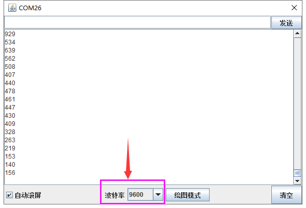

### 实验二十六 热敏电阻传感器简单测试

实验说明

在这个套件中，有一个热敏电阻传感器，它主要采用NTC-MF52AT热敏电阻元件。NTC-MF52AT热敏电阻元件能够时感知周边环境温度的变化，电阻大小随着温度的变化而变化。该传感器就是利用NTC-MF52AT热敏电阻元件这一特性，搭建电路将电阻变化转换为电压变化。

实验中，我们将传感器信号端接到keyes UNO R3开发板模拟口，读出对应的模拟值。我们可以利用模拟值，通过特定公式，计算出当前环境的温度。由于温度计算公式比较复杂，这里就不多介绍了。实验中，我们只是读取对应的模拟值。

实验器材

keyes brick 热敏电阻传感器\*1

keyes UNO R3开发板\*1

传感器扩展板\*1

3P 双头XH2.54连接线\*1

USB线\*1

接线图

测试代码

代码说明

1.  在实验中，我们需要在单元内，找到以下元件。

    

2.  其它设置方法和实验二十四类似，这里就不多做介绍了。

测试结果

上传测试代码成功，利用USB线上电后，打开串口监视器，设置波特率为9600。串口监视器显示对应的模拟值，温度越高，模拟值越大。

### 实验二十七 麦克风声音传感器检测声音大小

实验说明

在这个套件中，有一个keyes brick
麦克风声音传感器，它主要采用一个高感度麦克风元件和LM386芯片。高感度麦克风元件用于检测外界的声音。利用LM386芯片搭建合适的电路，我们对高感度麦克风检测到的声音进行放大，最大倍数为200倍。使用时我们可以通过旋转传感器上电位器，调节声音的放大倍数。调节时，顺时针调节电位器到尽头，放大倍数最大。

实验中，我们利用这个传感器测试当前环境中的声音大小对应的模拟值，声音越大，模拟值越大；并且，我们在串口监视器上显示测试结果。

实验器材

keyes brick 麦克风声音传感器\*1

keyes UNO R3开发板\*1

传感器扩展板\*1

3P双头XH2.54连接线\*1

USB线\*1

接线图

测试代码

代码说明

1.  在实验中，我们需要在单元内，找到以下元件。

    

2.  其它设置方法和实验二十四类似，这里就不多做介绍了。

测试结果

上传测试代码成功，利用USB线上电后，打开串口监视器，设置波特率为9600。串口监视器显示对应模拟值。实验中，我们顺时针旋转电位器和对准MIC头大声说话，可以看到模拟值数据变大，如下图。

### 实验二十八 MQ-2 烟雾传感器

实验说明

在这个套件中，有一个keyes brick MQ-2 烟雾传感器，它主要用到了MQ-2
可燃气体、烟雾传感器元件。该元件所使用的气敏材料是在清洁空气中电导率较低的二氧化锡(SnO2)。当传感器所处环境中存在可燃气体时，传感器的电导率随空气中可燃气体浓度的增加而增大。该传感器对液化气、丙烷、氢气的灵敏度高，对天然气和其它可燃蒸汽的检测也很理想。它可检测多种可燃性气体，是一款适合多种应用的低成本传感器。

使用时，A0端读取对应气体的模拟值；D0端连接一个LM393芯片（比较器），我们可以通过电位器调节测量气体报警临界点，在D0输出数字值。当测量气体含量超过临界点时，D0端输出低电平；测量气体含量没超过临界点时，D0端输出高电平。

实验中，我们读取传感器A0端模拟值，和D0端数字值，判断空气中测量气体的含量，以及它们是否超标。

实验器材

keyes brick MQ-2 烟雾传感器\*1

keyes UNO R3开发板\*1

传感器扩展板\*1

4P 双头XH2.54连接线\*1

USB线\*1

接线图

测试代码

代码说明

1.在实验中，我们需要在单元内，找到以下元件。

2\. 我们把管脚设置为A2，管脚设置为A3。

3\. 参考实验七，根据A2管脚高低电平，设置串口监视器输出不同字符。

4\. 根据接线，读取模拟口A3的模拟值，并将测试结果只是串口监视器上显示。

测试结果

上传测试代码成功，利用USB线上电后，打开串口监视器，设置波特率为9600。串口监视器显示对应数据和字符。实验中，我们可以看到当测试的模拟值小于等于255时，气体含量没有超过临界点；当测试的模拟值大于等于261时，气体含量超过临界点；那么就代表气体含量临界点对于的模拟值在255-261之间，我们可以通过旋转传感器上电位器，调节临界点。

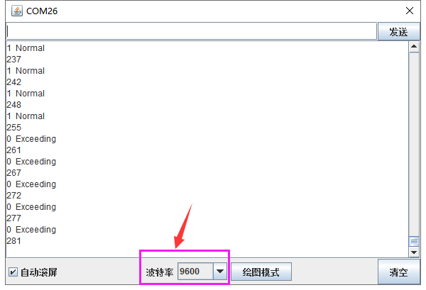

### 实验二十九 MQ-3 酒精传感器

实验说明

在这个套件中，有一个keyes brick MQ-3 酒精传感器，它主要用到了MQ-3
酒精、乙醇蒸汽传感器元件。该元件所使用的气敏材料是在清洁空气中电导率较低的二氧化锡(SnO2)。当传感器所处环境中存在酒精蒸汽时，传感器的电导率随空气
中酒精蒸汽浓度的增加而增大。

使用时，A0端读取对应酒精蒸汽的模拟值；D0端连接一个LM393芯片（比较器），我们可以通过电位器调节测量酒精蒸汽报警临界点，在D0输出数字值。当测量酒精蒸汽含量超过临界点时，D0端输出低电平；测量酒精蒸汽含量没超过临界点时，D0端输出高电平。

实验中，我们读取传感器A0端模拟值，和D0端数字值，判断空气中酒精蒸汽的含量，以及它们是否超标。

实验器材

keyes brick MQ-3 酒精传感器\*1

keyes UNO R3开发板\*1

传感器扩展板\*1

4P双头XH2.54连接线\*1

USB线\*1

接线图

测试代码

代码说明

1.在实验中，我们需要在单元内，找到以下元件。

2.其它设置方法和实验二十八类似，这里就不多做介绍了。

测试结果

上传测试代码成功，利用USB线上电后，打开串口监视器，设置波特率为9600。串口监视器显示对应数据和字符。实验中，我们可以看到当测试的模拟值小于等于286时，酒精蒸汽含量没有超过临界点；当测试的模拟值大于等于301时，酒精蒸汽含量超过临界点；那么就代表酒精蒸汽含量临界点对于的模拟值在286-301之间，我们可以通过旋转传感器上电位器，调节临界点。

### 实验三十 摇杆模块传感器

实验说明

在这个套件中，有一个keyes brick 摇杆模块传感器，它主要采用PS2
手柄摇杆元件。控制时，我们需要将模块X Y端口连接单片机模拟口，B端口连接单片机数字口，VCC接单片机电源输出端（3.3-5V），GND接单片机GND。我们可以读取两个模拟值和一个数字口的高低电平情况，判断模块上摇杆的工作状态。

实验中，我们将读取两个模拟值和一个数字值，并在串口监视器上显示测试结果。

实验器材

keyes brick 摇杆模块传感器\*1

keyes UNO R3开发板\*1

传感器扩展板\*1

5P双头XH2.54连接线\*1

USB线\*1

接线图

测试代码

代码说明

1.在实验中，我们需要在单元内，找到以下元件。

2\. 根据接线，x管脚设置为A0，y管脚设置为A1，摇杆按钮管脚设置为7

3
串口监视器显示测试数据，显示前需设置波特率（我们默认设置为9600，可更改）。

测试结果

上传测试代码成功，利用USB线上电后，打开串口监视器，设置波特率为9600。串口监视器显示对应数值。摇动摇杆，x轴和y轴对应的模拟值发生改变，按下按钮，读取到的数字值为1，否则为0，如下图。

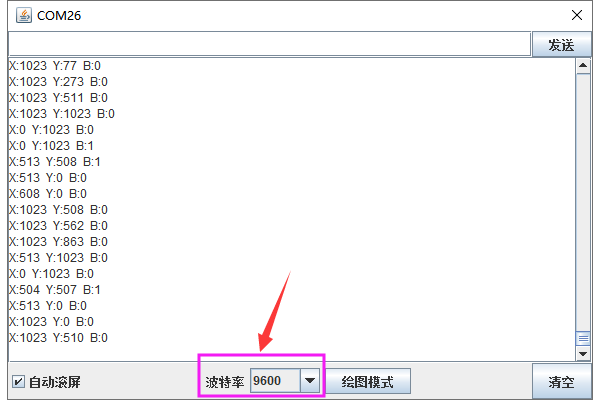

### 实验三十一 手指测心跳模块

实验说明

在这个套件中，有一个手指测心跳模块，它主要由1个光敏接收器和1个红外发射器组成。红外发射器在手指的一面，光敏接收器在手指的另一面；光敏接收器用来获取发射的光通量；当血压脉动通过手指时，光敏接收器的电阻会用微小的变化。

使用时，我们提供该模块和arduino系列单片机搭配使用的方法。**测试时，特别需要注意，需要用黑布包裹模块和手指，确保在无光环境中测试，否则测试不准确。**

实验中，我们将测试得到是数据，复制到Excel上，并生成相应的图片。

实验器材

keyes brick 手指测心跳模块\*1

keyes UNO R3开发板\*1

传感器扩展板\*1

3P 双头XH2.54连接线\*1

USB线\*1

接线图

测试代码

代码说明

1.在实验中，我们需要在单元内，找到以下元件。

2.将管脚设置为A3，将所测数据用串口监视器打印出来。

测试结果

烧录好测试代码，按照接线图连接好线；利用USB接口上电后，进入串口监视器，设置波特率为9600。用，用手指按住光敏接收器，用黑布包裹模块和手指。串口监视器显示对应数据，如下图。

等待一会，将串口监视器数据复制到excel上，生成对应图片，如下图。

### 实验三十二 ADXL345加速度传感器

实验说明

在这个套件中，有一个keyes brick ADXL345加速度传感器，它采用ADXL345BCCZ芯片。ADXL345BCCZ是一款小而薄的低功耗3轴加速度计，分辨率高（13位），测量范围达±16g。它数字输出数据为16位二进制补码格式，可通过SPI（3线或4线）或I2C数字接口访问。该传感器非常适合移动设备应用。它可以在倾斜检测应用中测量静态重力加速度，还可以测量运动或冲击导致的动态加速度。其高分辨率(4mg/LSB)，能够测量不到1.0°的倾斜角度变化。

实验中，我们测试出传感器X Y Z轴的加速度数值；并且，我们在串口监视器上显示测试数据。

实验器材

keyes brick ADXL345加速度传感器\*1

keyes UNO R3开发板\*1

传感器扩展板\*1

4P双头XH2.54连接线\*1

USB线\*1

接线图

测试代码

代码说明

1\. 在实验中，我们需要在单元内，找到以下元件。

2\. 设置3个小数变量X Y Z，将所测结果赋值给X Y Z。

3\. 串口监视器显示X Y Z的值，显示前需设置波特率（我们默认设置为9600，可更改）。

测试结果

上传测试代码成功，利用USB线上电后，打开串口监视器，设置波特率为9600。串口监视器显示传感器对应的X Y Z的值，单位为g，如下图。

### 实验三十三 震动模块传感器

实验说明

这是一个常用的震动模块传感器。它具有无方向性特性，任何角度均可以触发工作，完全密封式封装可以防水、防尘，适用于小电流电路的触发。

传感器接上电源后，在静止时为开路（OFF）状态，信号端输出为高电平，传感器上LED变暗；当受到外力碰触而达到适当震动力时，或移动速度达到适当离（偏）心力时，导电接脚会发生瞬间导通（ON）状态，使电气特性改变，信号端输出为低电平，传感器上LED变亮；而当外力消失时电气特性恢复开路（OFF）状态。

传感器上兼容各种单片机控制板，如arduino系列单片机。使用时，我们可以在单片机上堆叠一个传感器扩展板。传感器上模块和自带导线连接，然后连接在传感器扩展板上，简单方便。同时，传感器自带2个直径为3mm的定位孔，方便你将传感器固定在其他设备。

实验中，我们通过读取传感器上S端高低电平，判断传感器是否震动；并且，我们在串口监视器上显示测试结果。

实验器材

keyes brick震动模块传感器\*1

keyes UNO R3开发板\*1

传感器扩展板\*1

3P双头XH2.54连接线\*1

USB线\*1

接线图

测试代码

代码说明

1.  我们在 找到，设置管脚为3

2.  其它设置方法和实验十九类似，这里就不多做介绍了。

测试结果

烧录好测试代码，按照接线图连接好线，上电后，打开串口监视器，设置波特率为9600.当传感器每检测到一次震动时，串口监视器打印Vibrate，否则打印It's still。

### 实验三十四 水滴水蒸气传感器

实验说明

这是一个常用的水滴水蒸气传感器。它的原理是通过电路板上裸露的印刷平行线检测水量的大小。水量越多，就会有更多的导线被联通，随着导电的接触面积增大，输出的电压就会逐步上升。除了可以检测水量的大小，它还可以检测空气中的水蒸气。

同时，传感器自带2个直径为3mm的定位孔，方便你将传感器固定在其他设备。

实验中，我们将传感器信号端(S端)输入到arduino系列单片机的模拟口，感知模拟值的变化，并在串口监视器上显示出对应的模拟值。

实验器材

keyes brick 水滴水蒸气传感器\*1

keyes UNO R3开发板\*1

传感器扩展板\*1

3P双头XH2.54连接线\*1

USB线\*1

接线图

测试代码

代码说明

1.在实验中，我们需要在单元内，找到以下元件。

2.其它设置方法和实验二十八类似，这里就不多做介绍了。

测试结果

烧录好测试代码，按照接线图连接好线；利用USB接口上电后，进入串口监视器，设置波特率为9600。当水蒸气传感器上检测到水分时，输出的模拟值在串口监视器显示出来，如下图。

### 实验三十五 土壤传感器

实验说明

这是一个常用的土壤传感器。它可用于检测土壤中的水分。将它和其他单片机搭配使用，我们可以制作一款自动浇花装置。当您长时间不在家或过了浇水的时间，它可以感测到您的植物是否已经渴了。然后我再控制其他设备给您的植物浇水。

实验中，我们将传感器信号端(S端)输入到arduino系列单片机的模拟口，感知模拟值的变化，并在串口监视器上显示出对应的模拟值。

实验器材

keyes brick 土壤传感器\*1

keyes UNO R3开发板\*1

传感器扩展板\*1

3P双头XH2.54连接线\*1

USB线\*1

接线图

测试代码

代码说明

1.在实验中，我们需要在单元内，找到以下元件。

2.其它设置方法和实验二十八类似，这里就不多做介绍了。

测试结果

烧录好测试代码，按照接线图连接好线，利用USB线上电后，打开软件串口监视器，设置波特率为9600，我们可以看到对应土壤湿度的模拟值，土壤湿度越高，模拟值越大，如下图。

### 实验三十六 舵机控制

实验说明

舵机是一种位置伺服的驱动器，主要是由外壳、电路板、无核心马达、齿轮与位置检测

器所构成。舵机有很多规格，但所有的舵机都有外接三根线，分别用棕、红、橙三种颜

色进行区分，由于舵机品牌不同，颜色也会有所差异，棕色为接地线，红色为电源正极

线，橙色为信号线。

舵机的转动的角度是通过调节PWM（脉冲宽度调制）信号的占空比来实现的，标准PWM

（脉冲宽度调制）信号的周期固定为20ms（50Hz），理论上脉宽分布应在1ms到2ms

之间，但是，事实上脉宽可由0.5ms 到2.5ms 之间，脉宽和舵机的转角0°～180°相

对应。有一点值得注意的地方，由于舵机牌子不同，对于同一信号，不同牌子的舵机旋

转的角度也会有所不同。

实验器材

keyes 伺服舵机\*1

keyes UNO R3开发板\*1

传感器扩展板\*1

USB线\*1

接线图

测试代码

代码1：

代码2：

代码说明

代码1说明：

1.我们在 找到，并设置管脚为9。

2\. 为舵机转动的角度位置，也就是说，输入0~180的数字，舵机就转动到对应角度的位置。

代码2说明：

1.  跟实验一样，先找到并设置管脚9；

2.  在找到，范围设置为0~180，步长为1，因为我们想让舵机一度一度的转动：，加个延时15ms，不让它转动得太快。

3.  ，然后又从180度转回0度。

测试结果

实验1 结果：

上传测试代码成功，利用USB线上电后，舵机由0度，90度，180度三个角度来回转动。

实验2 结果：

上传测试代码成功，利用USB线上电后，舵机由0~180度来回转动，并且每次转动一度。

### 实验三十七 3231时钟模块

实验说明

这个模块主要用到高精度时钟芯片DS3231。它是低成本、高精度I2C实时时钟(RTC)，具有集成的温补晶振(TCXO)和晶体。该器件包含电池输入端，断开主电源时仍可保持精确的计时。集成晶振提高了器件的长期精确度，并减少了生产线的元件数量。DS3231提供商用级和工业级温度范围，采用16引脚300mil的SO封装。

实验中，我们利用keyes brick
时钟模块获取系统时间，将测试结果在串口监视器上显示出来。

实验器材

keyes brick 3231时钟模块\*1

keyes UNO R3开发板\*1

传感器扩展板\*1

4P双头XH2.54连接线\*1

USB线\*1

接线图

测试代码

代码说明

1.  在实验中，我们需要在单元内，找到以下元件。

    

2.  再把模块改为DS3231，管脚改为A4、A5，如图：

3.  为获取当前系统的时间和日期。

测试结果

烧录好测试代码，按照接线图连接好线；利用USB接口上电后，进入串口监视器，设置波特率为57600。我们可在软件串口监视器中看到设置时间日期（年、月、日、时、分、秒、周），如下图。

### 实验三十八 TM1637 4位数码管模块

实验说明

这个模块主要由一个0.36英寸 红色共阳
4位数码管组成，它的驱动芯片是TM1637。使用时，我们只需要2根信号线即可使单片机控制4位8数码管，大大节约了控制板IO口资源。

实验中，我们利用四位数码管各显示出0~9，并加延迟为1秒。

实验器材

keyes brick TM1637 4位数码管模块\*1

keyes UNO R3开发板\*1

传感器扩展板\*1

4P双头XH2.54连接线\*1

USB线\*1

接线图

测试代码

代码说明

1.在实验中，我们需要在单元内，找到以下元件。

2\.
我们在接线这种是CLK接A3，DIO接A2，所以我们要设置为：

3\.
亮度设置范围为0~100

4.当分到了60秒时，将分清0，时加1，当时到了24时，将时清0，延时60秒。

测试结果

烧录好测试代码，按照接线图连接好线,上电后，4位数码管按分刷新时间。

### 实验三十九 8X8点阵模块

实验说明

当我们利用单片机驱动一个8\*8点阵时，我们总共需要用到16个数字口，这样就极大的浪费单片机资料。为此，我们特别设计了这个模块，利用HT16K33芯片驱动1个8\*8点阵，只需要利用单片机的I2C通信端口控制点阵，大大的节约了单片机资源。

模块兼容各种单片机控制板，如arduino系列单片机。使用时，我们可以在单片机上堆叠一个传感器扩展板。模块和自带导线连接，然后连接在传感器扩展板上，简单方便。模块上自带3个拨码开关，可以让你随意拨动开关，这I2C通信地址。设置方法如下表格。

<table>
<colgroup>
<col style="width: 11%" />
<col style="width: 11%" />
<col style="width: 11%" />
<col style="width: 11%" />
<col style="width: 11%" />
<col style="width: 11%" />
<col style="width: 11%" />
<col style="width: 11%" />
<col style="width: 11%" />
<col style="width: 0%" />
</colgroup>
<tbody>
<tr>
<td>A0（1）</td>
<td>A1（2）</td>
<td>A2（3）</td>
<td>A0（1）</td>
<td>A1（2）</td>
<td>A2（3）</td>
<td>A0（1）</td>
<td>A1（2）</td>
<td colspan="2">A2（3）</td>
</tr>
<tr>
<td>0（OFF）</td>
<td>0（OFF）</td>
<td>0（OFF）</td>
<td>1（ON）</td>
<td>0（OFF）</td>
<td>0（OFF）</td>
<td>0（OFF）</td>
<td>1（ON）</td>
<td colspan="2">0（OFF）</td>
</tr>
<tr>
<td colspan="3">OX70</td>
<td colspan="3">OX71</td>
<td colspan="3">OX72</td>
<td></td>
</tr>
<tr>
<td>A0（1）</td>
<td>A1（2）</td>
<td>A2（3）</td>
<td>A0（1）</td>
<td>A1（2）</td>
<td>A2（3）</td>
<td>A0（1）</td>
<td>A1（2）</td>
<td colspan="2">A2（3）</td>
</tr>
<tr>
<td>1（ON）</td>
<td>1（ON）</td>
<td>0（OFF）</td>
<td>0（OFF）</td>
<td>0（OFF）</td>
<td>1（ON）</td>
<td>1（ON）</td>
<td>0（OFF）</td>
<td colspan="2">1（ON）</td>
</tr>
<tr>
<td colspan="3">OX73</td>
<td colspan="3">OX74</td>
<td colspan="3">OX75</td>
<td></td>
</tr>
<tr>
<td>A0（1）</td>
<td>A1（2）</td>
<td>A2（3）</td>
<td>A0（1）</td>
<td>A1（2）</td>
<td>A2（3）</td>
<td colspan="4" rowspan="3"></td>
</tr>
<tr>
<td>0（OFF）</td>
<td>1（ON）</td>
<td>1（ON）</td>
<td>1（ON）</td>
<td>1（ON）</td>
<td>1（ON）</td>
</tr>
<tr>
<td colspan="3">OX76</td>
<td colspan="3">OX77</td>
</tr>
</tbody>
</table>

同时，模块自带2个直径为3mm的定位孔，方便你将模块固定在其他设备。

实验中我们让点阵显示出图案。

实验器材

keyes brick 8\*8点阵模块\*1

keyes UNO R3开发板\*1

传感器扩展板\*1

4P双头XH2.54连接线\*1

USB线\*1

接线图

测试代码

代码说明

1.  首先在中找到点阵屏，然后初始化iic引脚

    ，SCL就是A5，SDA就是A4。

2.  找到点阵，并把类型改为HT16K33，还可以设置亮度，范围为0~15.

测试结果

烧录好测试代码，按照接线图连接好线；上电后，点阵显示一个心形图案。

### 实验四十一 IIC OLED模块

实验说明

oled是有机发光二极管，又称为有机点激光显示。OLED显示技术具有自发光特性，它采用非常薄的有机材料涂层和玻璃基板，当有电流通过时，这些有机材料就会发光。OLED显示屏可视角度大、功耗低。OLED同时具备自发光、不需背光源（只上电是不会亮的，驱动程序和接线正确才会亮）、对比度高、厚度薄、视角广、反应速度快、可用于挠曲面版、使用温度范围广、结构及制程简单等优异特性。

这个模块主要用到一个0.96寸 OLED
蓝屏，它是利用SSD1306驱动，利用I2C通信和单片机通信连接。模块自带4个定位孔，方便你将模块固定在其他设备。

实验中我们将让oled模块显示出一些字符。

实验器材

keyes brick IIC OLED模块\*1

keyes UNO R3开发板\*1

传感器扩展板\*1

4P双头XH2.54连接线\*1

USB线\*1

接线图

测试代码

代码说明

1.  首先在找到和，其中设置默认就行。

2.  然后往下翻找到，可以在这个模块中设置要显示的字符大小，字体格式和位置。

3.  再往下翻可以找到一些模块可以显示出图像，还可以画一些图像，画线、矩形、圆形、椭圆等等。

测试结果

上传测试代码成功，按照接线图接好线，利用USB上电后，oled显示屏显示“Hello World”“Hello Keyes”和一个自带图像：

### 实验四十二 电机-水泵驱动模块

实验说明

在生活中，我们经常需要驱动一个风扇转动或者或者一个小水泵。为了方便接线，我们特别设计了130电机-DC3-5V浇花小水泵驱动模块。使用时，只需要将水泵或130电机两端连接在模块的2pin接口上，同时，模块的4pin接口用于连接对应单片机，用于控制电机或水泵状态。

模块兼容各种单片机控制板，如arduino系列单片机。模块上自带的防反插白色端子兼具为2.54mm，使用时，我们可以利用杜邦线连接到单片机。为方便接线，我们还特别设计了一款完全兼容这模块和Arduino UNO R3单片机的扩展板，我们只需要将扩展板堆叠到UNO R3单片机，利用1根3P
双头XH2.54插头线（防反）即可连接在扩展板上，简单方便。

实验中，我们让电机转动起来和小水泵抽水。

实验器材

keyes brick电机-水泵驱动模块\*1

keyes UNO R3开发板\*1

传感器扩展板\*1

4P双头XH2.54连接线\*1

USB线\*1

DC3-5V浇花小水泵+100MM连接线\*1

浇花水管 内径6MM 外径8MM 1米\*1

130电机+100MM连接线\*1

电机桨\*1

接线图

电机接线图：

水泵接线图：

测试代码

电机：

水泵：

代码说明

代码1说明：

在中找到并将管脚设置为A2、A3，当A2输出为低电平，A3输出为高电平时，电机逆时针旋转；当A2输出为高电平，A3输出为低电平时，电机顺时针旋转；当两个管脚都设置为低电平时，电机停止转动。

代码2说明：

当A2输出为低电平，A3输出为高电平时，水泵工作。

测试结果

烧录好测试130电机代码，按照接线图连接好线；上电后，风扇逆时针转动2秒；停止1秒；顺时针转动2秒；停止1秒；循环交替。

烧录好测试小水泵代码，按照接线图连接好线；将小水泵放入水中，上电后，水泵不停抽水。

### 实验四十 IIC 1602 液晶屏

实验说明

这是一个可以显示2行，每行16个字符的液晶屏模块。液晶屏显示蓝底白字，自带I2C通信模块，使用时只需连接单片机I2C通信接口，大大节约了单片机资源。I2C通信模块上带有1个电位器，可用于调节显示屏背光，通信地址默认为0x27。

实验中我们让iic 1602显示屏显示出一些字符。

实验器材

keyes brick IIC 1602 蓝屏\*1

keyes UNO R3开发板\*1

传感器扩展板\*1

4P双头XH2.54连接线\*1

USB线\*1

接线图

测试代码

代码说明

1.  首先在,中找到

2.  在输入字符就能在1602上显示出来，每行16个字符，共两行。

测试结果

烧录好测试代码，按照接线图连接好线；上电后，显示屏两行分别显示" Hello World! "和" Hello Keyes! "字符。

## 传感器/模块组合实验课程

前面课程中，我们单独测试了传感器/模块的功能，功能比较单一。在此，我们可以将多个传感器/模块搭配使用，组合出各种各样的功能。传感器/模块种类比较多，我们只是选择几款比较经典的组合实验。你们也可以根据自己的想法，自己设置代码，组合出你想要的特别的功能。

### 实验一 电位器调节灯光亮度

实验说明

在前面课程中，我们学习了利用代码调节LED模块上LED亮度的方法。学习利用可调电位器读取模拟值的方法。两个组合，我们利用可调电位器读取到的模拟值控制LED的亮度。设计代码时，模拟值的范围是0-1023；LED的亮度是由PWM值控制，范围为0-255。在这里，我们就需要用到映射功能，将0-1023数值映射到0-255。

设置成功后，我们就可以通过旋转电位器，控制模块上LED的亮度。

实验器材

keyes brick LED模块\*1

keyes brick 可调电位器模块\*1

keyes UNO R3开发板\*1

传感器扩展板\*1

3P 双头XH2.54连接线\*2

USB线\*1

接线图

测试代码

代码说明

1\. 在实验中，我们需要在单元内，找到以下元件。

2\.
设置变量，控制设置，以及串口通信，我们都在前面课程中介绍了。实验中，主要新增的知识点就是映射功能

将val1从范围0-1023映射到0-255，并赋值给val2。

测试结果

上传测试代码成功，上电后，旋转模块上电位器，就可以调节LED模块上的LED的亮度。

### 实验二 模拟户外灯

实验说明

在生活中我们可以看到户外有很多公共灯光。这些灯白天不亮，一到晚上，阳光暗下的时候，自动亮起；当阳光变亮时，这些灯就自动关闭。难道是有人在手动控制这些灯光？实际上不是的，实际上这些灯光上都安装有光敏传感器，这些传感器将外界阳光的亮暗，转换成对应数值。然后设置一个临界点，当超过临界点时，控制灯光熄灭，没有超过时，控制灯光亮起。

在这个实验中，我们利用套件中自带的光线传感器和LED模块模拟这一现象。

实验器材

keyes brick TEMT6000光线传感器\*1

keyes brick LED模块\*1

keyes UNO R3开发板\*1

传感器扩展板\*1

3P 双头XH2.54连接线\*2

USB线\*1

接线图

测试代码

代码说明

1\. 在实验中，我们需要在单元内，找到以下元件。

2\.
设置变量，控制设置，以及串口通信，我们都在前面课程中介绍了。实验中，我们设置了当模拟值低于150时LED亮起，否则熄灭。

测试结果

上传测试代码成功，利用USB线上电后，打开串口监视器，设置波特率为9600。串口监视器显示对应模拟值。实验中，我们把光线传感器用手握住，数据变小，小于150时，LED模块上LED亮起，否则熄灭。

### 实验三 旋转编码器模块控制RGB模块

实验说明

在前面课程的实验二十中，我们利用旋转编码器计数。在这里我们将它扩展下，通过得出的计数，我们用来控制RGB模块上LED显示不同颜色。

设计代码时，我们需要对所得数据取绝对值。然后我们将数据除以3，得到余数，余数为0控制双色LED模块上LED亮红光，余数为1，双色LED模块上LED亮绿光，余数为2，双色LED模块上LED亮蓝光。

实验器材

keyes brick 旋转编码器模块\*1

keyes UNO R3开发板\*1

keyes brick 插件RGB模块\*1

传感器扩展板\*1

5P双头XH2.54连接线\*1

4P 双头XH2.54连接线\*1

USB线\*1

接线图

测试代码

代码说明

1.  在实验中我们我们在找到
    ，将+改成%，设置

    ，即将val1设置为val除以3的余数。

2.  得到余数后，我们可以在找到

    ，设置管脚，根据接线设置管脚为9（红灯）、10（绿灯）和11（蓝灯）。

3.  参考前面实验学习的控制方法，利用余数控制模块上LED显示对应灯光颜色。

测试结果

上传测试代码成功，按照接线图接好线，上电后，打开串口监视器，设置波特率为9600。旋转编码器，串口监视器显示对应余数。即可控制外接的RGB模块上的LED的颜色（红绿蓝）。

### 实验四 按键控制RGB灯

实验说明

在前面课程中，我们利用旋转编码器计数然后控制RGB模块。在这一课程中，我们做一个扩展，我们利用代码，计算出按下模块上按键的次数。设置计数代码时，我们可以参考第四章实验十七的计数代码。然后我们将所得数据除以三，所得余数为0 1 2三种。然后通过不同的余数，控制RGB模块上LED显示不同的颜色。

这样，我们就可以通过不断的按下按键，任意调节RGB模块上LED显示不同颜色了（三种颜色）。

实验器材

keyes brick 插件RGB模块\*1

keyes UNO R3开发板\*1

keyes brick 按键传感器\*1

传感器扩展板\*1

4P双头XH2.54连接线\*1

3P 双头XH2.54连接线\*1

USB线\*1

接线图

测试代码

代码说明

1.在实验中，我们需要在单元内，找到以下元件。

2.通过以下表格，我们可以了解这个代码的逻辑设置。

<table>
<colgroup>
<col style="width: 23%" />
<col style="width: 32%" />
<col style="width: 21%" />
<col style="width: 21%" />
</colgroup>
<tbody>
<tr>
<td rowspan="4">初始设置</td>
<td colspan="3">PushCounter设置为0（累计通过物体数目）</td>
</tr>
<tr>
<td colspan="3">PushCounter1设置为0（累计通过物体数目除以3的余数）</td>
</tr>
<tr>
<td colspan="3">State设置为1（传感信号端数值）</td>
</tr>
<tr>
<td colspan="3">lastState设置为1（传感器信号端上一循环数值）</td>
</tr>
<tr>
<td>按键按下（一瞬间）</td>
<td>State检测到变为0，lastState为1，两个数据不相等。</td>
<td>
PushCounter设置为

PushCounter加1
</td>
<td>PushCounter1加1或变为0</td>
</tr>
<tr>
<td>长按按键（循环）</td>
<td>State检测到变为0，lastState设置为0，两个数据相等。</td>
<td>PushCounter不变</td>
<td>PushCounte1不变</td>
</tr>
<tr>
<td>松开按键（一瞬间）</td>
<td>State检测到变为1，lastState设置为0，两个数据不相等。</td>
<td>PushCounter不变</td>
<td>PushCounte1不变</td>
</tr>
<tr>
<td>按键松开（循环）</td>
<td>State检测到变为1，lastState设置为1，两个数据相等。</td>
<td>PushCounter不变</td>
<td>PushCounte1不变</td>
</tr>
<tr>
<td>PushCounte1为0</td>
<td colspan="3">设置RGB模块上LED显示红色</td>
</tr>
<tr>
<td>PushCounte1为1</td>
<td colspan="3">设置RGB模块上LED显示绿色</td>
</tr>
<tr>
<td>PushCounte1为2</td>
<td colspan="3">设置RGB模块上LED显示蓝色</td>
</tr>
</tbody>
</table>

测试结果

上传测试代码成功，按照接线图接好线，利用USB上电后，打开串口监视器，设置波特率为9600；串口监视器显示数据，不断按下按键，数据在0 1
2中变化。当为0时，RGB模块上LED显示红色；当为1时，RGB模块上LED显示绿色；当为2时，RGB模块上LED显示蓝色。

### 实验五 温度控制RGB灯

实验说明

在前面实验中，我们利用按键手动控制RGB模块上LED灯的颜色。在这一课程中，我们利用一个热敏电阻传感器检测当前环境的温度。然后利用检测到的温度数据控制RGB模块上LED灯的颜色。

生活中，我们可以把这个电路设计应用到环境中。我们利用温度传感器检测到环境温度，控制LED的颜色。这样我们就可以通过LED颜色，判断周围环境大概温度。

实验器材

keyes brick 插件RGB模块\*1

keyes UNO R3开发板\*1

keyes brick 热敏电阻传感器\*1

传感器扩展板\*1

4P双头XH2.54连接线\*1

3P 双头XH2.54连接线\*1

USB线\*1

接线图

测试代码

代码说明

1.  实验中，检测并显示温度的方法和上一课中实验二十六一样。

    2\. 检测到温度数据后通过设置控制RGB模块上的LED颜色，设置方法参考上一课中实验七知识点。

测试结果

上传测试代码成功，按照接线图接好线，利用USB上电后，打开串口监视器，设置波特率为9600；串口监视器显示当前环境中温度数值。当模拟值小于400时，RGB模块上的LED显示蓝色；当模拟值大于400且小于等于600时，RGB模块上的LED显示绿色；当模拟值大于600时，RGB模块上的LED显示红色。

### 实验六 障碍物报警实验

实验说明

在上一课实验十五中，我们利用避障传感器检测前方障碍物，结果在串口监视器显示。在这一实验中，我们利用检测结果控制一个有源蜂鸣器响起。

生活中，我们可以利用一个检测传感器控制一个有源蜂鸣器响起，做报警设备，如检测磁场（霍尔传感器）、检测倾斜（倾斜模块）等等。

实验器材

keyes brick 避障传感器\*1

keyes UNO R3开发板\*1

keyes brick 有源蜂鸣器模块\*1

传感器扩展板\*1

3P 双头XH2.54连接线\*2

USB线\*1

接线图

测试代码

代码说明

实验中代码设置和上一课中实验七类似，只是将控制串口监视器显示换成了控制有源蜂鸣器的响起。

测试结果

上传测试代码成功，按照接线图接好线，上电后，检测到障碍物时，外接的有源蜂鸣器响起声音，否则有源蜂鸣器停止响起声音。

### 实验七 超声波雷达

实验说明

在前面一章节中，实验三，我们学会了控制RGB模块发出彩色光；实验六，我们学会了利用无源蜂鸣器模块，调节响起声音的频率；实验二十，我们学会了利用超声波传感器检测前方障碍物的距离。我们可以将三个实验结合在一起。设置时，我们通过超声波传感器测试出障碍物距离。然后，我们利用距离大小控制无源蜂鸣器上模块上蜂鸣器响起对应频率的声音和RGB亮起对应颜色。搭建好电路后，我们可以人为控制超声波前方障碍物，控制检测距离，从而达到控制声音响起频率、LED灯颜色来模拟雷达效果。

实验器材

keyes brick HC-SR04超声波传感器\*1

keyes brick 无源蜂鸣器模块\*1

keyes brick 插件RGB模块\*1

keyes UNO R3开发板\*1

传感器扩展板\*1

3P 双头XH2.54连接线\*1

4P 双头XH2.54连接线\*2

USB线\*1

接线图

测试代码

代码说明

1.  设置时，我们通过调节不同距离范围，设置声音频率和灯光颜色，具体声音频率我们可以点击米思齐软件的处看到。

2.  为方便控制障碍物距离，我们可以在上面代码中，根据实际情况，在控制逻辑里调节距离范围。

测试结果

上传测试代码成功，按照接线图接好线，上电后，打开串口监视器，设置波特率为9600.检测到障碍物不同距离时，外接无源蜂鸣器模块上蜂鸣器响起不同频率的声音RGB亮起不同的颜色。

### 实验八 酒精检测仪

实验说明

在前面一章节中，实验五，我们学会了利用有源蜂鸣器模块，调节响起声音的频率；实验二十九，我们学会了利用MQ-3
酒精传感器检测酒精浓度，实验四十，我们学会了控制1602显示屏；。我们可以将三个实验结合在一起。设置时，我们通过酒精传感器测试出酒精浓度。然后，我们利用浓度大小控制有源蜂鸣器报警和1602显示屏显示浓度。从而达到酒精检测仪的模拟效果。

实验器材

keyes brick 有源蜂鸣器模块\*1

keyes UNO R3开发板\*1

keyes brick MQ-3 酒精传感器\*1

传感器扩展板\*1

IIC 1602 蓝屏\*1

3P双头XH2.54连接线\*1

4P 双头XH2.54连接线\*2

USB线\*1

接线图

测试代码

代码说明

1.  实验中，在找到并初始化设置还有检测酒精浓度都跟前面讲的原理是一样的。

2.  主要讲一下这里为什么要分开显示，如果不分开显示出来值的话，最后面那位值就会保留原来的数值，不会被刷新。比如开始显示的值是100，当模拟值降到95的时候，后面的“0”还在，就会显示成“950”。

测试结果

上传测试代码成功，按照接线图接好线，上电后，检测到不同酒精浓度时，外接有源蜂鸣器模块上蜂鸣器报警，1602显示屏上第一行显示“Alcoho：”，第二行显示浓度值。

### 实验九 智能浇花系统

实验说明

生活中，可能由于我们不在家时间过长，可能导致我们家中的花草枯萎。所以我们常常想，要是能做成一个自动的智能的浇花装置就好了。

在前面我们学会使用土壤传感器和水泵模块，所以我们可以把它们结合起来做成一个智能浇花系统。当检测到土壤湿度低于某一个值时的时候，水泵开启，给花浇水直到高于所设定的阈值。这样就实现了智能浇花。

实验器材

keyes brick 土壤传感器\*1

keyes UNO R3开发板\*1

keyes brick 电机-水泵驱动模块\*1

传感器扩展板\*1

3P双头XH2.54连接线\*1

4P 双头XH2.54连接线\*1

USB线\*1

DC3-5V浇花小水泵+100MM连接线\*1

浇花水管 内径6MM 外径8MM 1米\*1

接线图

测试代码

代码说明

为打开水泵

是关闭水泵

测试结果

上传测试代码成功，按照接线图接好线，上电后，打开串口监视器，设置波特率为9600.串口监视器上打印土壤湿度值，当这个值低于200时水泵抽水，否则关闭。这个值根据实际情况去设置就行。

### 实验十 散热装置

实验说明

生活中，我们的电脑或者电路板芯片等等经常会由于工作时间或者功耗问题而发热严重，所以我们常常需要一个散热装置。

在前面我们学会使用温度传感器和电机模块，所以我们这节实验可以把它们结合起来做成一个智能散热装置。当检测到环境温度高于某一个值时的时候，电机开启，从而降低环境温度，达到散热效果。

实验器材

keyes brick 热敏电阻传感器\*1

keyes UNO R3开发板\*1

keyes brick 电机-水泵驱动模块\*1

传感器扩展板\*1

3P双头XH2.54连接线\*1

4P 双头XH2.54连接线\*1

USB线\*1

130电机+100MM连接线\*1

电机桨\*1

接线图

测试代码

代码说明

1.  首先我们在找到并接到A4

2.  当读取的模拟值大于600时，电机开启，否则关闭。

测试结果

烧录好测试代码，按照接线图连接好线，利用USB线上电后，打开软件串口监视器，设置波特率为9600，我们可以看到对应温度的模拟值，温度度越高，模拟值越大，如下图。当这个值超过我们设定的值时，电机转动。

### 实验十一 综合实验

实验说明

在前面我们做了很多实验，每做一个实验，我们都需要重新上传一次代码。那我们可以把多个实验组合在一起吗？可以的，在这一实验中，我们将第四章节中的实验三、实验二十一、实验二十三、实验三十、实验三十二和本章节中的实验一，组合在一起。设置时，我们参考本章节实验四的方法，利用外接按键模块。每按一次按键，功能变换一次，实验功能循环交替。

实验器材

keyes brick LED白发白模块\*1

keyes brick 按键传感器\*1

keyes brick DHT11温湿度传感器\*1

keyes brick ADXL345加速度传感器\*1

keyes brick 红外接收传感器\*1

keyes brick 摇杆模块传感器\*1

keyes brick HC-SR04超声波传感器\*1

keyes brick TEMT6000光线传感器\*1

keyes brick 可调电位器模块\*1

keyes brick 插件RGB模块\*1

keyes UNO R3开发板\*1

传感器扩展板\*1

3P 双头XH2.54连接线\*6

4P 双头XH2.54连接线\*3

5P 双头XH2.54连接线\*1

JMP-1 17键 红外遥控\*1

USB线\*1

接线图

测试代码

代码说明

1.  设置时，我们参考本章节实验四方法。计算出按下按键的次数，除以8，得到余数，为0     1 2 3 4 5 6 7，根据不同的余数，控制实验实现不同功能。

2.  实验中，我们对应功能，都利用了子程序设置。子程序设置方法，可以参考前面章节实验。

3.  参照介绍方法，我们可以在接线中添加或减少传感器/模块，然后在代码中更改实验功能。

测试结果

上传测试代码成功，按照接线图接好线，利用USB上电。

刚开始时，按键次数为0，余数为0，RGB模块上LED循环闪烁红绿蓝三种颜色。点击打卡串口监视器，设置波特率为9600，按一下按键（时间长些），按键次数为1，余数为1，RGB模块上LED显示蓝色，实验实现的功能是红外接收模块红外发射信息。如果我们利用红外遥控对准接收模块接收头，按下按键，红外接收头接收到信息，串口监视器显示如下。

特别注意：如果先按下按键，按键次数变为1，再打开串口监视器时，程序会复位，按键成次数会变为0，需要再按下按键重新设置按键次数。

再按一下按键，按键次数为2，余数为2，实验实现的功能是利用DHT11温湿度传感器读取环境中的温湿度数值，每0.1秒读取一次，串口监视器显示数据如下图。

再按一下按键，按键次数为3，余数为3，实验实现的功能是读取摇杆模块传感器X轴和Y轴对应的模拟值，B（Z轴）接口对应的数字值，串口监视器显示如下图。

再按一下按键，按键次数为4，余数为4，实验实现的功能是利用ADXL345加速度传感器测试X Y Z 3轴加速度数值，单位为g，串口监视器显示如下图。

再按一下按键，按键次数为5，余数为5，实验实现的功能是利用外接可调电位器模块调节D5接口的PWM值，从而调节外接的LED白发白模块上LED的亮度。串口监视器显示图下图。

再按一下按键，按键次数为6，余数为6，实验实现的功能是利用外接TEMT6000光线传感器输出模拟值，。串口监视器显示图下图。

再按一下按键，按键次数为7，余数为7，实验实现的功能是利用超声波模块检测距离并在串口打印出来，串口监视器显示图下图。

再按一下按键，按键次数为8，余数为0，实现初始时的现象。不断按下按键，余数循环变化，实验功能也循环变化。

